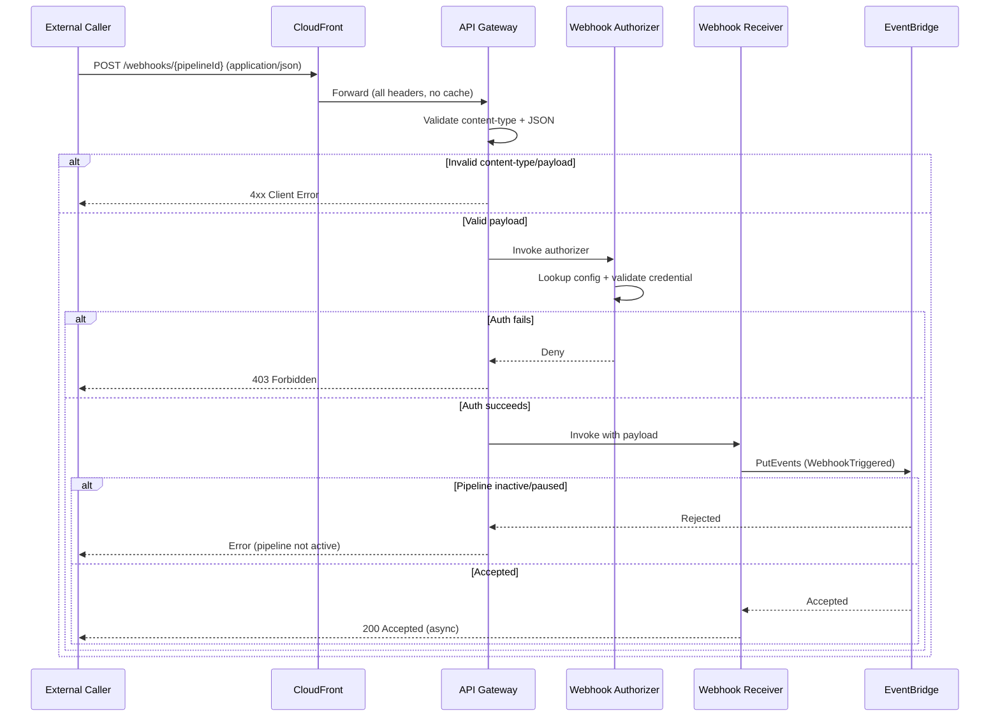

# Epic: Webhook Trigger Node Development

---

# Core Flows: Webhook Trigger Node

## Overview

Four flows cover the complete lifecycle of a Webhook Trigger Node: configuration in the pipeline builder, automatic provisioning on save, live invocation by an external caller, and automatic cleanup on pipeline deletion.

---

## Flow 1 — Configure a Webhook Trigger Node

**Description:** A pipeline author adds a Webhook Trigger node to a pipeline and configures its authentication method before saving.

**Entry point:** User opens the pipeline builder and drags the "Webhook Trigger" node from the trigger node palette onto the canvas.

**Steps:**

1. User drops the Webhook Trigger node onto the canvas. The node appears with a "Not yet provisioned" label and a dimmed URL field — indicating the endpoint does not exist until the pipeline is saved.
2. If the pipeline already contains a Webhook Trigger node, the product blocks adding another and shows a validation message: "Only one Webhook Trigger is allowed per pipeline."
3. User clicks the node to open its configuration panel.
4. The panel shows:
   - **Auth Method** selector (required): API Key / Bearer Token · Basic Auth
   - Auth-method-specific credential fields (see below)
   - A read-only **Webhook URL** field (empty, with placeholder "Generated on save")
5. User selects an auth method. The credential fields update accordingly:
   - **API Key / Bearer Token:** Single "Token" text field.
   - **Basic Auth:** "Username" and "Password" fields.
6. User fills in the credential fields. The panel validates that all required fields are non-empty before allowing save.
7. User connects the node to the rest of the pipeline graph and clicks **Save Pipeline**.

**Exit:** Pipeline save flow begins (Flow 2).

---

```wireframe
<!DOCTYPE html>
<html>
<head>
<style>
  body { font-family: sans-serif; font-size: 13px; margin: 0; background: #f5f5f5; display: flex; gap: 0; height: 100vh; }
  .canvas { flex: 1; background: #fafafa; border-right: 1px solid #ddd; position: relative; display: flex; align-items: center; justify-content: center; }
  .node { border: 2px solid #555; border-radius: 8px; padding: 12px 18px; background: #fff; text-align: center; width: 160px; }
  .node-label { font-weight: 600; font-size: 13px; }
  .node-sub { font-size: 11px; color: #999; margin-top: 4px; }
  .panel { width: 300px; background: #fff; border-left: 1px solid #ddd; padding: 20px; display: flex; flex-direction: column; gap: 14px; overflow-y: auto; }
  .panel-title { font-weight: 700; font-size: 14px; border-bottom: 1px solid #eee; padding-bottom: 8px; }
  label { font-size: 12px; color: #555; display: block; margin-bottom: 4px; }
  select, input { width: 100%; box-sizing: border-box; padding: 6px 8px; border: 1px solid #ccc; border-radius: 4px; font-size: 12px; }
  .url-field { background: #f5f5f5; color: #aaa; font-style: italic; }
  .field-group { display: flex; flex-direction: column; gap: 4px; }
  .badge { display: inline-block; font-size: 10px; background: #eee; border-radius: 3px; padding: 2px 6px; color: #666; }
  .save-btn { margin-top: auto; padding: 8px; background: #333; color: #fff; border: none; border-radius: 4px; font-size: 13px; cursor: pointer; text-align: center; }
</style>
</head>
<body>
  <div class="canvas">
    <div class="node" data-element-id="webhook-node">
      <div class="node-label">🔗 Webhook Trigger</div>
      <div class="node-sub">Not yet provisioned</div>
    </div>
  </div>
  <div class="panel">
    <div class="panel-title">Webhook Trigger — Configuration</div>

    <div class="field-group">
      <label>Webhook URL <span class="badge">Generated on save</span></label>
      <input class="url-field" type="text" value="" placeholder="https://…/webhooks/{pipelineId}" readonly data-element-id="webhook-url-field" />
    </div>

    <div class="field-group">
      <label>Auth Method <span style="color:red">*</span></label>
      <select data-element-id="auth-method-select">
        <option>API Key / Bearer Token</option>
        <option>Basic Auth</option>
      </select>
    </div>

    <div class="field-group">
      <label>Token <span style="color:red">*</span></label>
      <input type="password" placeholder="Enter or paste token value" data-element-id="api-token-field" />
    </div>

    <div class="save-btn" data-element-id="save-pipeline-btn">Save Pipeline</div>
  </div>
</body>
</html>
```

---

## Flow 2 — Pipeline Save: Webhook Provisioning

**Description:** When a pipeline containing a Webhook Trigger node is saved, the platform automatically provisions the webhook endpoint and credentials, then surfaces the URL back to the user.

**Entry point:** User clicks **Save Pipeline** from the pipeline builder (Flow 1 exit).

**Steps:**

1. The pipeline builder shows a progress indicator: "Saving pipeline…" with a step-by-step status (consistent with how other pipeline saves work today — e.g., "Creating resources", "Configuring triggers").
2. The backend detects the Webhook Trigger node and, as part of pipeline resource creation:
   - Creates a Secrets Manager secret containing the user-supplied credentials.
   - Registers the webhook configuration (auth method, secret reference, pipeline ID) in the pipeline record.
   - Constructs the webhook URL: `https://{cloudfront_domain}/webhooks/{pipelineId}`.
   - Stores the URL in the pipeline record.
3. On success, the pipeline builder returns to the saved state. The Webhook Trigger node now shows:
   - Status changes from "Not yet provisioned" → "Active".
   - The **Webhook URL** field in the config panel is populated with the live URL (copyable).
   - Stored secrets are never shown in full after save; API key/token-style credentials display only masked value with last 4 characters.
4. A success toast appears: "Pipeline saved. Webhook endpoint is live."
5. If a user edits auth method or credentials later, the webhook URL remains unchanged; new credentials become active on the next pipeline save.
6. If provisioning or credential update fails, the pipeline status is set to "Failed", the node shows an error indicator, and the user sees an inline error message with a retry option.

**Exit:** User copies the webhook URL and shares it with the external system, or continues editing the pipeline.

---

```wireframe
<!DOCTYPE html>
<html>
<head>
<style>
  body { font-family: sans-serif; font-size: 13px; margin: 0; background: #f5f5f5; display: flex; gap: 0; height: 100vh; }
  .canvas { flex: 1; background: #fafafa; border-right: 1px solid #ddd; position: relative; display: flex; align-items: center; justify-content: center; }
  .node { border: 2px solid #2a7; border-radius: 8px; padding: 12px 18px; background: #fff; text-align: center; width: 160px; }
  .node-label { font-weight: 600; font-size: 13px; }
  .node-sub { font-size: 11px; color: #2a7; margin-top: 4px; }
  .panel { width: 300px; background: #fff; border-left: 1px solid #ddd; padding: 20px; display: flex; flex-direction: column; gap: 14px; overflow-y: auto; }
  .panel-title { font-weight: 700; font-size: 14px; border-bottom: 1px solid #eee; padding-bottom: 8px; }
  label { font-size: 12px; color: #555; display: block; margin-bottom: 4px; }
  input { width: 100%; box-sizing: border-box; padding: 6px 8px; border: 1px solid #ccc; border-radius: 4px; font-size: 12px; }
  .url-field { background: #f0fff4; color: #1a6; font-weight: 500; }
  .field-group { display: flex; flex-direction: column; gap: 4px; }
  .copy-row { display: flex; gap: 6px; }
  .copy-row input { flex: 1; }
  .copy-btn { padding: 6px 10px; background: #eee; border: 1px solid #ccc; border-radius: 4px; font-size: 11px; cursor: pointer; white-space: nowrap; }
  .toast { background: #2a7; color: #fff; padding: 10px 14px; border-radius: 6px; font-size: 12px; }
  .badge-active { display: inline-block; font-size: 10px; background: #d4f5e2; border-radius: 3px; padding: 2px 6px; color: #1a6; }
</style>
</head>
<body>
  <div class="canvas">
    <div class="node" data-element-id="webhook-node-active">
      <div class="node-label">🔗 Webhook Trigger</div>
      <div class="node-sub">● Active</div>
    </div>
  </div>
  <div class="panel">
    <div class="panel-title">Webhook Trigger — Configuration</div>

    <div class="field-group">
      <label>Webhook URL <span class="badge-active">Live</span></label>
      <div class="copy-row">
        <input class="url-field" type="text" value="https://abc123.cloudfront.net/webhooks/pipe-xyz" readonly data-element-id="webhook-url-live" />
        <div class="copy-btn" data-element-id="copy-url-btn">Copy</div>
      </div>
    </div>

    <div class="field-group">
      <label>Auth Method</label>
      <input type="text" value="API Key / Bearer Token" readonly />
    </div>

    <div class="field-group">
      <label>Token</label>
      <input type="password" value="••••••••••••1234" readonly />
    </div>

    <div class="toast" data-element-id="success-toast">✓ Pipeline saved. Webhook endpoint is live.</div>
  </div>
</body>
</html>
```

---

## Flow 3 — Live Webhook Invocation (External Caller)

**Description:** An external system sends a POST request to the webhook URL. The platform validates payload format and authentication, then (if accepted) starts asynchronous pipeline processing.

**Entry point:** External system sends `POST /webhooks/{pipelineId}` with `Content-Type: application/json`, a valid JSON body, and the appropriate auth credential in request headers.

**Steps:**

1. The request arrives at CloudFront via the `/webhooks/*` behavior. CloudFront forwards it to API Gateway with all headers intact (no caching).
2. API Gateway validates request shape for the endpoint contract.
3. **If content type is not `application/json` or payload is invalid JSON:** the endpoint returns a client error response and request processing stops.
4. API Gateway invokes the **webhook Lambda authorizer** before payload is accepted.
5. The authorizer:
   - Looks up pipeline webhook configuration using the `pipelineId` path parameter.
   - Retrieves auth secret material from secure storage.
   - Validates credential using configured method (Bearer/API Key or Basic Auth).
6. **If authentication fails:** API Gateway returns `403 Forbidden` immediately. The payload never reaches the pipeline.
7. **If pipeline is inactive/paused:** request is rejected with an error response indicating pipeline is not active.
8. **If validation and authentication succeed and pipeline is active:** webhook event is accepted for async processing and forwarded into pipeline triggering flow.
9. The external caller receives `200 OK` meaning **accepted for asynchronous processing**, not pipeline completion. When available, response metadata includes correlation identifiers (e.g., execution ID / state machine execution reference).

**Exit:** Pipeline execution starts asynchronously. Caller can use returned identifiers (when present) or execution APIs to track completion.



---

## Flow 4 — Pipeline Deletion: Automatic Cleanup

**Description:** When a pipeline with a Webhook Trigger node is deleted, all associated webhook resources are automatically removed — no manual steps required.

**Entry point:** User clicks **Delete Pipeline** from the pipeline list or pipeline detail view and confirms the deletion prompt.

**Steps:**

1. User confirms the deletion dialog ("Delete pipeline and all associated resources?").
2. The platform begins cleanup of all pipeline-dependent resources (existing behaviour: Lambda functions, Step Functions state machine, SQS queues, EventBridge rules, IAM roles).
3. As part of this cleanup, the platform additionally:
   - Deletes the Secrets Manager secret associated with the webhook (force-deleted immediately, no recovery window).
   - Removes the webhook metadata (URL, auth method, secret reference) from the pipeline's DynamoDB record.
4. The pipeline is removed from the pipeline list.
5. Any subsequent `POST` to the now-orphaned webhook URL receives `403 Forbidden` — the authorizer finds no matching pipeline record and denies the request.

**Exit:** Pipeline and all its resources, including the webhook secret, are fully removed. The URL is permanently dead.

---

## State Summary

| Pipeline State                        | Node Appearance       | URL Field               | Incoming Requests                                |
| ------------------------------------- | --------------------- | ----------------------- | ------------------------------------------------ |
| Unsaved / draft                       | "Not yet provisioned" | Empty placeholder       | N/A                                              |
| Saving                                | "Provisioning…"       | Empty                   | N/A                                              |
| Active                                | "● Active"            | Live URL (copyable)     | Valid JSON + valid auth → `200` accepted (async) |
| Active (bad credential)               | "● Active"            | Live URL                | `403 Forbidden`                                  |
| Active (invalid content-type/payload) | "● Active"            | Live URL                | Client error (`4xx`)                             |
| Inactive / paused                     | "● Inactive"          | Live URL                | Rejected (pipeline not active)                   |
| Deleted                               | Node gone             | N/A                     | `403 Forbidden`                                  |
| Failed provisioning/update            | "⚠ Error"            | Empty or last-known URL | N/A                                              |
