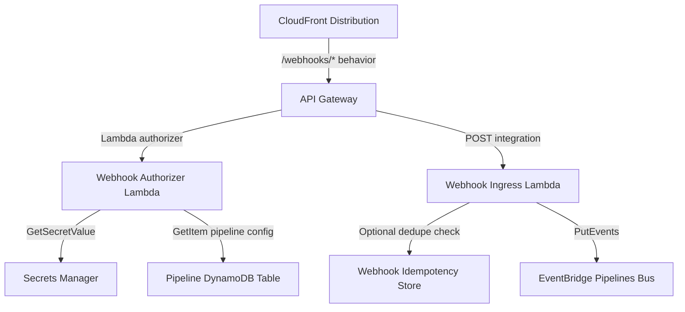
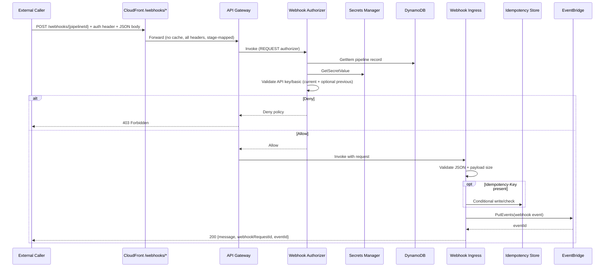

# Epic: Webhook Trigger Node Development

---

# Tech Plan: Webhook Trigger Node

## Architectural Approach

### Key Decisions

**1. Static API Gateway resource, dynamic routing via path parameter**

The `/webhooks/{pipelineId}` resource and its `POST` method are created once at CDK deploy time on the existing API Gateway. All webhook traffic for all pipelines flows through this single resource. The `pipelineId` path parameter is used at runtime to look up the correct pipeline configuration and credentials. This avoids the complexity and IAM surface area of dynamically mutating API Gateway resources at pipeline-save time — a pattern that does not exist anywhere else in the codebase and would require significant additional permissions.

_Trade-off:_ The URL structure is fixed at deploy time. Accepted — this is the correct constraint.

**2. Webhook path forwards to EventBridge only (no direct Step Functions start)**

Webhook ingestion uses EventBridge as the first pipeline handoff. The webhook ingress component publishes an event to the existing pipelines event bus, and the pipeline’s existing trigger wiring starts execution from there. This keeps webhook triggers consistent with event-driven trigger architecture already used in the platform.

_Trade-off:_ Execution IDs may not be available synchronously at webhook response time. Accepted — v1 response returns acceptance/correlation metadata available at ingest time (for example webhook request ID and EventBridge event ID).

**3. Dedicated webhook Lambda authorizer with API key/basic auth only (TTL=0)**

A new Lambda authorizer is attached exclusively to the `POST /webhooks/{pipelineId}` method. It is separate from the existing platform authorizer (`file:lambdas/auth/custom_authorizer/index.py`) which validates Cognito JWTs and API keys for internal platform users. For v1, webhook auth methods are **API key/Bearer** and **Basic Auth** only; HMAC is explicitly deferred. Authorizer result caching remains TTL=0 so credential rotation takes effect immediately after save and each request is independently validated.

_Trade-off:_ Higher per-request auth Lambda invocation cost/latency. Accepted for v1; no strict latency SLO is enforced.

**4. Secrets Manager for credential storage, one secret per pipeline**

Consistent with the existing pattern in `file:lambdas/nodes/api_handler/index.py` which retrieves API keys from Secrets Manager. Secret name: `{resource_prefix}/webhooks/{pipelineId}`. The secret stores `authMethod`, `current` credentials, optional `previous` credentials, and `graceUntil` rotation metadata. On pipeline update, the same secret ARN is retained (URL stable) while credential versions are rotated in place.

**5. New `/webhooks/*` CloudFront behavior with internal stage origin-path mapping**

Added to the existing CloudFront distribution in `file:medialake_constructs/userInterface.py`. Public URL stays clean (`/webhooks/{pipelineId}`), while CloudFront origin-path mapping routes internally to the API Gateway stage path. The behavior uses no-cache policy (TTL=0), passes auth headers through (`Authorization`, `X-Api-Key`), and allows POST + OPTIONS. This isolates webhook traffic from platform API traffic while preserving stage-based deployment conventions.

**6. `webhook_secret` resource type added to `dependentResources`**

The pipeline DynamoDB record's `dependentResources` list (format: `[resource_type, identifier]`) gains a new entry type: `["webhook_secret", secret_arn]`. The existing cleanup dispatcher in `file:lambdas/api/pipelines/rp_pipelinesId/del_pipelinesId/resource_cleanup.py` is extended with a `delete_webhook_secret()` function that calls `secretsmanager.delete_secret(ForceDeleteWithoutRecovery=True)`. No structural changes to the cleanup framework.

**7. Payload cap enforced at ingress based on EventBridge limits**

Webhook payload size is capped to EventBridge entry capacity minus platform-added envelope fields. Requests above cap are rejected with `413 Payload Too Large` before publish attempt.

**8. Dual-secret rotation grace window**

On credential rotation, authorizer accepts both previous and current credentials for a short configurable grace period, then automatically expires previous credentials.

**9. Optional Idempotency-Key support**

If `Idempotency-Key` header is present, ingress performs short-window deduplication to avoid duplicate event publish under client retries. If absent, request is processed normally.

---

## Data Model

### New fields on the pipeline DynamoDB record

The existing pipeline record (keyed by `id`) gains the following optional top-level fields, populated only when the pipeline contains a Webhook Trigger node:

| Field                   | Type     | Description                                                                                  |
| ----------------------- | -------- | -------------------------------------------------------------------------------------------- |
| `webhookUrl`            | `string` | Full CloudFront webhook URL: `https://{cf_domain}/webhooks/{pipelineId}`                     |
| `webhookAuthMethod`     | `string` | One of: `api_key`, `basic_auth` (v1)                                                         |
| `webhookSecretArn`      | `string` | ARN of the Secrets Manager secret holding credentials                                        |
| `webhookCredentialHint` | `string` | Display hint only — last 4 chars for token/key, masked username/password hint for Basic Auth |
| `webhookGraceUntil`     | `string` | Optional ISO timestamp indicating end of dual-secret rotation grace window                   |

These fields are written by the pipeline creation Lambda during the webhook provisioning step and read by the pipeline GET API to surface the URL and hint back to the UI.

### Secrets Manager secret structure

One secret per pipeline, stored as a JSON string with rotation metadata:

```json
{
  "authMethod": "api_key | basic_auth",
  "current": {
    "apiKey": "...",
    "basicAuthUsername": "...",
    "basicAuthPassword": "..."
  },
  "previous": {
    "apiKey": "...",
    "basicAuthUsername": "...",
    "basicAuthPassword": "..."
  },
  "graceUntil": "ISO-8601 timestamp"
}
```

Authorizer validates against `current`; if within grace window it also accepts `previous`.

### `dependentResources` addition

```
["webhook_secret", "arn:aws:secretsmanager:region:account:secret:{resource_prefix}/webhooks/{pipelineId}-xxxx"]
```

This entry is appended to the existing `dependentResources` list alongside Lambda ARNs, Step Functions ARN, IAM roles, etc.

### Optional idempotency entity

When `Idempotency-Key` is provided, a short-lived dedupe entity is stored with TTL.

| Field       | Type     | Description                                            |
| ----------- | -------- | ------------------------------------------------------ |
| `pk`        | `string` | Composite key: `WEBHOOK#{pipelineId}#{idempotencyKey}` |
| `requestId` | `string` | Platform-generated webhook request identifier          |
| `eventId`   | `string` | EventBridge event ID from first accepted publish       |
| `expiresAt` | `number` | UNIX epoch TTL for dedupe expiration                   |

If the same key is replayed within TTL, ingress returns existing acceptance metadata instead of republishing.

### Node YAML template

A new file `file:s3_bucket_assets/pipeline_nodes/node_templates/trigger/trigger_webhook.yaml` follows the exact schema of `trigger_manual.yaml` and `trigger_eventbridge.yaml`. The `actions.trigger.parameters` section defines the auth method selector and per-method credential fields (**API key/Bearer and Basic Auth for v1**). The node deployment Lambda (`file:lambdas/back_end/pipeline_nodes_deployment/index.py`) processes it automatically with no code changes.

---

## Component Architecture

### New components



**Webhook Authorizer Lambda** (`file:lambdas/auth/webhook_authorizer/index.py`)

- Triggered by API Gateway as a REQUEST-type Lambda authorizer on `POST /webhooks/{pipelineId}`.
- Reads `pipelineId` from path parameters.
- Fetches pipeline record from DynamoDB to resolve `webhookSecretArn`, `webhookAuthMethod`, and `active` state.
- Denies when pipeline is missing or inactive/paused.
- Fetches credentials from Secrets Manager and validates against:
  - **API Key / Bearer** (`Authorization` / `X-Api-Key`)
  - **Basic Auth** (`Authorization: Basic ...`)
- Supports dual-secret grace: accepts `current`, and also `previous` while `graceUntil` is not expired.
- Returns allow/deny policy only; no payload inspection.
- TTL: 0 (no caching).

**Webhook Ingress Lambda** (`file:lambdas/nodes/webhook_ingress/index.py`)

- Invoked by API Gateway only after authorizer allow.
- Validates `Content-Type: application/json` and JSON parse.
- Enforces payload-byte cap derived from EventBridge detail limit minus platform envelope.
- If `Idempotency-Key` header is present, applies short-window dedupe using conditional write.
- Publishes webhook event to pipelines EventBridge bus (includes `pipelineId`, payload, and request correlation metadata).
- Returns async acceptance response (`200`) with available correlation IDs (for example webhook request ID and EventBridge event ID).
- Returns `4xx/5xx` on validation/publish failures.

### Modified components

**`file:medialake_constructs/userInterface.py`**

- Adds `/webhooks/*` CloudFront behavior:
  - Origin: API Gateway `HttpOrigin` with **origin-path set to API stage** so clean public path `/webhooks/{pipelineId}` routes to deployed stage internally.
  - Cache policy: TTL=0 (no caching).
  - Origin request policy: `ALL_VIEWER_EXCEPT_HOST_HEADER` (pass all headers).
  - Allowed methods: POST + OPTIONS.
  - New `ResponseHeadersPolicy` for webhooks: no CSP, permissive CORS (`Access-Control-Allow-Origin: *`), exposes no sensitive headers.

**`file:medialake_constructs/api_gateway/api_gateway_main_construct.py`** (or a new sibling construct)

- Adds `/webhooks` resource and `{pipelineId}` child resource to the existing REST API.
- Adds `POST` method with:
  - Webhook Lambda authorizer (REQUEST type, TTL=0).
  - Webhook ingress Lambda integration.
  - No `X-Origin-Verify` requirement (external callers cannot know this header).
- Adds `OPTIONS` method for CORS preflight.

**`file:lambdas/api/pipelines/post_pipelines/handlers.py`**

- Detects `trigger_webhook` node by `node.data.id == "trigger_webhook"`.
- Enforces single webhook-trigger-per-pipeline validation.
- Calls `create_or_rotate_webhook_secret()` to maintain `current` and `previous` credentials with `graceUntil`.
- Ensures pipeline has webhook EventBridge trigger wiring (rule/target) consistent with existing event-trigger lifecycle.
- Appends `["webhook_secret", secret_arn]` to `dependentResources`.
- Writes `webhookUrl`, `webhookAuthMethod`, `webhookSecretArn`, `webhookCredentialHint`, and grace metadata to the pipeline record.

**`file:lambdas/api/pipelines/rp_pipelinesId/del_pipelinesId/resource_cleanup.py`**

- Adds `delete_webhook_secret(secret_arn)` function: calls `secretsmanager.delete_secret(ForceDeleteWithoutRecovery=True)`.
- Adds `"webhook_secret"` case to the `cleanup_pipeline_resources()` dispatcher.

**`file:medialake_stacks/nodes_stack.py`**

- Adds `LambdaDeployment` for the webhook ingress Lambda (under trigger-related deployment path).

### Request flow end-to-end



### IAM permissions summary

| Lambda                   | New permissions needed                                                                            |
| ------------------------ | ------------------------------------------------------------------------------------------------- |
| Webhook Authorizer       | `dynamodb:GetItem` (pipeline table), `secretsmanager:GetSecretValue` (webhook secrets by prefix)  |
| Webhook Ingress          | `events:PutEvents` (pipelines event bus), optional `dynamodb:PutItem/GetItem` (idempotency store) |
| Pipeline Creation Lambda | `secretsmanager:CreateSecret`, `secretsmanager:UpdateSecret`, `secretsmanager:TagResource`        |
| Pipeline Deletion Lambda | `secretsmanager:DeleteSecret`                                                                     |
