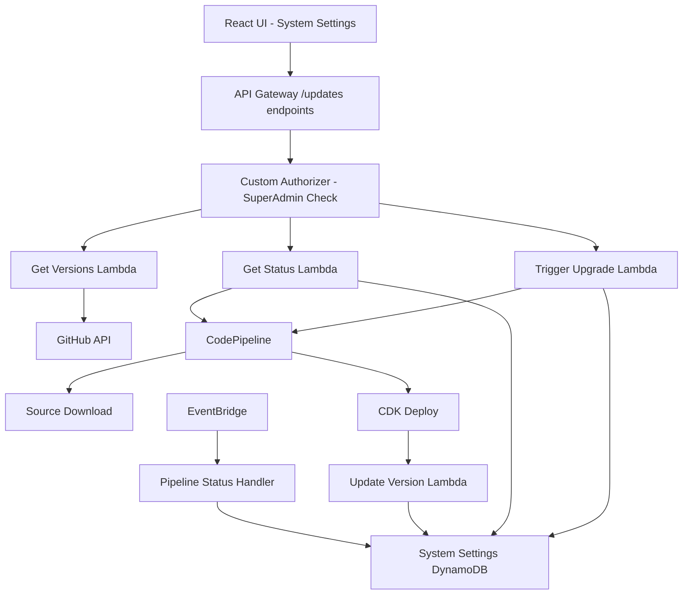

# Design Document

## Overview

The MediaLake Auto-Upgrade System is designed as a comprehensive solution that integrates with the existing MediaLake architecture to provide seamless version management and deployment capabilities. The system leverages the existing CodePipeline infrastructure deployed via the medialake.template CloudFormation script and extends the current system settings functionality to provide a user-friendly upgrade interface.

The design follows MediaLake's serverless-first architecture principles, using AWS Lambda functions for API endpoints, DynamoDB for state management, and EventBridge for event-driven coordination. The system integrates with the existing authentication and authorization framework, restricting access to super administrators only.

## Architecture

### High-Level Architecture



### Component Integration

The auto-upgrade system integrates with existing MediaLake components:

- **System Settings Stack**: Extends the existing system settings table to store version information
- **API Gateway**: Adds new `/updates` endpoints to the existing API structure
- **Authentication**: Uses the existing superAdministrator group validation
- **CodePipeline**: Modifies the existing pipeline source configuration dynamically
- **EventBridge**: Leverages existing event bus for pipeline status notifications

## Components and Interfaces

### 1. Frontend Components

#### System Settings Upgrade Section

- **Location**: `medialake_user_interface/src/pages/settings/SystemSettings.tsx`
- **Purpose**: Provides UI for version management and upgrade triggering
- **Features**:
  - Current version display
  - Available versions list (branches and tags)
  - Upgrade trigger button with confirmation
  - Progress tracking and status display
  - Upgrade history view

#### Upgrade Modal Component

- **Location**: `medialake_user_interface/src/components/UpgradeModal.tsx`
- **Purpose**: Handles upgrade confirmation and scheduling
- **Features**:
  - Version selection confirmation
  - Immediate vs scheduled upgrade options
  - Progress indicator during upgrade

### 2. Backend API Endpoints

#### Single Updates Lambda with APIGatewayRestResolver

- **Main Handler**: `lambdas/api/updates/index.py`
- **Router**: AWS Lambda Powertools APIGatewayRestResolver
- **Authorization**: SuperAdministrator group validation for all endpoints

**Endpoint Handlers**:

- `GET /updates/versions` → `lambdas/api/updates/handlers/get_versions.py`
- `POST /updates/trigger` → `lambdas/api/updates/handlers/post_trigger.py`
- `GET /updates/status` → `lambdas/api/updates/handlers/get_status.py`
- `POST /updates/schedule` → `lambdas/api/updates/handlers/post_schedule.py`
- `DELETE /updates/schedule/{scheduleId}` → `lambdas/api/updates/handlers/delete_schedule_id.py`
- `GET /updates/scheduled` → `lambdas/api/updates/handlers/get_scheduled.py`
- `GET /updates/history` → `lambdas/api/updates/handlers/get_history.py`

**Shared Modules**:

- `lambdas/api/updates/models/` → Pydantic models
- `lambdas/api/updates/services/` → Business logic services
- `lambdas/api/updates/utils/` → Common utilities

### 3. Lambda Functions

#### Updates API Lambda (Single Function)

- **Path**: `lambdas/api/updates/`
- **Main Handler**: `index.py` with APIGatewayRestResolver
- **Purpose**: Handle all /updates API endpoints through routing
- **Environment Variables**:
  - `GITHUB_REPO_URL`: Repository URL
  - `GITHUB_API_TIMEOUT`: API timeout setting
  - `CODEPIPELINE_NAME`: Pipeline name from CloudFormation
  - `SYSTEM_SETTINGS_TABLE_NAME`: DynamoDB table name
- **IAM Permissions**:
  - `codepipeline:StartPipelineExecution`
  - `codepipeline:GetPipeline`
  - `codepipeline:UpdatePipeline`
  - `codepipeline:GetPipelineExecution`
  - `codepipeline:ListPipelineExecutions`
  - `dynamodb:PutItem`
  - `dynamodb:UpdateItem`
  - `dynamodb:Query`
  - `dynamodb:GetItem`
  - `events:PutRule`
  - `events:DeleteRule`
  - `events:PutTargets`
  - `events:RemoveTargets`
- **Dependencies**:
  - aws-lambda-powertools
  - requests
  - pydantic
  - boto3

**Handler Structure**:

```python
# lambdas/api/updates/index.py
from aws_lambda_powertools.event_handler import APIGatewayRestResolver
from aws_lambda_powertools import Logger, Tracer, Metrics

app = APIGatewayRestResolver()
logger = Logger()
tracer = Tracer()
metrics = Metrics()

@app.get("/versions")
def get_versions():
    # Route to handlers/get_versions.py

@app.post("/trigger")
def post_trigger():
    # Route to handlers/post_trigger.py

@app.get("/status")
def get_status():
    # Route to handlers/get_status.py

# ... other routes

@logger.inject_lambda_context
@tracer.capture_lambda_handler
@metrics.log_metrics
def lambda_handler(event, context):
    return app.resolve(event, context)
```

#### Pipeline Status Handler Lambda

- **Path**: `lambdas/back_end/pipeline_status_handler/`
- **Purpose**: Handle pipeline status events from EventBridge
- **Trigger**: EventBridge rule for CodePipeline state changes
- **Environment Variables**:
  - `SYSTEM_SETTINGS_TABLE_NAME`: DynamoDB table name
- **IAM Permissions**:
  - `dynamodb:UpdateItem`

#### Scheduled Upgrade Lambda

- **Path**: `lambdas/back_end/scheduled_upgrade/`
- **Purpose**: Execute scheduled upgrades via EventBridge rules
- **Trigger**: EventBridge scheduled events
- **Environment Variables**:
  - `CODEPIPELINE_NAME`: Pipeline name
  - `SYSTEM_SETTINGS_TABLE_NAME`: DynamoDB table name

#### Version Update Lambda

- **Path**: `lambdas/back_end/version_update/`
- **Purpose**: Update system settings with new version after successful deployment
- **Trigger**: Custom resource in CDK deployment
- **Environment Variables**:
  - `SYSTEM_SETTINGS_TABLE_NAME`: DynamoDB table name
  - `CURRENT_VERSION`: Version being deployed

### 4. Infrastructure Components

#### API Gateway Extensions

- **Construct**: `medialake_constructs/api_gateway/api_gateway_updates.py`
- **Purpose**: Define /updates API endpoints
- **Integration**: Extends existing API Gateway structure
- **Authorization**: Uses existing custom authorizer with superAdministrators group validation

#### DynamoDB Schema Extensions

- **Table**: Existing system-settings table (single table design with PK/SK)
- **New Items**:
  - `PK: "SYSTEM_UPGRADE", SK: "VERSION_CURRENT"` - Current version information
  - `PK: "SYSTEM_UPGRADE", SK: "VERSION_UPGRADE_{timestamp}"` - Upgrade history records
  - `PK: "SYSTEM_UPGRADE", SK: "VERSION_SCHEDULED_{id}"` - Scheduled upgrade records

#### EventBridge Rules

- **Pipeline Status Rule**: Captures CodePipeline state changes
- **Scheduled Upgrade Rules**: Dynamic rules for scheduled upgrades
- **Target**: Pipeline Status Handler Lambda

#### CodePipeline Modifications

- **Source Stage**: Modified to support dynamic branch/tag selection
- **Environment Variables**: Added to support version parameter passing
- **Custom Resource**: Updates pipeline source configuration

## API Specification

### GET /updates/versions

**Purpose**: Retrieve available versions (branches and tags) from GitHub repository

**Authorization**: Requires superAdministrators group membership

**Request**: No parameters required

**Response**:

```json
{
  "success": true,
  "data": {
    "branches": [
      {
        "name": "main",
        "type": "branch",
        "sha": "abc123def456",
        "date": "2024-01-15T10:30:00Z",
        "message": "Latest updates to MediaLake core",
        "isDefault": true
      },
      {
        "name": "develop",
        "type": "branch",
        "sha": "def456ghi789",
        "date": "2024-01-14T15:20:00Z",
        "message": "Development branch with new features"
      }
    ],
    "tags": [
      {
        "name": "v1.3.0",
        "type": "tag",
        "sha": "ghi789jkl012",
        "date": "2024-01-10T09:15:00Z",
        "message": "Release v1.3.0 - Performance improvements",
        "isLatest": true
      },
      {
        "name": "v1.2.0",
        "type": "tag",
        "sha": "jkl012mno345",
        "date": "2024-01-01T12:00:00Z",
        "message": "Release v1.2.0 - New pipeline features"
      }
    ]
  },
  "meta": {
    "timestamp": "2024-01-15T10:30:00Z",
    "version": "v1"
  }
}
```

**Error Response**:

```json
{
  "success": false,
  "error": {
    "code": "FORBIDDEN",
    "message": "Access denied. Requires superAdministrators group membership."
  },
  "meta": {
    "timestamp": "2024-01-15T10:30:00Z",
    "version": "v1",
    "request_id": "req_abc123def456"
  }
}
```

### POST /updates/trigger

**Purpose**: Trigger immediate upgrade to selected version

**Authorization**: Requires superAdministrators group membership

**Request**:

```json
{
  "targetVersion": "v1.3.0",
  "versionType": "tag",
  "confirmUpgrade": true
}
```

**Response**:

```json
{
  "success": true,
  "data": {
    "message": "Upgrade initiated successfully",
    "upgradeId": "upgrade-2024-01-15T10:30:00Z",
    "targetVersion": "v1.3.0",
    "pipelineExecutionId": "exec-abc123def456",
    "estimatedDuration": "15-20 minutes"
  },
  "meta": {
    "timestamp": "2024-01-15T10:30:00Z",
    "version": "v1"
  }
}
```

**Error Responses**:

```json
{
  "success": false,
  "error": {
    "code": "UPGRADE_IN_PROGRESS",
    "message": "Upgrade already in progress",
    "details": {
      "currentUpgrade": {
        "targetVersion": "v1.2.0",
        "status": "in_progress",
        "pipelineExecutionId": "exec-def456ghi789"
      }
    }
  },
  "meta": {
    "timestamp": "2024-01-15T10:30:00Z",
    "version": "v1",
    "request_id": "req_def456ghi789"
  }
}
```

### GET /updates/status

**Purpose**: Get current upgrade status and version information

**Authorization**: Requires superAdministrators group membership

**Request**: No parameters required

**Response**:

```json
{
  "success": true,
  "data": {
    "currentVersion": "v1.2.0",
    "upgradeStatus": "idle",
    "lastUpgrade": {
      "fromVersion": "v1.1.0",
      "toVersion": "v1.2.0",
      "completedAt": "2024-01-01T12:30:00Z",
      "duration": 1200,
      "status": "completed"
    },
    "activeUpgrade": null
  },
  "meta": {
    "timestamp": "2024-01-15T10:30:00Z",
    "version": "v1"
  }
}
```

**During Upgrade Response**:

```json
{
  "success": true,
  "data": {
    "currentVersion": "v1.2.0",
    "upgradeStatus": "in_progress",
    "activeUpgrade": {
      "targetVersion": "v1.3.0",
      "startTime": "2024-01-15T10:30:00Z",
      "pipelineExecutionId": "exec-abc123def456",
      "progress": {
        "stage": "Source",
        "percentage": 25,
        "currentAction": "Downloading source code"
      }
    }
  },
  "meta": {
    "timestamp": "2024-01-15T10:30:00Z",
    "version": "v1"
  }
}
```

### POST /updates/schedule

**Purpose**: Schedule upgrade for future execution

**Authorization**: Requires superAdministrators group membership

**Request**:

```json
{
  "targetVersion": "v1.3.0",
  "versionType": "tag",
  "scheduledTime": "2024-01-20T02:00:00Z",
  "timezone": "UTC"
}
```

**Response**:

```json
{
  "success": true,
  "data": {
    "message": "Upgrade scheduled successfully",
    "scheduleId": "sched-abc123def456",
    "targetVersion": "v1.3.0",
    "scheduledTime": "2024-01-20T02:00:00Z",
    "status": "scheduled"
  },
  "meta": {
    "timestamp": "2024-01-15T14:00:00Z",
    "version": "v1"
  }
}
```

### DELETE /updates/schedule/{scheduleId}

**Purpose**: Cancel a scheduled upgrade

**Authorization**: Requires superAdministrators group membership

**Request Parameters**:

- `scheduleId` (path): The ID of the scheduled upgrade to cancel

**Response**:

```json
{
  "success": true,
  "data": {
    "message": "Scheduled upgrade cancelled successfully",
    "scheduleId": "sched-abc123def456",
    "targetVersion": "v1.3.0",
    "originalScheduledTime": "2024-01-20T02:00:00Z",
    "cancelledAt": "2024-01-15T14:30:00Z"
  },
  "meta": {
    "timestamp": "2024-01-15T14:30:00Z",
    "version": "v1"
  }
}
```

**Error Responses**:

```json
{
  "success": false,
  "error": {
    "code": "SCHEDULE_NOT_FOUND",
    "message": "Scheduled upgrade not found",
    "details": {
      "scheduleId": "sched-invalid123"
    }
  },
  "meta": {
    "timestamp": "2024-01-15T14:30:00Z",
    "version": "v1",
    "request_id": "req_invalid123"
  }
}
```

```json
{
  "success": false,
  "error": {
    "code": "CANNOT_CANCEL_STARTED_UPGRADE",
    "message": "Cannot cancel upgrade that has already started",
    "details": {
      "scheduleId": "sched-abc123def456",
      "status": "in_progress"
    }
  },
  "meta": {
    "timestamp": "2024-01-15T14:30:00Z",
    "version": "v1",
    "request_id": "req_abc123def456"
  }
}
```

### GET /updates/scheduled

**Purpose**: List all scheduled upgrades

**Authorization**: Requires superAdministrators group membership

**Request**: No parameters required

**Response**:

```json
{
  "success": true,
  "data": [
    {
      "scheduleId": "sched-abc123def456",
      "targetVersion": "v1.3.0",
      "versionType": "tag",
      "scheduledTime": "2024-01-20T02:00:00Z",
      "status": "scheduled",
      "createdBy": "admin@example.com",
      "createdAt": "2024-01-15T14:00:00Z"
    }
  ],
  "meta": {
    "timestamp": "2024-01-15T15:00:00Z",
    "version": "v1"
  }
}
```

### GET /updates/history

**Purpose**: Retrieve upgrade history

**Authorization**: Requires superAdministrators group membership

**Request Parameters**:

- `limit` (optional): Number of records to return (default: 10, max: 50)
- `cursor` (optional): Cursor-based pagination key for next page

**Response**:

```json
{
  "success": true,
  "data": [
    {
      "upgradeId": "upgrade-2024-01-15T10:30:00Z",
      "fromVersion": "v1.2.0",
      "toVersion": "v1.3.0",
      "status": "completed",
      "startTime": "2024-01-15T10:30:00Z",
      "endTime": "2024-01-15T10:45:00Z",
      "duration": 900,
      "triggeredBy": "admin@example.com",
      "pipelineExecutionId": "exec-abc123def456"
    }
  ],
  "pagination": {
    "next_cursor": "eyJpZCI6InVwZ3JhZGUtMjAyNC0wMS0xNVQxMDozMDowMFoiLCJjcmVhdGVkX2F0IjoiMjAyNC0wMS0xNVQxMDozMDowMFoifQ==",
    "prev_cursor": null,
    "has_next_page": false,
    "has_prev_page": false,
    "limit": 10
  },
  "meta": {
    "timestamp": "2024-01-15T15:30:00Z",
    "version": "v1"
  }
}
```

## Data Models

### API Request Models (Pydantic)

#### TriggerUpgradeRequest

```python
from pydantic import BaseModel, Field
from typing import Literal

class TriggerUpgradeRequest(BaseModel):
    target_version: str = Field(..., description="Version name (e.g., 'v1.3.0', 'main')")
    version_type: Literal['tag', 'branch'] = Field(..., description="Type of version")
    confirm_upgrade: bool = Field(..., description="Explicit confirmation required")
```

#### ScheduleUpgradeRequest

```python
from pydantic import BaseModel, Field, validator
from typing import Literal, Optional
from datetime import datetime

class ScheduleUpgradeRequest(BaseModel):
    target_version: str = Field(..., description="Version name")
    version_type: Literal['tag', 'branch'] = Field(..., description="Type of version")
    scheduled_time: str = Field(..., description="ISO 8601 timestamp")
    timezone: Optional[str] = Field(default="UTC", description="Timezone")

    @validator('scheduled_time')
    def validate_scheduled_time(cls, v):
        try:
            datetime.fromisoformat(v.replace('Z', '+00:00'))
            return v
        except ValueError:
            raise ValueError('scheduled_time must be a valid ISO 8601 timestamp')
```

#### GetHistoryRequest

```python
from pydantic import BaseModel, Field
from typing import Optional

class GetHistoryRequest(BaseModel):
    limit: Optional[int] = Field(default=10, ge=1, le=50, description="Number of records")
    cursor: Optional[str] = Field(default=None, description="Pagination cursor")
```

### API Response Models (Pydantic)

#### StandardApiResponse

```python
from pydantic import BaseModel, Field
from typing import Optional, Any, Generic, TypeVar
from datetime import datetime

T = TypeVar('T')

class ApiError(BaseModel):
    code: str = Field(..., description="Error code")
    message: str = Field(..., description="Human-readable error message")
    details: Optional[Any] = Field(default=None, description="Additional error details")

class PaginationInfo(BaseModel):
    next_cursor: Optional[str] = Field(default=None, description="Next page cursor")
    prev_cursor: Optional[str] = Field(default=None, description="Previous page cursor")
    has_next_page: bool = Field(..., description="Whether next page exists")
    has_prev_page: bool = Field(..., description="Whether previous page exists")
    limit: int = Field(..., description="Items per page")

class ResponseMeta(BaseModel):
    timestamp: str = Field(..., description="ISO 8601 timestamp")
    version: str = Field(default="v1", description="API version")
    request_id: Optional[str] = Field(default=None, description="Request ID for error tracking")

class StandardApiResponse(BaseModel, Generic[T]):
    success: bool = Field(..., description="Request success status")
    data: Optional[T] = Field(default=None, description="Response data")
    error: Optional[ApiError] = Field(default=None, description="Error information")
    pagination: Optional[PaginationInfo] = Field(default=None, description="Pagination info")
    meta: ResponseMeta = Field(..., description="Response metadata")
```

#### VersionsResponse

```python
from pydantic import BaseModel, Field
from typing import List, Optional, Literal

class GitHubVersion(BaseModel):
    name: str = Field(..., description="Branch/tag name")
    type: Literal['branch', 'tag'] = Field(..., description="Version type")
    sha: str = Field(..., description="Commit SHA")
    date: str = Field(..., description="ISO 8601 timestamp")
    message: Optional[str] = Field(default=None, description="Commit message")
    is_default: Optional[bool] = Field(default=None, description="For branches - is default branch")
    is_latest: Optional[bool] = Field(default=None, description="For tags - is latest release")

class VersionsResponseData(BaseModel):
    branches: List[GitHubVersion] = Field(..., description="Available branches")
    tags: List[GitHubVersion] = Field(..., description="Available tags")
```

#### TriggerUpgradeResponse

```python
class TriggerUpgradeResponseData(BaseModel):
    message: str = Field(..., description="Success message")
    upgrade_id: str = Field(..., description="Unique upgrade identifier")
    target_version: str = Field(..., description="Target version")
    pipeline_execution_id: str = Field(..., description="CodePipeline execution ID")
    estimated_duration: str = Field(..., description="Human readable duration estimate")
```

#### UpgradeStatusResponse

```python
from typing import Literal

class UpgradeProgress(BaseModel):
    stage: str = Field(..., description="Current pipeline stage")
    percentage: int = Field(..., ge=0, le=100, description="Progress percentage")
    current_action: str = Field(..., description="Human readable current action")

class UpgradeRecord(BaseModel):
    upgrade_id: str = Field(..., description="Unique upgrade identifier")
    from_version: str = Field(..., description="Source version")
    to_version: str = Field(..., description="Target version")
    status: Literal['completed', 'failed'] = Field(..., description="Upgrade status")
    start_time: str = Field(..., description="ISO 8601 timestamp")
    end_time: str = Field(..., description="ISO 8601 timestamp")
    duration: int = Field(..., description="Duration in seconds")
    triggered_by: str = Field(..., description="User email")
    pipeline_execution_id: str = Field(..., description="CodePipeline execution ID")
    error_message: Optional[str] = Field(default=None, description="Error message if failed")

class ActiveUpgrade(BaseModel):
    upgrade_id: str = Field(..., description="Unique upgrade identifier")
    target_version: str = Field(..., description="Target version")
    start_time: str = Field(..., description="ISO 8601 timestamp")
    pipeline_execution_id: str = Field(..., description="CodePipeline execution ID")
    progress: UpgradeProgress = Field(..., description="Current progress")

class UpgradeStatusResponseData(BaseModel):
    current_version: str = Field(..., description="Currently deployed version")
    upgrade_status: Literal['idle', 'in_progress', 'completed', 'failed'] = Field(..., description="Current upgrade status")
    last_upgrade: Optional[UpgradeRecord] = Field(default=None, description="Last completed upgrade")
    active_upgrade: Optional[ActiveUpgrade] = Field(default=None, description="Current upgrade if in progress")
```

#### ScheduleUpgradeResponse

```python
class ScheduleUpgradeResponseData(BaseModel):
    message: str = Field(..., description="Success message")
    schedule_id: str = Field(..., description="Unique schedule identifier")
    target_version: str = Field(..., description="Target version")
    scheduled_time: str = Field(..., description="ISO 8601 timestamp")
    status: Literal['scheduled'] = Field(default='scheduled', description="Always 'scheduled' on creation")
```

#### CancelScheduleResponse

```python
class CancelScheduleResponseData(BaseModel):
    message: str = Field(..., description="Success message")
    schedule_id: str = Field(..., description="Schedule identifier")
    target_version: str = Field(..., description="Target version")
    original_scheduled_time: str = Field(..., description="Original scheduled time")
    cancelled_at: str = Field(..., description="Cancellation timestamp")
```

#### ScheduledUpgradesResponse

```python
class ScheduledUpgrade(BaseModel):
    schedule_id: str = Field(..., description="Unique identifier")
    target_version: str = Field(..., description="Target version")
    version_type: Literal['tag', 'branch'] = Field(..., description="Version type")
    scheduled_time: str = Field(..., description="ISO 8601 timestamp")
    status: Literal['scheduled', 'cancelled', 'completed', 'failed'] = Field(..., description="Schedule status")
    created_by: str = Field(..., description="User email")
    created_at: str = Field(..., description="Creation timestamp")

# Response data is List[ScheduledUpgrade]
ScheduledUpgradesResponseData = List[ScheduledUpgrade]
```

#### UpgradeHistoryResponse

```python
# Response data is List[UpgradeRecord] with pagination
UpgradeHistoryResponseData = List[UpgradeRecord]
```

### Domain Models

### Internal Domain Models (Pydantic)

#### VersionInfo (Internal)

```python
class VersionInfo(BaseModel):
    name: str = Field(..., description="Branch or tag name")
    type: Literal['branch', 'tag'] = Field(..., description="Version type")
    sha: str = Field(..., description="Commit SHA")
    date: str = Field(..., description="Last commit date")
    message: Optional[str] = Field(default=None, description="Commit message")
    is_latest: Optional[bool] = Field(default=None, description="Latest tag indicator")
    is_default: Optional[bool] = Field(default=None, description="Default branch indicator")
```

#### UpgradeStatus (Internal)

```python
class UpgradeStatusInternal(BaseModel):
    current_version: str = Field(..., description="Currently deployed version")
    target_version: Optional[str] = Field(default=None, description="Target version")
    status: Literal['idle', 'in_progress', 'completed', 'failed'] = Field(..., description="Upgrade status")
    pipeline_execution_id: Optional[str] = Field(default=None, description="CodePipeline execution ID")
    start_time: Optional[str] = Field(default=None, description="Start timestamp")
    end_time: Optional[str] = Field(default=None, description="End timestamp")
    error_message: Optional[str] = Field(default=None, description="Error message")
    progress: Optional[UpgradeProgress] = Field(default=None, description="Progress information")
```

#### UpgradeHistory (Internal)

```python
class UpgradeHistoryInternal(BaseModel):
    upgrade_id: str = Field(..., description="Unique upgrade identifier")
    from_version: str = Field(..., description="Source version")
    to_version: str = Field(..., description="Target version")
    status: Literal['completed', 'failed'] = Field(..., description="Upgrade status")
    start_time: str = Field(..., description="Start timestamp")
    end_time: str = Field(..., description="End timestamp")
    duration: int = Field(..., description="Duration in seconds")
    pipeline_execution_id: str = Field(..., description="CodePipeline execution ID")
    triggered_by: str = Field(..., description="User email")
    error_message: Optional[str] = Field(default=None, description="Error message")
```

#### ScheduledUpgradeInternal

```python
class ScheduledUpgradeInternal(BaseModel):
    schedule_id: str = Field(..., description="Unique schedule identifier")
    target_version: str = Field(..., description="Target version")
    version_type: Literal['tag', 'branch'] = Field(..., description="Version type")
    scheduled_time: str = Field(..., description="Scheduled execution time")
    status: Literal['scheduled', 'cancelled', 'executing', 'completed', 'failed'] = Field(..., description="Schedule status")
    created_by: str = Field(..., description="User email")
    created_at: str = Field(..., description="Creation timestamp")
    event_bridge_rule_arn: Optional[str] = Field(default=None, description="ARN of EventBridge rule for scheduling")
    cancelled_at: Optional[str] = Field(default=None, description="Cancellation timestamp")
    executed_at: Optional[str] = Field(default=None, description="Execution timestamp")
    error_message: Optional[str] = Field(default=None, description="Error message")
```

#### DynamoDB Item Models

```python
class SystemUpgradeItem(BaseModel):
    """Base model for SYSTEM_UPGRADE DynamoDB items"""
    PK: str = Field(..., description="Partition key")
    SK: str = Field(..., description="Sort key")
    setting_value: dict = Field(..., description="Setting value as JSON")
    description: str = Field(..., description="Item description")
    created_by: str = Field(..., description="Creator")
    last_updated: str = Field(..., description="Last update timestamp")

class CurrentVersionItem(SystemUpgradeItem):
    """Current version DynamoDB item"""
    PK: str = Field(default="SYSTEM_UPGRADE", description="Partition key")
    SK: str = Field(default="VERSION_CURRENT", description="Sort key")

class UpgradeHistoryItem(SystemUpgradeItem):
    """Upgrade history DynamoDB item"""
    PK: str = Field(default="SYSTEM_UPGRADE", description="Partition key")
    # SK will be "VERSION_UPGRADE_{timestamp}"

class ScheduledUpgradeItem(SystemUpgradeItem):
    """Scheduled upgrade DynamoDB item"""
    PK: str = Field(default="SYSTEM_UPGRADE", description="Partition key")
    # SK will be "VERSION_SCHEDULED_{schedule_id}"
```

### DynamoDB Schema

```json
{
  "PK": "SYSTEM_UPGRADE",
  "SK": "VERSION_CURRENT",
  "setting_value": {
    "currentVersion": "main",
    "lastUpgradeTime": "2024-01-15T10:30:00Z",
    "upgradeStatus": "idle",
    "pipelineExecutionId": null
  },
  "description": "Current MediaLake version and upgrade status",
  "created_by": "system",
  "last_updated": "2024-01-15T10:30:00Z"
}

{
  "PK": "SYSTEM_UPGRADE",
  "SK": "VERSION_UPGRADE_2024-01-15T10:30:00Z",
  "setting_value": {
    "upgradeId": "upgrade-2024-01-15T10:30:00Z",
    "fromVersion": "v1.2.0",
    "toVersion": "v1.3.0",
    "status": "completed",
    "startTime": "2024-01-15T10:30:00Z",
    "endTime": "2024-01-15T10:45:00Z",
    "duration": 900,
    "pipelineExecutionId": "exec-123456",
    "triggeredBy": "admin@example.com"
  },
  "description": "Upgrade history record",
  "created_by": "system",
  "last_updated": "2024-01-15T10:45:00Z"
}

{
  "PK": "SYSTEM_UPGRADE",
  "SK": "VERSION_SCHEDULED_sched-123",
  "setting_value": {
    "scheduleId": "sched-123",
    "targetVersion": "v1.4.0",
    "versionType": "tag",
    "scheduledTime": "2024-01-20T02:00:00Z",
    "status": "scheduled",
    "createdBy": "admin@example.com",
    "createdAt": "2024-01-15T14:00:00Z",
    "eventBridgeRuleArn": "arn:aws:events:us-east-1:123456789012:rule/medialake-upgrade-sched-123"
  },
  "description": "Scheduled upgrade configuration",
  "created_by": "admin@example.com",
  "last_updated": "2024-01-15T14:00:00Z"
}
```

## Error Handling

### GitHub API Errors

- **Connection Failures**: Retry with exponential backoff
- **Rate Limiting**: Implement request throttling and caching
- **Invalid Repository**: Return user-friendly error messages
- **Authentication Issues**: Log errors and return generic failure message

### CodePipeline Errors

- **Pipeline Not Found**: Validate pipeline existence before operations
- **Insufficient Permissions**: Return authorization error
- **Pipeline Already Running**: Prevent concurrent executions
- **Source Configuration Errors**: Validate version exists before updating

### DynamoDB Errors

- **Throttling**: Implement retry logic with exponential backoff
- **Item Not Found**: Handle gracefully with default values
- **Conditional Check Failures**: Prevent concurrent modifications
- **Capacity Exceeded**: Monitor and alert on capacity issues

### Upgrade Process Errors

- **CDK Deployment Failures**: Capture and display deployment errors
- **Version Rollback**: Maintain previous version information for rollback
- **Partial Failures**: Implement cleanup procedures for failed upgrades
- **Timeout Handling**: Set appropriate timeouts for long-running operations

## Testing Strategy

### Unit Testing

- **Lambda Functions**: Test all business logic with mocked AWS services
- **API Endpoints**: Test request/response handling and validation
- **Error Scenarios**: Test all error conditions and edge cases
- **Authorization**: Test superAdministrator group validation

### Integration Testing

- **GitHub API Integration**: Test with real GitHub API calls
- **CodePipeline Integration**: Test pipeline triggering and status monitoring
- **DynamoDB Operations**: Test data persistence and retrieval
- **EventBridge Events**: Test event handling and processing

### End-to-End Testing

- **Upgrade Workflow**: Test complete upgrade process from UI to completion
- **Scheduled Upgrades**: Test scheduled upgrade execution
- **Error Recovery**: Test error handling and recovery procedures
- **Permission Validation**: Test access control throughout the system

### Performance Testing

- **GitHub API Response Times**: Monitor and optimize API call performance
- **Pipeline Execution Times**: Track upgrade duration and optimize
- **UI Responsiveness**: Ensure smooth user experience during upgrades
- **Concurrent Access**: Test multiple administrator access scenarios

## Security Considerations

### Authentication and Authorization

- **SuperAdministrator Validation**: Strict group membership checking
- **API Token Security**: Secure handling of GitHub API tokens if needed
- **Session Management**: Leverage existing Cognito session handling
- **Audit Logging**: Log all upgrade activities for security auditing

### Data Protection

- **Sensitive Information**: Avoid storing sensitive data in logs
- **Encryption**: Use existing KMS keys for data encryption
- **Access Patterns**: Minimize data exposure in API responses
- **Input Validation**: Validate all user inputs and API responses

### Infrastructure Security

- **IAM Permissions**: Follow least-privilege principle
- **Network Security**: Use existing VPC and security group configurations
- **Resource Access**: Restrict access to upgrade functionality
- **Pipeline Security**: Secure CodePipeline source and artifact handling

## Monitoring and Observability

### CloudWatch Metrics

- **Upgrade Success Rate**: Track successful vs failed upgrades
- **Upgrade Duration**: Monitor time taken for upgrades
- **API Response Times**: Monitor endpoint performance
- **Error Rates**: Track and alert on error conditions

### CloudWatch Logs

- **Structured Logging**: Use consistent log format across all components
- **Correlation IDs**: Track requests across multiple services
- **Error Details**: Capture detailed error information for debugging
- **Audit Trail**: Log all administrative actions

### CloudWatch Alarms

- **Upgrade Failures**: Alert on failed upgrade attempts
- **API Errors**: Alert on high error rates
- **Pipeline Issues**: Alert on pipeline execution problems
- **Performance Degradation**: Alert on slow response times

### X-Ray Tracing

- **Request Tracing**: Trace upgrade requests across services
- **Performance Analysis**: Identify bottlenecks in upgrade process
- **Error Analysis**: Trace error propagation through system
- **Dependency Mapping**: Visualize service interactions
