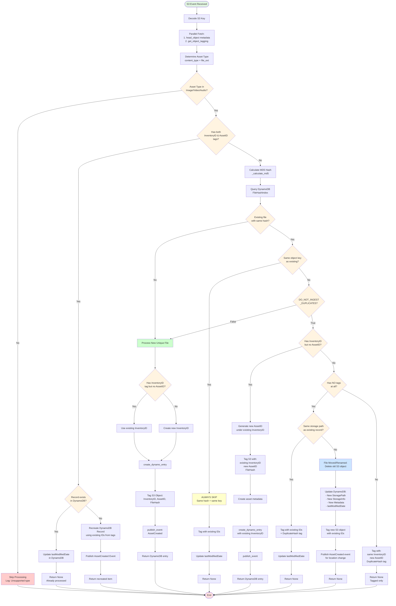
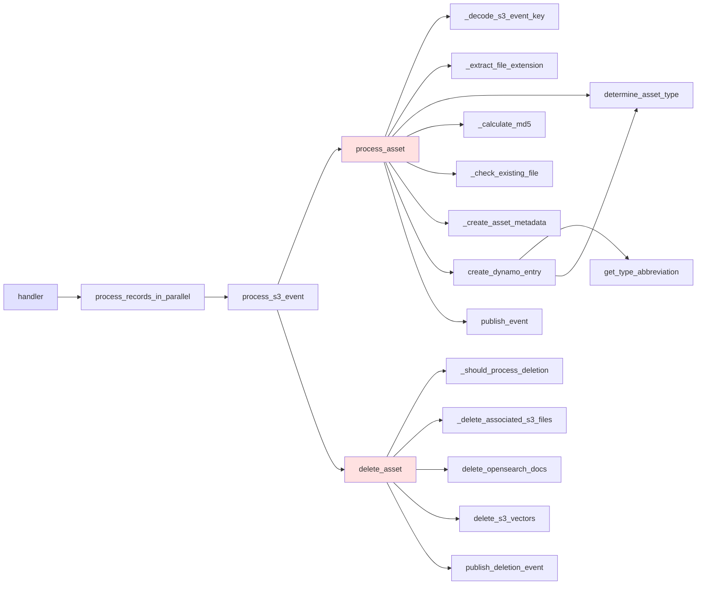

# S3 Ingest Lambda - Asset Processing Flow

This diagram shows the complete flow of asset processing in the S3 ingest Lambda, including all checks for duplicates, hashes, and asset identification.

## Key Decision Points

### 1. Asset Type Check

- **Location**: Lines 674-698
- **Purpose**: Only process Image, Video, or Audio assets
- **Action**: Skip processing for "Other" types

### 2. Existing Tags Check

- **Location**: Lines 703-866
- **Purpose**: Fast path for already-processed assets
- **Actions**:
  - If DB record exists: Update `lastModifiedDate` only
  - If DB record missing: Recreate record with existing IDs

### 3. Duplicate Hash Detection

- **Location**: Lines 869-1067
- **Purpose**: Detect files with same content (MD5 hash)
- **Key Logic**:
  - Same hash + same key = ALWAYS skip (regardless of settings)
  - Same hash + different key = Depends on `DO_NOT_INGEST_DUPLICATES`

### 4. DO_NOT_INGEST_DUPLICATES Setting

- **Location**: Lines 47-49, 938-1067
- **Purpose**: Control duplicate asset handling
- **Behaviors**:
  - `True`: Apply duplicate prevention logic (tag only, share InventoryID)
  - `False`: Create separate assets even with same hash

### 5. Inventory ID Handling

- **Location**: Lines 943-992, 1073-1084
- **Purpose**: Support grouping assets under same inventory
- **Logic**: If object has `InventoryID` tag but no `AssetID`, generate new AssetID under existing inventory

## Function Call Hierarchy

## Configuration Impact

### DO_NOT_INGEST_DUPLICATES = True (Default)

- Same content uploaded to different paths gets same `InventoryID`
- New `AssetID` generated for each unique path
- Tagged with `DuplicateHash` flag
- **Use case**: Prevent duplicate processing pipelines

### DO_NOT_INGEST_DUPLICATES = False

- Each upload creates completely separate asset
- Different `InventoryID` and `AssetID`
- Full processing for each copy
- **Use case**: Track each file instance independently

## Special Cases

### Same Hash + Same Key

- **Always skipped** regardless of `DO_NOT_INGEST_DUPLICATES`
- Only updates `lastModifiedDate`
- Represents exact same file (no change)

### Tagged Object Missing from DB

- **Recreates** DynamoDB record using existing tags
- Preserves original IDs for consistency
- Publishes `AssetCreated` event for downstream systems

### Object with Partial Tags

- InventoryID exists, AssetID missing
- Generates new AssetID under existing inventory
- Creates full asset entry with metadata

### File Moved/Renamed (New in this update)

- **Trigger**: Same hash, no tags, but different storage path from DB record
- **Actions**:
  1. Deletes old S3 object at previous location
  2. Updates DynamoDB record with new storage path and metadata
  3. Tags new S3 object with existing InventoryID and AssetID
  4. Publishes `AssetCreated` event to notify about location change
- **Use case**: Handles files that have been moved or renamed in S3
- **Metrics**: `OldObjectsDeleted`, `RecordsUpdatedWithNewPath`
- **Location**: Lines 994-1129 in `process_asset` method
