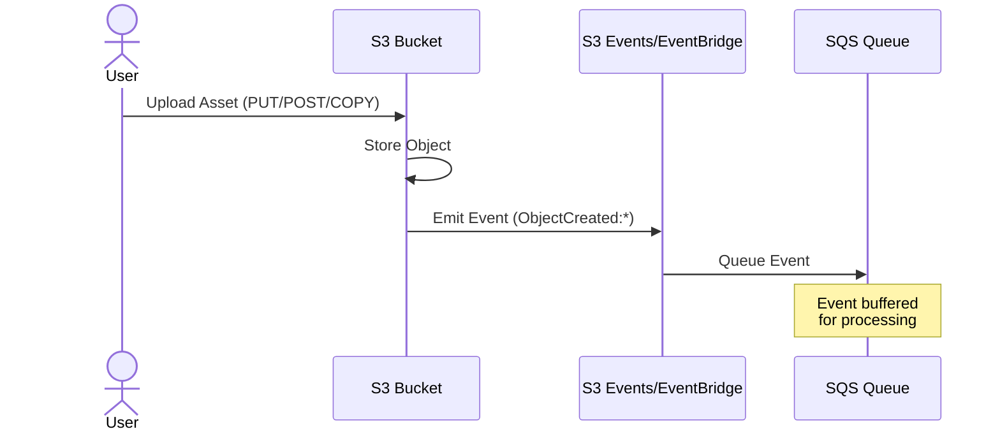
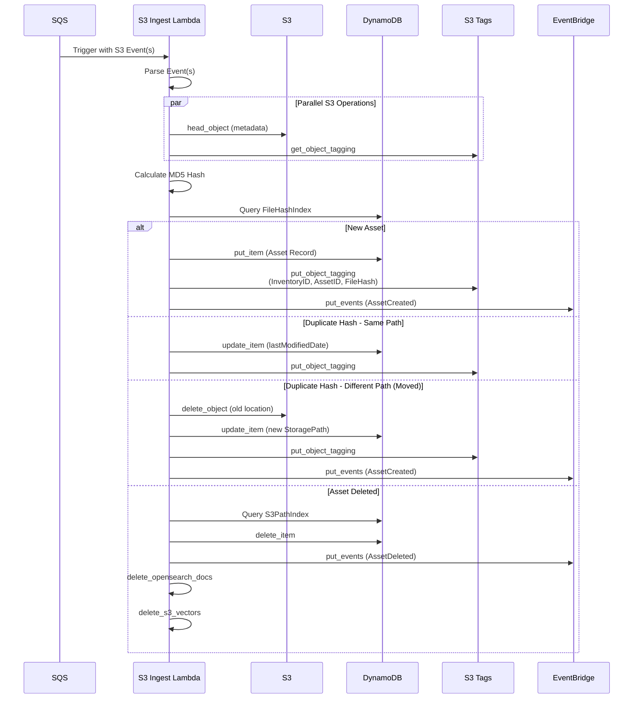
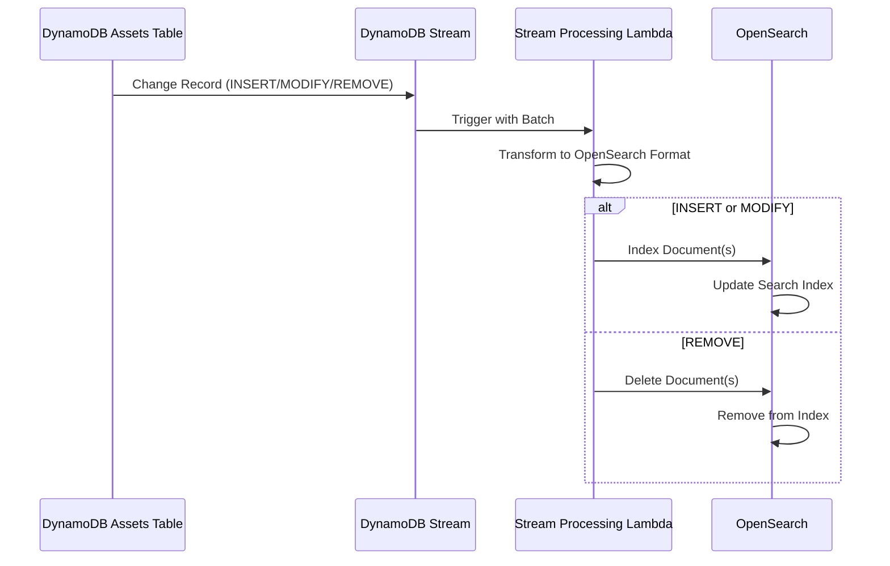
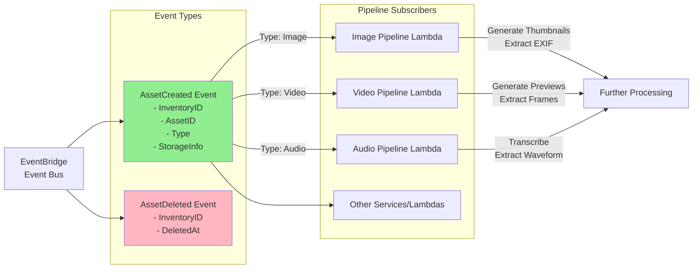

# S3 Ingest Connector - Architecture Overview

This document provides a comprehensive view of the S3 ingestion connector architecture, showing how assets flow through various AWS services.

## High-Level Architecture Diagram

b

## Detailed Component Interactions

### 1. Asset Upload & Event Generation



### 2. Lambda Processing Flow



### 3. DynamoDB Stream to OpenSearch



### 4. Event Distribution & Pipeline Processing



## Data Structures

### DynamoDB Asset Record

```json
{
  "InventoryID": "asset:uuid:{uuid}",
  "FileHash": "{md5-hash}",
  "StoragePath": "{bucket}:{key}",
  "DigitalSourceAsset": {
    "ID": "asset:{type-abbrev}:{uuid}",
    "Type": "Image|Video|Audio",
    "CreateDate": "ISO-8601",
    "IngestedAt": "ISO-8601",
    "originalIngestDate": "ISO-8601",
    "lastModifiedDate": "ISO-8601",
    "MainRepresentation": {
      "ID": "asset:rep:{uuid}:master",
      "Type": "Image|Video|Audio",
      "Format": "JPG|MP4|WAV|etc",
      "Purpose": "master",
      "StorageInfo": {
        "PrimaryLocation": {
          "StorageType": "s3",
          "Bucket": "{bucket-name}",
          "ObjectKey": {
            "Name": "{filename}",
            "Path": "{directory-path}",
            "FullPath": "{full-key}"
          },
          "Status": "active",
          "FileInfo": {
            "Size": 12345,
            "Hash": {
              "Algorithm": "SHA256",
              "Value": "{etag}",
              "MD5Hash": "{md5}"
            },
            "CreateDate": "ISO-8601"
          }
        }
      }
    }
  },
  "DerivedRepresentations": [],
  "Metadata": {
    "ObjectMetadata": {
      "ExtractedDate": "ISO-8601",
      "S3": {
        "Metadata": {},
        "ContentType": "image/jpeg",
        "LastModified": "ISO-8601"
      }
    }
  }
}
```

### S3 Object Tags

```
InventoryID: asset:uuid:{uuid}
AssetID: asset:{type}:{uuid}
FileHash: {md5-hash}
DuplicateHash: true|false (optional)
```

### EventBridge Events

**AssetCreated:**

```json
{
  "Source": "custom.asset.processor",
  "DetailType": "AssetCreated",
  "Detail": {
    "InventoryID": "asset:uuid:{uuid}",
    "FileHash": "{md5}",
    "DigitalSourceAsset": {
      "ID": "asset:{type}:{uuid}",
      "Type": "Image|Video|Audio",
      "CreateDate": "ISO-8601",
      "originalIngestDate": "ISO-8601",
      "lastModifiedDate": "ISO-8601",
      "MainRepresentation": {
        /* ... */
      }
    },
    "DerivedRepresentations": [],
    "Metadata": {
      /* ... */
    }
  }
}
```

**AssetDeleted:**

```json
{
  "Source": "custom.asset.processor",
  "DetailType": "AssetDeleted",
  "Detail": {
    "InventoryID": "asset:uuid:{uuid}",
    "DeletedAt": "ISO-8601"
  }
}
```

## Key AWS Services & Their Roles

### S3 Bucket

- **Purpose**: Primary storage for media assets
- **Configuration**: Event notifications enabled for ObjectCreated and ObjectRemoved events
- **Tags**: Lambda adds metadata tags (InventoryID, AssetID, FileHash)

### SQS Queue

- **Purpose**: Buffer S3 events for reliable processing
- **Benefit**: Decouples event generation from processing, provides retry capability
- **Configuration**: Dead Letter Queue for failed messages

### Lambda (S3 Ingest)

- **Runtime**: Python 3.x
- **Memory**: Configurable (recommend 1024MB+)
- **Timeout**: 15 minutes (for large file processing)
- **Concurrency**: Configurable based on load
- **Environment Variables**:
  - `ASSETS_TABLE`: DynamoDB table name
  - `EVENT_BUS_NAME`: EventBridge bus name
  - `DO_NOT_INGEST_DUPLICATES`: Boolean flag
  - `OPENSEARCH_ENDPOINT`: OpenSearch domain endpoint
  - `VECTOR_BUCKET_NAME`: S3 Vector Store bucket

### DynamoDB Assets Table

- **Primary Key**: `InventoryID` (String)
- **Global Secondary Indexes**:
  - `FileHashIndex`: Query by `FileHash` for duplicate detection
  - `S3PathIndex`: Query by `StoragePath` for deletions
- **Stream**: Enabled for real-time indexing to OpenSearch
- **On-Demand or Provisioned**: Based on workload

### EventBridge Event Bus

- **Purpose**: Distribute asset events to downstream services
- **Rules**: Filter events by DetailType, asset Type, etc.
- **Targets**: Pipeline Lambdas, SNS topics, Step Functions

### OpenSearch

- **Purpose**: Full-text search and analytics
- **Index**: `media` (configurable)
- **Population**: Via DynamoDB Stream Lambda
- **Deletion**: Direct from S3 Ingest Lambda

### S3 Vector Store

- **Purpose**: Store embeddings for semantic search
- **Population**: Via pipeline processing Lambdas
- **Deletion**: Direct from S3 Ingest Lambda
- **Index**: `media-vectors`

## Processing Metrics

The Lambda publishes CloudWatch metrics for monitoring:

### Operational Metrics

- `Invocations`: Lambda invocation count
- `RecordsProcessed`: Total S3 events processed
- `RecordsProcessedSuccessfully`: Successful processing count
- `RecordsSkipped`: Events skipped (unsupported types, etc.)
- `RecordsProcessedWithErrors`: Failed processing count

### Asset Metrics

- `ProcessedAssets`: New assets created
- `DeletedAssets`: Assets removed
- `UnsupportedAssetTypeSkipped`: Non-media files skipped
- `CreationEvents`: ObjectCreated event count

### Duplicate Detection

- `DuplicateCheckPerformed`: Hash checks executed
- `OldObjectsDeleted`: Old S3 objects deleted (moves/renames)
- `RecordsUpdatedWithNewPath`: Records updated for moved files

### Performance Metrics

- `EventProcessingTime`: Processing duration (seconds)
- `FailedEventProcessingTime`: Failed processing duration
- `MemoryUsedMB`: Lambda memory usage

### Data Operations

- `OpenSearchDocsDeleted`: OpenSearch documents deleted
- `VectorsDeleted`: S3 vector embeddings deleted
- `EventsPublished`: EventBridge events published
- `EventPublishErrors`: Failed event publications

## Error Handling

### Retry Strategy

1. **SQS Queue**: Failed Lambda invocations automatically retry
2. **Dead Letter Queue**: Messages that fail after max retries
3. **CloudWatch Logs**: Detailed error logging with context
4. **AWS X-Ray**: Distributed tracing for debugging

### Failure Scenarios

- **S3 Access Errors**: Logged and retried
- **DynamoDB Throttling**: Exponential backoff with adaptive retry mode
- **EventBridge Failures**: Logged for manual intervention
- **OpenSearch Errors**: Non-blocking (deletion continues)
- **S3 Vector Store Errors**: Non-blocking (deletion continues)

## Performance Considerations

### Optimization Techniques

1. **Parallel Processing**: ThreadPoolExecutor for concurrent S3 operations
2. **Global Client Reuse**: Clients initialized once per container
3. **LRU Caching**: Type mappings and determinations cached
4. **Batch Operations**: Multiple records processed per invocation
5. **Conditional Processing**: Early exit for unsupported types

### Scalability

- **Lambda Concurrency**: Auto-scales based on SQS queue depth
- **DynamoDB**: On-demand scaling or provisioned throughput
- **SQS**: Unlimited throughput
- **OpenSearch**: Configurable instance types and counts

## Security

### IAM Permissions Required

- **S3**: GetObject, PutObjectTagging, DeleteObject, HeadObject, GetObjectTagging
- **DynamoDB**: Query, GetItem, PutItem, UpdateItem, DeleteItem
- **EventBridge**: PutEvents
- **OpenSearch**: ESHttpPost, ESHttpDelete
- **S3 Vectors**: ListVectors, DeleteVectors
- **CloudWatch**: PutMetricData, CreateLogGroup, CreateLogStream, PutLogEvents
- **X-Ray**: PutTraceSegments, PutTelemetryRecords

### Data Security

- **Encryption at Rest**: S3, DynamoDB, OpenSearch all support encryption
- **Encryption in Transit**: All AWS service calls use TLS
- **VPC**: Lambda can run in VPC for network isolation
- **IAM Roles**: Least privilege access per service
