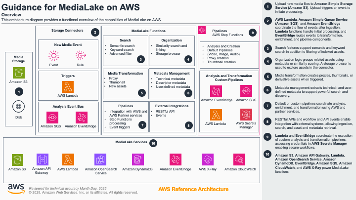
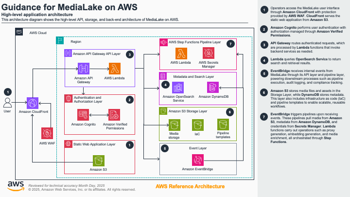
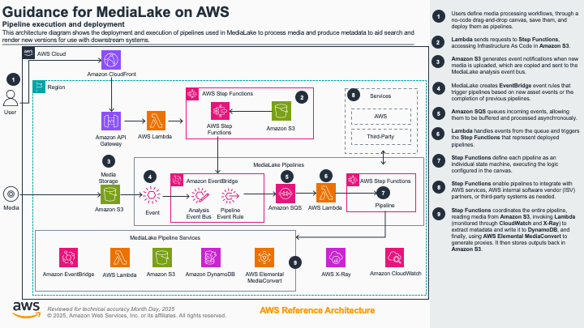

# Guidance for MediaLake on AWS

> **Table of Contents**
>
> - [Overview](#overview)
> - [Cost](#cost)
>   - [Cost Table](#cost-table)
> - [Development](#development)
>   - [Prerequisites](#prerequisites)
>   - [Operating System](#operating-system)
> - [Deployment Steps](#deployment-steps)
>   - [Clone the repository](#1-clone-the-repository)
>   - [Prepare the environment](#2-prepare-the-environment)
>   - [Configure AWS account and region](#3-configure-aws-account-and-region)
>   - [Configuration Setup](#4-configuration-setup)
>   - [Deploy using AWS CDK](#5-deploy-using-aws-cdk)
>   - [Alternative: Deploy using CloudFormation](#6-alternative-deploy-using-cloudformation-and-shell-script)
> - [Deployment Validation](#deployment-validation)
> - [Running the Guidance](#running-the-guidance)
>   - [Login](#1-login)
>   - [Connect Storage](#2-connect-storage)
>   - [Ingest Media](#3-ingest-media)
>   - [Enable Semantic Search and Integrations](#4-enable-semantic-search-and-integrations)
>   - [Process and Retrieve Assets](#5-process-and-retrieve-assets)
> - [Next Steps](#next-steps)
> - [Project Structure](#project-structure)
> - [Key Components](#key-components)
>   - [Storage Connectors](#storage-connectors)
>   - [Processing Pipelines](#processing-pipelines)
>   - [AWS Services Used](#aws-services-used)
> - [Security Features](#security-features)
> - [Supported Media Types](#supported-media-types)
>   - [Audio Files](#audio-files)
>   - [Video Files](#video-files)
>   - [Image Files](#image-files)
> - [Cleanup](#cleanup)
>   - [Using the Deletion Script](#using-the-deletion-script)
>   - [Manual Cleanup (AWS Console)](#manual-cleanup-aws-console)
> - [FAQ, Known Issues, and Additional Considerations](#faq-known-issues-and-additional-considerations)
> - [Revisions](#revisions)
> - [Notices](#notices)
> - [Acknowledgments](#acknowledgments)
> - [Authors](#authors)

---

## Overview

**Guidance for MediaLake on AWS** provides a comprehensive, serverless, and scalable platform for media ingestion, processing, management, and workflow orchestration on AWS. MediaLake enables you to connect various storage sources, ingest and organize media at scale, run customizable processing pipelines (such as proxy/thumbnail generation and AI enrichment), and integrate with both AWS native and partner services. 

MediaLake is designed for:
- Media organizations and content creators needing automated processing and enrichment of large media libraries.
- Use cases such as media asset management, automated compliance, and media AI/ML workflows.
- Organizations requiring secure, event-driven, and highly available media workflows.

### High-Level Overview


> _Diagram: MediaLake provides a comprehensive serverless platform connecting storage sources, processing pipelines, and enrichment services with secure user interfaces and API endpoints for scalable media management workflows._

### Application Architecture


> _Diagram: MediaLake application layer shows the React UI, API Gateway endpoints, Lambda functions, and data flow between Cognito authentication, DynamoDB storage, and OpenSearch indexing for user interactions and asset management._

### Pipeline Execution and Deployment


> _Diagram: MediaLake processes media through S3 ingestion, EventBridge routing, Lambda orchestration, Step Functions, and enrichment with metadata, search, and integration endpoints._

---

## Cost

You are responsible for the cost of the AWS services used while running this Guidance.
As of July 2025, the cost for running this Guidance with the **large deployment configuration** in the **US East (N. Virginia)** region is approximately **$401.23 per month** for the core infrastructure (not including add-ons or variable workloads). Add-on processing and enrichment services (like Twelve Labs and Transcription) will increase the cost depending on usage.

We recommend creating a **Budget through AWS Cost Explorer** to help manage costs. Prices are subject to change. For full details, refer to the pricing webpage for each AWS service used in this Guidance.

### Cost Table

| **Service & Usage**                           | **How It Relates to Your Team’s Usage**                                                                           | **Estimated Monthly Cost (USD)**                                                        |
| --------------------------------------------- | ----------------------------------------------------------------------------------------------------------------- | --------------------------------------------------------------------------------------- |
| **Cognito (Users)**                           | 50 active users signing in and using the system each month                                                        | \$2.00                                                                                  |
| **S3 + Step Functions (Uploads)**             | 1,000 new media files uploaded/month, each triggering a workflow                                                  | S3 storage: \$23.55<br>Step Functions: \$2.40                                           |
| **S3/CloudFront (Images, Audio, Video)**      | All users viewing/downloading images, audio, and video each month (aggregate, served via S3 and CloudFront)       | S3 requests: \$0.05 + \$0.40<br>CloudFront data: \$29.75<br>CloudFront requests: \$0.03 |
| **Total Media Downloaded (S3/CloudFront)**    | About 350GB of media files viewed/downloaded per month                                                            | S3 data transfer out: \$45.00                                                           |
| **Web/App Requests (CloudFront)**             | 25,000 clicks or page loads/month through CDN                                                                     | \$0.03                                                                                  |
| **API Gateway (API Requests)**                | 500,000 system actions/searches/uploads per month                                                                 | \$1.75                                                                                  |
| **Lambda (All Automated and API Processing)** | All automated backend tasks, API logic, file processing, and event handling; includes 1,000,000 invocations/month | \~\$13.00                                                                               |
| **Database Usage (DynamoDB)**                 | 200,000 new or updated records per month (write/read/storage)                                                     | Writes: \$18.75<br>Reads: \$7.50<br>Storage: \$25.00                                    |
| **Message Queues (SQS)**                      | 10,000 standard and 1,000 FIFO auto-messages per month                                                            | Standard: \$0.002<br>FIFO: \$0.0005                                                     |
| **Workflow Automations (Step Functions)**     | 1,000 automated workflows (pipelines), 20 steps each every month                                                  | \$2.40                                                                                  |
| **Encryption (KMS)**                          | 30 keys, 311,000 encryption/decryption actions per month                                                          | \$30.00 (CMK/month) + \$15.00 (requests) = \$45.00                                      |
| **Monitoring/Logging (CloudWatch)**           | Storage, metrics, logs for all services                                                                           | Data: \$7.50<br>Storage: \$0.07                                                         |
| **OpenSearch (Search)**                       | Search and index storage and compute                                                                              | t3.small: \$131.40 (2 instances)<br>Storage: \$2.44 (gp3)                               |
| **NAT Gateway (VPC)**                         | Outbound internet access from VPC                                                                                 | \$33.30                                                                                 |
| **WAF (Web Application Firewall)**            | API & web protection (rules + ACLs + requests)                                                                    | WebACL: \$5.00<br>Rules: \$2.00<br>Requests: \$0.30                                     |
| **EventBridge**                               | Event-driven triggers                                                                                             | \$0.01                                                                                  |
| **X-Ray (Tracing)**                           | Distributed trace monitoring                                                                                      | \$5.00                                                                                  |
| **TOTAL**                                     | **Monthly cost estimate for large deployment**                                                                   | **\$401.23**                                                                            |


## Development

### Prerequisites

- An AWS account with appropriate permissions to create and manage resources.
- **AWS CLI** configured with your account credentials.
- **AWS CDK CLI** (`npm install -g aws-cdk`).
- **Node.js** (v20.x or later).
- **Python** (3.12).
- **Docker** (for local development).
- **Git** for cloning the repository.
- Optional: Third-party services (such as Twelve Labs) require separate setup and API credentials for integration.

### Operating System

Development and deployment instructions are validated for **MacOS**, **Windows**, and **Linux**.
Deployment to AWS services is fully managed through the AWS CLI and Console and does not depend on local OS beyond the tools above.

> These deployment instructions are optimized for modern developer environments (MacOS/Windows/Linux). Deployment to AWS services (e.g., Lambda, CloudFormation, CDK) runs on AWS-managed infrastructure.

**Required Packages:**
- Python 3.12 (`python3 --version`)
- Node.js 20+ (`node --version`)
- Docker (`docker --version`)
- AWS CLI (`aws --version`)
- AWS CDK (`cdk --version`)

**Install examples (MacOS):**
```bash
brew install python node awscli docker
npm install -g aws-cdk
```

**Install examples (Linux, Ubuntu):**
```bash
sudo apt-get update
sudo apt-get install python3 python3-venv nodejs npm awscli docker.io
sudo npm install -g aws-cdk
```

---

## Deployment Steps

You can deploy MediaLake using either the AWS CDK or the provided CloudFormation/script-based workflow.

### 1. **Clone the repository**

```bash
git clone git@github.com:aws-solutions-library-samples/guidance-for-medialake.git
cd guidance-for-medialake
```

### 2. **Prepare the environment**

#### (a) **Python virtual environment (recommended):**
```bash
python3 -m venv .venv
source .venv/bin/activate      # Mac/Linux
# OR
.venv\Scriptsctivate.bat     # Windows
```

#### (b) **Install dependencies:**
```bash
pip install -r requirements.txt
npm install
```
For development:
```bash
pip install -r requirements-dev.txt
```

### 3. **Configure AWS account and region**

Ensure AWS credentials are configured (`aws configure`), and bootstrap your account for CDK (if using CDK):

```bash
cdk bootstrap --profile <profile> --region <region>
```

### 4. **Configuration Setup**

Create a [`config.json`](config.json) file in the project root with your deployment settings:

```bash
touch config.json
```

Key configuration parameters include:
- **environment**: Choose between "dev" or "prod"
- **deployment_size**: OpenSearch deployment size ("small", "medium", "large")
- **resource_prefix**: Prefix for all AWS resources created
- **account_id**: AWS Account ID for deployment
- **primary_region**: Primary region for deployment (tested in us-east-1)
- **initial_user**: Initial user configuration with email and name
- **vpc**: VPC configuration for using existing or creating new VPC
- **authZ**: Identity provider configuration (Cognito, SAML)

See the [`config-example.json`](config-example.json) for a complete configuration example.

---

### 5. **Deploy using CloudFormation Template**

Deploy directly using the CloudFormation template from GitHub:

1. Go to the AWS Console > CloudFormation > "Create Stack" > "With new resources (standard)".
2. Choose **Upload a template file**, select `medialake.template`.
3. Set stack name to `medialake-cf`.
4. Enter the required parameters as defined in your [`config.json`](config.json).
5. Accept the required IAM capabilities and deploy.

See the [`MediaLake-Installation-Guide.md`](assets/docs/MediaLake-Installation-Guide.md) for a complete CloudFormation deployment guide.

---

### 6. **Deploy using Deployment Script**

Use the provided shell script for automated deployment:

```bash
chmod +x assets/scripts/deploy-medialake.sh
./assets/scripts/deploy-medialake.sh --profile <your-aws-profile> --region us-east-1 --deploy
```
- The script automates S3 uploads, CloudFormation stack creation, and (optionally) redeployments or stack deletions.

---

### 7. **Deploy using AWS CDK**

```bash
cdk deploy --all --profile <profile> --region <region>
```
---

## Deployment Validation

1. In the AWS CloudFormation console, check that the stack `medialake-cf` (and related MediaLake stacks) are in **CREATE_COMPLETE** status.
2. After deployment, you will receive a welcome email at the address you provided, containing:
   - The MediaLake application URL
   - Username (your email)
   - Temporary password
3. Log in at the URL provided. You should see the MediaLake user interface and be able to add storage connectors and media.

---

## Running the Guidance

### 1. **Login**

Use the emailed credentials to log in to the MediaLake UI.

### 2. **Connect Storage**

- Navigate to **Settings > Connectors** in the UI.
- Add a connector, choosing Amazon S3 and providing your bucket details.

### 3. **Ingest Media**

- Upload media to your configured S3 bucket or use the UI’s manual upload feature.

### 4. **Enable Semantic Search and Integrations**

- Enable and configure semantic search providers (e.g., Twelve Labs) as described in the UI and [MediaLake-Instructions.docx](assets/docs/MediaLake-Instructions.docx).
- Import pipelines for enrichment and transcription.

### 5. **Process and Retrieve Assets**

- Monitor pipeline executions, view extracted metadata, and use search/discovery features in the UI.

---

## Next Steps

- Customize pipeline configurations for your use case.
- Scale up OpenSearch or DynamoDB for higher performance.

---

## Project Structure

```
medialake/
├── assets/                   # Documentation, images, and scripts
│   ├── docs/                 # Documentation files
│   ├── images/               # Architecture diagrams
│   └── scripts/              # Deployment and utility scripts
├── medialake_constructs/     # CDK construct definitions
│   ├── shared_constructs/    # Shared AWS constructs
│   └── api_gateway_connectors.py
├── medialake_stacks/         # CDK stack definitions
│   ├── base_infrastructure.py # Base infrastructure stack
│   └── api_gateway.py         # API Gateway stack
├── lambdas/                  # Lambda functions
│   ├── api/                  # API handlers
│   └── pipelines/           # Pipeline processors
├── medialake_user_interface/ # React-based user interface
├── pipeline_library/         # Pipeline templates and configurations
├── s3_bucket_assets/         # S3 deployment assets
├── app.py                    # Main CDK app
├── requirements.txt          # Python dependencies
├── cdk.json                 # CDK configuration
├── config.py                # Configuration interpreter and validator
├── config.json              # Configuration file
└── README.md                # This file
```

---

## Key Components

### Storage Connectors
- S3 Connector with EventBridge/S3 event integration
- Automatic resource provisioning (SQS, Lambda, IAM roles)
- Bucket exploration and management capabilities

### Processing Pipelines
- FIFO queue-based media processing
- Step Functions workflow orchestration
- Customizable processing steps
- Event-driven architecture

### AWS Services Used

**Core Services:**
- **AWS Lambda** - Serverless compute for API handlers and media processing
- **Amazon S3** - Object storage for media assets and metadata
- **AWS Step Functions** - Orchestration of media processing workflows
- **Amazon SQS** - Queues for ordered media processing
- **Amazon EventBridge** - Event routing and pipeline triggers
- **Amazon API Gateway** - REST API endpoint management
- **Amazon DynamoDB** - Asset metadata and configuration storage
- **AWS MediaConvert** - Media transcoding and format conversion service
- **Amazon Transcribe** - Speech-to-text transcription service (only when pipeline is imported and enabled)

**Security & Authentication:**
- **AWS Cognito** - User authentication and authorization
- **AWS KMS** - Encryption key management
- **AWS IAM** - Resource access control

**Monitoring & Search:**
- **Amazon CloudWatch** - Metrics, logging, and alerting
- **Amazon OpenSearch** - Search and analytics engine

---

## Security Features

- AWS Cognito authentication and authorization including support for local username/password and federated authentication via SAML
- KMS encryption for sensitive data
- IAM role-based access control
- CORS-enabled API endpoints
- VPC deployment options for network isolation

---

## Supported Media Types

MediaLake supports processing of the following file types through its default pipelines:

### Audio Files
- **WAV** - Waveform Audio File Format
- **AIFF/AIF** - Audio Interchange File Format
- **MP3** - MPEG Audio Layer III
- **PCM** - Pulse Code Modulation
- **M4A** - MPEG-4 Audio

### Video Files
- **FLV** - Flash Video
- **MP4** - MPEG-4 Part 14
- **MOV** - QuickTime Movie
- **AVI** - Audio Video Interleave
- **MKV** - Matroska Video
- **WEBM** - WebM Video
- **MXF** - Material Exchange Format

### Image Files
- **PSD** - Adobe Photoshop Document
- **TIF** - Tagged Image File Format
- **JPG/JPEG** - Joint Photographic Experts Group
- **PNG** - Portable Network Graphics
- **WEBP** - WebP Image Format
- **GIF** - Graphics Interchange Format
- **SVG** - Scalable Vector Graphics

Each media type is automatically processed through dedicated pipelines that handle metadata extraction, proxy/thumbnail generation, and integration with AI services for enhanced search and analysis capabilities.

---

## Cleanup

To remove all MediaLake resources:

### Using the Deletion Script:

```bash
chmod +x assets/scripts/delete_medialake_stacks.py
./assets/scripts/delete_medialake_stacks.py --profile <your-aws-profile> --region us-east-1
```
- The script will:
  - Identify all stacks with "MediaLake" prefix
  - Attempt deletion, handling dependencies automatically

### Manual Cleanup (AWS Console):

- Go to CloudFormation console
- Delete all stacks with prefix "MediaLake" and `medialake-cf`
- Delete any associated S3 buckets, DynamoDB tables, or other resources as needed

> **Warning:** This will permanently remove all MediaLake data and resources. Use with caution.

---

## FAQ, Known Issues, and Additional Considerations

- For feedback, questions, or suggestions, please use the [GitHub Issues page](https://github.com/aws-solutions-library-samples/guidance-for-medialake/issues).
- Known issues and deployment tips will be tracked in the Issues section.
- Service quotas: MediaLake relies on OpenSearch, DynamoDB, Lambda, and S3 limits; monitor and request increases if needed for large-scale deployments.
- For SAML integration and advanced identity provider setup, refer to the SAML instructions in [MediaLake-Instructions.docx](assets/docs/MediaLake-Instructions.docx).

---

## Revisions

- July 2025: Initial Alchemy format conversion.  
- See repository commit history for further changes.

---

## Notices

Customers are responsible for making their own independent assessment of the information in this Guidance. This Guidance: (a) is for informational purposes only, (b) represents AWS current product offerings and practices, which are subject to change without notice, and (c) does not create any commitments or assurances from AWS and its affiliates, suppliers or licensors. AWS products or services are provided “as is” without warranties, representations, or conditions of any kind, whether express or implied. AWS responsibilities and liabilities to its customers are controlled by AWS agreements, and this Guidance is not part of, nor does it modify, any agreement between AWS and its customers.

---

## Acknowledgments

- AWS CDK team for the excellent infrastructure as code framework
- AWS Lambda Powertools for Python
- The open-source community for various tools and libraries used in this project

---

## Authors

- Amazon Web Services, Inc. and contributors.

---

## License

Copyright Amazon.com, Inc. or its affiliates. All Rights Reserved.

Licensed under the Apache License, Version 2.0 (the "License"). You may not use this file except in compliance with the License. You may obtain a copy of the License at

<http://www.apache.org/licenses/LICENSE-2.0>

Unless required by applicable law or agreed to in writing, software distributed under the License is distributed on an "AS IS" BASIS, WITHOUT WARRANTIES OR CONDITIONS OF ANY KIND, either express or implied. See the License for the specific language governing permissions and limitations under the License.


