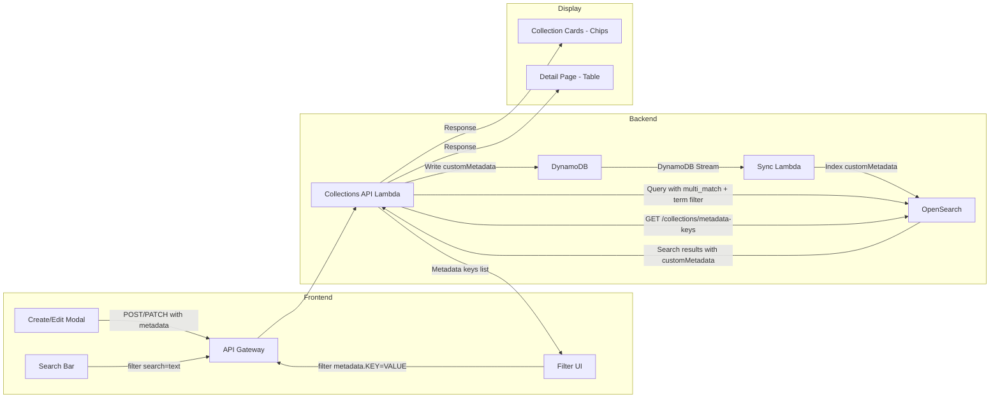
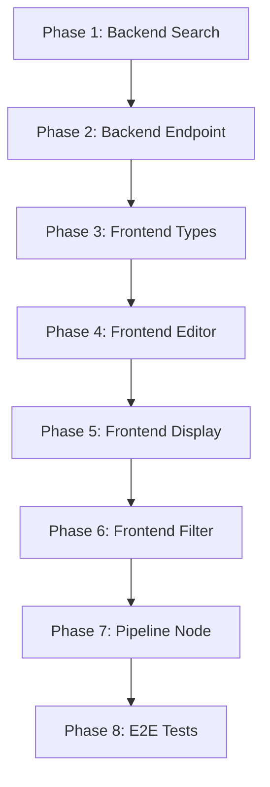

# Design Document: Custom Key-Value Metadata for MediaLake Collections

**Status:** Implementation-Ready
**Last Updated:** 2026-04-07

---

## 1. Overview

### Problem Statement

MediaLake collections currently store custom metadata in the backend but lack:

- Full-text search coverage for metadata values
- Dedicated key-value filter capabilities in the API
- Frontend UI for creating, editing, viewing, and filtering by metadata
- Pipeline node support for passing metadata during automated collection management

### Goals

1. Include custom metadata values in full-text search results
2. Provide a dedicated key-value filter API with a corresponding filter UI
3. Display metadata as chips on collection cards and as a table on detail pages
4. Allow the `collection_manager` pipeline node to accept custom metadata

### Design Decisions

| Decision               | Choice                                                       |
| ---------------------- | ------------------------------------------------------------ |
| Schema enforcement     | Fully free-form — any key name, any string value             |
| Search/filter strategy | Text search + dedicated key-value filter UI                  |
| Frontend display       | Chips on cards (list view) + key-value table (detail page)   |
| Pipeline nodes         | `collection_manager` node accepts `metadata` input parameter |

---

## 2. Architecture Diagram



### What Already Exists (No Changes Needed)

These components are fully functional and require zero modifications:

| Component                 | Location                                                                                        | What It Does                                    |
| ------------------------- | ----------------------------------------------------------------------------------------------- | ----------------------------------------------- |
| DynamoDB model            | [`db_models.py:57`](lambdas/api/collections_api/db_models.py:57)                                | `customMetadata = MapAttribute(null=True)`      |
| Create handler            | [`collections_post.py:84`](lambdas/api/collections_api/handlers/collections_post.py:84)         | Accepts `metadata` → stores as `customMetadata` |
| Update handler            | [`collections_ID_patch.py:81`](lambdas/api/collections_api/handlers/collections_ID_patch.py:81) | Accepts `metadata` → updates `customMetadata`   |
| Pydantic request (create) | [`collection_models.py:20`](lambdas/api/collections_api/models/collection_models.py:20)         | `metadata: Optional[Dict[str, Any]]`            |
| Pydantic request (update) | [`collection_models.py:63`](lambdas/api/collections_api/models/collection_models.py:63)         | `metadata: Optional[Dict[str, Any]]`            |
| Pydantic response         | [`collection_models.py:121`](lambdas/api/collections_api/models/collection_models.py:121)       | `customMetadata: Optional[Dict[str, Any]]`      |
| OpenSearch mapping        | [`index.py:62`](lambdas/sync/collections_sync/index.py:62)                                      | `customMetadata: object, dynamic: True`         |
| Sync transformer          | [`document_transformer.py:49`](lambdas/sync/collections_sync/document_transformer.py:49)        | Copies `customMetadata` to OpenSearch docs      |

---

## 3. Backend Changes

### 3.1 Search Query Builder — Add Metadata to Full-Text Search and Key-Value Filtering

**File:** [`collections_search.py`](lambdas/api/collections_api/utils/collections_search.py:14)

#### 3.1.1 Expand `multi_match` Fields

Currently, the [`multi_match`](lambdas/api/collections_api/utils/collections_search.py:107) query only searches `name` and `description`:

```python
# CURRENT (line 107-110)
"multi_match": {
    "query": search_text,
    "fields": ["name", "description"],
}
```

**Change:** Add `customMetadata.*` to the fields list so free-text search covers metadata values:

```python
# NEW
"multi_match": {
    "query": search_text,
    "fields": ["name", "description", "customMetadata.*"],
}
```

Since `customMetadata` is mapped as `{"type": "object", "dynamic": True}`, OpenSearch auto-creates sub-fields as `text` type. The wildcard `customMetadata.*` matches all dynamically created sub-fields.

#### 3.1.2 Add `metadata_filters` Parameter

Add a new parameter to [`search_collections()`](lambdas/api/collections_api/utils/collections_search.py:14) for key-value metadata filtering:

```python
def search_collections(
    user_id: str,
    search_text: Optional[str] = None,
    status_filter: Optional[str] = None,
    collection_type_filter: Optional[str] = None,
    owner_filter: Optional[str] = None,
    parent_id_filter: Optional[str] = None,
    metadata_filters: Optional[Dict[str, str]] = None,  # NEW
    page: int = 1,
    page_size: int = 50,
    sort_field: str = "name",
    sort_direction: str = "asc",
) -> Tuple[List[Dict[str, Any]], int]:
```

Inside the function, after existing filter clauses (around line 81), append metadata term filters:

```python
# Metadata key-value filters
if metadata_filters:
    for key, value in metadata_filters.items():
        filter_clauses.append({
            "term": {f"customMetadata.{key}.keyword": value}
        })
```

> **Note on `.keyword`:** When OpenSearch dynamically maps a string field inside `customMetadata`, it creates both a `text` field (for full-text) and a `.keyword` sub-field (for exact match). The term filter uses `.keyword` for exact matching.

#### 3.1.3 Add `get_metadata_keys()` Function

Add a new function for the metadata-keys aggregation endpoint:

```python
def get_metadata_keys(user_id: str) -> List[str]:
    """Return distinct custom metadata key names across all accessible collections.

    Uses an OpenSearch aggregation on the customMetadata field mapping
    to extract all dynamically created sub-field names.
    """
    client = get_opensearch_client()
    if not client:
        raise ConnectionError("OpenSearch client not available")

    # Access control: same should clause as search_collections
    should_clauses = [
        {"term": {"ownerId": user_id}},
        {"term": {"isPublic": True}},
        {"term": {"sharedWithUserIds": user_id}},
    ]

    query_body = {
        "size": 0,
        "query": {
            "bool": {
                "filter": [{"term": {"documentType": "collection"}}],
                "should": should_clauses,
                "minimum_should_match": 1,
            }
        },
        "aggs": {
            "metadata_keys": {
                "nested": {"path": "customMetadata"}  # Only needed if nested; see note below
            }
        }
    }

    # Since customMetadata is "object" (not "nested"), we use a different approach:
    # Fetch the index mapping and extract dynamically created field names.
    mapping = client.indices.get_mapping(index=COLLECTIONS_INDEX_NAME)
    props = mapping[COLLECTIONS_INDEX_NAME]["mappings"]["properties"]
    custom_metadata_props = props.get("customMetadata", {}).get("properties", {})

    return sorted(custom_metadata_props.keys())
```

> **Implementation Note:** Since `customMetadata` uses `dynamic: True` with `type: object` (not `nested`), the most reliable way to discover keys is from the index mapping itself. This returns all keys that have ever been indexed. For a production system with high metadata key cardinality, consider caching this result with a short TTL (e.g., 60s).

### 3.2 Query Parameters Model — Accept Metadata Filters

**File:** [`common_models.py:66`](lambdas/api/collections_api/models/common_models.py:66)

The current [`ListCollectionsQueryParams`](lambdas/api/collections_api/models/common_models.py:66) uses explicit `filter_*` fields. Since metadata keys are dynamic, we need a flexible approach.

**Change:** Add an optional `metadata_filters` dict that gets populated by the handler:

```python
class ListCollectionsQueryParams(BaseModel):
    """Query parameters for listing collections."""

    # ... existing fields unchanged ...

    # NEW: metadata key-value filters (populated by handler from filter[metadata.*] params)
    metadata_filters: Optional[Dict[str, str]] = Field(
        None, description="Metadata key-value filters extracted from filter[metadata.KEY]=VALUE"
    )

    model_config = ConfigDict(populate_by_name=True)
```

### 3.3 GET Handler — Parse Metadata Filter Params and Wire to Search

**File:** [`collections_get.py`](lambdas/api/collections_api/handlers/collections_get.py)

In the query parameter parsing block (around line 40-84), add extraction of `filter[metadata.*]` parameters:

```python
# After existing filter parsing (line 84), before constructing ListCollectionsQueryParams:

# Extract metadata filters: filter[metadata.KEY]=VALUE
metadata_filters = {}
all_params = app.current_event.query_string_parameters or {}
for param_name, param_value in all_params.items():
    if param_name.startswith("filter[metadata.") and param_name.endswith("]"):
        # Extract key name: "filter[metadata.project]" -> "project"
        meta_key = param_name[len("filter[metadata."):-1]
        if meta_key:
            metadata_filters[meta_key] = param_value

if metadata_filters:
    query_params_dict["metadata_filters"] = metadata_filters
```

Then pass `metadata_filters` to [`search_collections()`](lambdas/api/collections_api/utils/collections_search.py:14) (around line 135):

```python
results, total_hits = search_collections(
    user_id=user_id,
    search_text=query_params.filter_search,
    status_filter=...,
    collection_type_filter=...,
    owner_filter=...,
    parent_id_filter=parent_id_filter,
    metadata_filters=query_params.metadata_filters,  # NEW
    page=query_params.page,
    page_size=query_params.pageSize,
    sort_field=query_params.sort or "name",
    sort_direction=query_params.sortDirection or "asc",
)
```

### 3.4 New Endpoint: GET /collections/metadata-keys

**New file:** `lambdas/api/collections_api/handlers/collections_metadata_keys_get.py`

```python
"""GET /collections/metadata-keys — Return distinct metadata key names."""

from aws_lambda_powertools import Logger
from collections_utils import create_success_response, create_error_response
from user_auth import extract_user_context
from utils.collections_search import get_metadata_keys

logger = Logger(service="collections-metadata-keys")


def register_route(app):
    """Register GET /collections/metadata-keys route."""

    @app.get("/collections/metadata-keys")
    def collections_metadata_keys_get():
        try:
            user_context = extract_user_context(app.current_event.raw_event)
            user_id = user_context.get("user_id")

            keys = get_metadata_keys(user_id)

            return create_success_response(
                data={"keys": keys},
                request_id=app.current_event.request_context.request_id,
            )
        except Exception as e:
            logger.exception("Error fetching metadata keys", exc_info=e)
            return create_error_response(
                error_code="InternalServerError",
                error_message="Failed to fetch metadata keys",
                status_code=500,
                request_id=app.current_event.request_context.request_id,
            )
```

Register in the main app entry point where other handlers are registered.

---

## 4. Frontend Changes

### 4.1 TypeScript Collection Interface — Add `customMetadata`

**File:** [`useCollections.ts:33`](medialake_user_interface/src/api/hooks/useCollections.ts:33)

Add to the `Collection` interface:

```typescript
export interface Collection {
  // ... existing fields ...
  customMetadata?: Record<string, string>; // NEW
}
```

Add to `CreateCollectionRequest` and `UpdateCollectionRequest`:

```typescript
export interface CreateCollectionRequest {
  // ... existing fields ...
  metadata?: Record<string, string>; // NEW
}

export interface UpdateCollectionRequest {
  // ... existing fields ...
  metadata?: Record<string, string>; // NEW
}
```

Add to `UseGetCollectionsParams`:

```typescript
export interface UseGetCollectionsParams {
  // ... existing fields ...
  metadataFilters?: Record<string, string>; // NEW
}
```

In [`useGetCollections`](medialake_user_interface/src/api/hooks/useCollections.ts:289), add metadata filter params to the URL builder (around line 309):

```typescript
// NEW: metadata filters
if (params.metadataFilters) {
  Object.entries(params.metadataFilters).forEach(([key, value]) => {
    urlParams.append(`filter[metadata.${key}]`, value);
  });
}
```

### 4.2 New Hook: `useGetMetadataKeys`

**File:** [`useCollections.ts`](medialake_user_interface/src/api/hooks/useCollections.ts) (append to existing file)

```typescript
export interface MetadataKeysResponse {
  success: boolean;
  data: { keys: string[] };
  meta: {
    timestamp: string;
    version: string;
    request_id: string;
  };
}

export const useGetMetadataKeys = (enabled = true) => {
  const { showError } = useErrorModal();

  return useQuery<MetadataKeysResponse, Error>({
    queryKey: QUERY_KEYS.COLLECTIONS.metadataKeys(),
    enabled,
    staleTime: 60_000, // Cache for 60s since keys change infrequently
    queryFn: async ({ signal }) => {
      try {
        const response = await apiClient.get<MetadataKeysResponse>(
          API_ENDPOINTS.COLLECTIONS.METADATA_KEYS,
          { signal },
        );
        return response.data;
      } catch (error) {
        logger.error("Fetch metadata keys error:", error);
        showError("Failed to fetch metadata keys");
        throw error;
      }
    },
  });
};
```

**File:** [`endpoints.ts`](medialake_user_interface/src/api/endpoints.ts) — Add to `COLLECTIONS`:

```typescript
COLLECTIONS: {
  // ... existing ...
  METADATA_KEYS: "/collections/metadata-keys",  // NEW
},
```

**File:** [`queryKeys.ts`](medialake_user_interface/src/api/queryKeys.ts) — Add to `COLLECTIONS`:

```typescript
COLLECTIONS: {
  // ... existing ...
  metadataKeys: () => [...QUERY_KEYS.COLLECTIONS.all, "metadataKeys"] as const,  // NEW
},
```

### 4.3 Create Collection Modal — Add Key-Value Editor

**File:** [`CreateCollectionModal.tsx`](medialake_user_interface/src/components/collections/CreateCollectionModal.tsx:58)

#### UI Mockup

```
┌──────────────────────────────────────────────┐
│  Create Collection                        ✕  │
├──────────────────────────────────────────────┤
│  Name:        [________________________]     │
│  Description: [________________________]     │
│  Parent:      [None selected       ▼]        │
│  Type:        [Select type         ▼]        │
│  Public:      [toggle]                       │
│                                              │
│  ── Custom Metadata ─────────────────────    │
│  ┌──────────┐  ┌──────────────┐              │
│  │ project  │  │ alpha        │  [🗑]        │
│  └──────────┘  └──────────────┘              │
│  ┌──────────┐  ┌──────────────┐              │
│  │ region   │  │ us-west-2    │  [🗑]        │
│  └──────────┘  └──────────────┘              │
│                                              │
│  [+ Add Metadata]                            │
│                                              │
│              [Cancel]  [Create Collection]    │
└──────────────────────────────────────────────┘
```

#### State Changes

Add metadata state to the existing [`formData`](medialake_user_interface/src/components/collections/CreateCollectionModal.tsx:58):

```typescript
const [metadataRows, setMetadataRows] = useState<
  Array<{ key: string; value: string }>
>([]);

const addMetadataRow = () => {
  setMetadataRows((prev) => [...prev, { key: "", value: "" }]);
};

const removeMetadataRow = (index: number) => {
  setMetadataRows((prev) => prev.filter((_, i) => i !== index));
};

const updateMetadataRow = (
  index: number,
  field: "key" | "value",
  val: string,
) => {
  setMetadataRows((prev) =>
    prev.map((row, i) => (i === index ? { ...row, [field]: val } : row)),
  );
};
```

#### Submit Changes

In the submit handler, convert `metadataRows` to an object and include in the request:

```typescript
const metadata: Record<string, string> = {};
metadataRows.forEach((row) => {
  if (row.key.trim()) {
    metadata[row.key.trim()] = row.value.trim();
  }
});

const requestBody: CreateCollectionRequest = {
  name: formData.name,
  description: formData.description || undefined,
  parentId: formData.parentId || undefined,
  isPublic: formData.isPublic,
  collectionTypeId: formData.collectionTypeId || undefined,
  ...(Object.keys(metadata).length > 0 && { metadata }),
};
```

#### JSX for Key-Value Editor

```tsx
{
  /* Custom Metadata Section */
}
<Box sx={{ mt: 2 }}>
  <Typography variant="subtitle2" sx={{ mb: 1, fontWeight: 600 }}>
    {t("collections.customMetadata", "Custom Metadata")}
  </Typography>
  {metadataRows.map((row, index) => (
    <Box
      key={index}
      sx={{ display: "flex", gap: 1, mb: 1, alignItems: "center" }}
    >
      <TextField
        size="small"
        placeholder={t("collections.metadataKey", "Key")}
        value={row.key}
        onChange={(e) => updateMetadataRow(index, "key", e.target.value)}
        sx={{ flex: 1 }}
      />
      <TextField
        size="small"
        placeholder={t("collections.metadataValue", "Value")}
        value={row.value}
        onChange={(e) => updateMetadataRow(index, "value", e.target.value)}
        sx={{ flex: 1 }}
      />
      <IconButton size="small" onClick={() => removeMetadataRow(index)}>
        <DeleteIcon fontSize="small" />
      </IconButton>
    </Box>
  ))}
  <Button
    size="small"
    startIcon={<AddIcon />}
    onClick={addMetadataRow}
    sx={{ textTransform: "none" }}
  >
    {t("collections.addMetadata", "Add Metadata")}
  </Button>
</Box>;
```

### 4.4 Edit Collection Modal — Pre-Populated Key-Value Editor

**File:** [`EditCollectionModal.tsx`](medialake_user_interface/src/components/collections/EditCollectionModal.tsx:56)

Same key-value editor component as Create, but initialize `metadataRows` from the existing collection in the [`useEffect`](medialake_user_interface/src/components/collections/EditCollectionModal.tsx:93):

```typescript
useEffect(() => {
  if (collection && open) {
    setFormData({
      name: collection.name || "",
      description: collection.description || "",
      parentId: collection.parentId || "",
      isPublic: collection.isPublic || false,
      collectionTypeId: collection.collectionTypeId || "",
    });
    // Initialize metadata rows from existing customMetadata
    if (
      collection.customMetadata &&
      Object.keys(collection.customMetadata).length > 0
    ) {
      setMetadataRows(
        Object.entries(collection.customMetadata).map(([key, value]) => ({
          key,
          value: String(value),
        })),
      );
    } else {
      setMetadataRows([]);
    }
    // ... rest of reset logic
  }
}, [collection?.id, open]);
```

Include `metadata` in the PATCH request body using the same conversion logic as Create.

### 4.5 Shared KeyValueEditor Component (Optional Refactor)

To avoid duplicating the key-value editor in both modals, extract a reusable component:

**New file:** `medialake_user_interface/src/components/collections/KeyValueEditor.tsx`

```typescript
interface KeyValueEditorProps {
  rows: Array<{ key: string; value: string }>;
  onChange: (rows: Array<{ key: string; value: string }>) => void;
  label?: string;
}

export const KeyValueEditor: React.FC<KeyValueEditorProps> = ({
  rows,
  onChange,
  label = "Custom Metadata",
}) => {
  // Add/remove/update handlers
  // Renders the TextField rows + Add button
};
```

### 4.6 Collection Cards — Display Metadata as Chips

**File:** [`CollectionsPage.tsx:809`](medialake_user_interface/src/pages/CollectionsPage.tsx:809)

In the card's info section (around [`CardContent`](medialake_user_interface/src/pages/CollectionsPage.tsx:951) at line 951), after the collection name and before the stats line, add metadata chips:

```tsx
{
  /* Custom metadata chips */
}
{
  collection.customMetadata &&
    Object.keys(collection.customMetadata).length > 0 && (
      <Box sx={{ display: "flex", flexWrap: "wrap", gap: 0.5, mt: 0.5 }}>
        {Object.entries(collection.customMetadata)
          .slice(0, 3) // Show max 3 chips to avoid overflow
          .map(([key, value]) => (
            <Chip
              key={key}
              label={`${key}: ${value}`}
              size="small"
              variant="outlined"
              sx={{
                height: 20,
                fontSize: "0.65rem",
                fontWeight: 500,
                maxWidth: 150,
                color: "text.secondary",
                borderColor: alpha(theme.palette.divider, 0.2),
              }}
            />
          ))}
        {Object.keys(collection.customMetadata).length > 3 && (
          <Chip
            label={`+${Object.keys(collection.customMetadata).length - 3}`}
            size="small"
            sx={{
              height: 20,
              fontSize: "0.65rem",
              fontWeight: 500,
              color: "text.secondary",
              bgcolor: alpha(theme.palette.action.hover, 0.08),
            }}
          />
        )}
      </Box>
    );
}
```

#### Card Visual Mockup

```
┌──────────────────────────────┐
│                              │
│      [Thumbnail / Icon]      │
│                              │
├──────────────────────────────┤
│ 📁 My Video Collection       │
│ [project: alpha] [region: …] │
│ 12 assets · 2 sub · Jan 2025 │
│                     Private  │
└──────────────────────────────┘
```

### 4.7 Collection Detail Page — Full Key-Value Table

**File:** [`CollectionViewPage.tsx:97`](medialake_user_interface/src/pages/CollectionViewPage.tsx:97)

Add a "Custom Metadata" section below the collection header area. This should render when `collection.customMetadata` has entries:

```tsx
import {
  Table,
  TableBody,
  TableCell,
  TableContainer,
  TableHead,
  TableRow,
} from "@mui/material";

{
  /* Custom Metadata Section */
}
{
  collection?.customMetadata &&
    Object.keys(collection.customMetadata).length > 0 && (
      <Paper
        sx={{
          mt: 2,
          mb: 2,
          p: 2,
          borderRadius: 2,
          border: "1px solid",
          borderColor: alpha(theme.palette.divider, 0.1),
        }}
      >
        <Typography variant="subtitle2" sx={{ fontWeight: 600, mb: 1 }}>
          {t("collections.customMetadata", "Custom Metadata")}
        </Typography>
        <TableContainer>
          <Table size="small">
            <TableHead>
              <TableRow>
                <TableCell sx={{ fontWeight: 600, width: "40%" }}>
                  {t("collections.metadataKey", "Key")}
                </TableCell>
                <TableCell sx={{ fontWeight: 600 }}>
                  {t("collections.metadataValue", "Value")}
                </TableCell>
              </TableRow>
            </TableHead>
            <TableBody>
              {Object.entries(collection.customMetadata).map(([key, value]) => (
                <TableRow key={key}>
                  <TableCell>{key}</TableCell>
                  <TableCell>{String(value)}</TableCell>
                </TableRow>
              ))}
            </TableBody>
          </Table>
        </TableContainer>
      </Paper>
    );
}
```

#### Detail Page Visual Mockup

```
┌──────────────────────────────────────┐
│ My Video Collection                  │
│ Description text here...             │
├──────────────────────────────────────┤
│ Custom Metadata                      │
│ ┌────────────┬───────────────────┐   │
│ │ Key        │ Value             │   │
│ ├────────────┼───────────────────┤   │
│ │ project    │ alpha             │   │
│ │ region     │ us-west-2         │   │
│ │ department │ engineering       │   │
│ └────────────┴───────────────────┘   │
├──────────────────────────────────────┤
│ Assets (12)                          │
│ ...                                  │
└──────────────────────────────────────┘
```

### 4.8 Filter UI — Metadata Key-Value Filter

**File:** [`CollectionsPage.tsx:608`](medialake_user_interface/src/pages/CollectionsPage.tsx:608)

Add a metadata filter component alongside the existing sort controls:

#### State

```typescript
const [metadataFilterKey, setMetadataFilterKey] = useState<string>("");
const [metadataFilterValue, setMetadataFilterValue] = useState<string>("");
const { data: metadataKeysResponse } = useGetMetadataKeys();
const metadataKeys = metadataKeysResponse?.data?.keys || [];

// Compute active metadata filters for the query
const activeMetadataFilters = useMemo(() => {
  if (metadataFilterKey && metadataFilterValue) {
    return { [metadataFilterKey]: metadataFilterValue };
  }
  return undefined;
}, [metadataFilterKey, metadataFilterValue]);
```

Pass `activeMetadataFilters` to the `useGetCollections` hook:

```typescript
const { data, isLoading } = useGetCollections({
  page,
  pageSize,
  sort: sortBy,
  sortDirection: sortOrder,
  search: searchText,
  metadataFilters: activeMetadataFilters, // NEW
  // ... other params
});
```

#### JSX

```tsx
{
  /* Metadata Filter — next to sort controls */
}
<Box sx={{ display: "flex", alignItems: "center", gap: 1 }}>
  <FormControl size="small" sx={{ minWidth: 130 }}>
    <Select
      value={metadataFilterKey}
      onChange={(e) => {
        setMetadataFilterKey(e.target.value);
        setMetadataFilterValue(""); // Reset value when key changes
      }}
      displayEmpty
      sx={{ borderRadius: 2, height: 36, fontSize: "0.85rem" }}
    >
      <MenuItem value="">
        <em>{t("collections.filterByMetadata", "Filter by metadata")}</em>
      </MenuItem>
      {metadataKeys.map((key) => (
        <MenuItem key={key} value={key}>
          {key}
        </MenuItem>
      ))}
    </Select>
  </FormControl>

  {metadataFilterKey && (
    <TextField
      size="small"
      placeholder={t("collections.metadataValue", "Value")}
      value={metadataFilterValue}
      onChange={(e) => setMetadataFilterValue(e.target.value)}
      sx={{ width: 150 }}
      InputProps={{
        sx: { borderRadius: 2, height: 36, fontSize: "0.85rem" },
      }}
    />
  )}

  {metadataFilterKey && (
    <IconButton
      size="small"
      onClick={() => {
        setMetadataFilterKey("");
        setMetadataFilterValue("");
      }}
    >
      <CloseIcon fontSize="small" />
    </IconButton>
  )}
</Box>;
```

#### Filter UI Mockup

```
[Sort: Name ▼] [↑↓] [Filter by metadata ▼] [Value____] [✕]
                           │
                           ├─ project
                           ├─ region
                           └─ department
```

---

## 5. Pipeline Node Changes

**File:** [`collection_manager.yaml`](s3_bucket_assets/pipeline_nodes/node_templates/utility/collection_manager.yaml)

Add a new `Metadata` parameter to the [`manage`](s3_bucket_assets/pipeline_nodes/node_templates/utility/collection_manager.yaml:37) action's parameters list, after the existing `Owner ID` parameter (line 107):

```yaml
- in: body
  name: Metadata
  label: Custom Metadata
  description: >-
    Custom key-value metadata pairs for the collection.
    Format as JSON object, e.g. {"project": "alpha", "region": "us-west-2"}.
    For create, sets initial metadata. For update, merges with existing metadata.
  required: false
  schema:
    type: keyvalue
```

The pipeline execution Lambda that handles `collection_manager` operations should include the `Metadata` parameter value in the `metadata` field of the POST/PATCH request body it sends to the Collections API.

---

## 6. OpenSearch Query Patterns

### 6.1 Full-Text Search Including Metadata Values

```json
{
  "query": {
    "bool": {
      "must": [
        {
          "multi_match": {
            "query": "alpha",
            "fields": ["name", "description", "customMetadata.*"]
          }
        }
      ],
      "filter": [{ "term": { "documentType": "collection" } }],
      "should": [
        { "term": { "ownerId": "user-123" } },
        { "term": { "isPublic": true } },
        { "term": { "sharedWithUserIds": "user-123" } }
      ],
      "minimum_should_match": 1
    }
  }
}
```

### 6.2 Key-Value Metadata Filter

Filter collections where `customMetadata.project` equals exactly `"alpha"`:

```json
{
  "query": {
    "bool": {
      "filter": [
        { "term": { "documentType": "collection" } },
        { "term": { "customMetadata.project.keyword": "alpha" } }
      ],
      "should": [
        { "term": { "ownerId": "user-123" } },
        { "term": { "isPublic": true } },
        { "term": { "sharedWithUserIds": "user-123" } }
      ],
      "minimum_should_match": 1
    }
  }
}
```

### 6.3 Metadata Keys Discovery (Index Mapping Approach)

```python
GET /collections-index/_mapping

# Response structure:
{
  "collections-index": {
    "mappings": {
      "properties": {
        "customMetadata": {
          "dynamic": "true",
          "properties": {
            "project": { "type": "text", "fields": { "keyword": { "type": "keyword" } } },
            "region": { "type": "text", "fields": { "keyword": { "type": "keyword" } } }
          }
        }
      }
    }
  }
}

# Extract keys: ["project", "region"]
```

---

## 7. API Contract

### 7.1 Modified: GET /collections

**New query parameters:**

| Parameter                | Type   | Description                                                                                     |
| ------------------------ | ------ | ----------------------------------------------------------------------------------------------- |
| `filter[metadata.{KEY}]` | string | Exact-match filter on a specific metadata key. Multiple metadata filters supported (AND logic). |

**Example:**

```
GET /collections?filter[metadata.project]=alpha&filter[metadata.region]=us-west-2
```

**Response:** No changes to response schema. The existing `customMetadata` field in `CollectionMetadata` already returns metadata.

### 7.2 New: GET /collections/metadata-keys

**Description:** Returns all distinct metadata key names across collections accessible to the current user.

**Request:**

```
GET /collections/metadata-keys
Authorization: Bearer {token}
```

**Response:**

```json
{
  "success": true,
  "data": {
    "keys": ["department", "project", "region"]
  },
  "meta": {
    "timestamp": "2026-04-07T23:00:00Z",
    "version": "v1",
    "request_id": "req-abc123"
  }
}
```

### 7.3 Existing: POST /collections (No Change to Contract)

Already accepts `metadata` in request body. Documenting for completeness:

```json
{
  "name": "My Collection",
  "description": "A project collection",
  "metadata": {
    "project": "alpha",
    "region": "us-west-2"
  }
}
```

### 7.4 Existing: PATCH /collections/{id} (No Change to Contract)

Already accepts `metadata` in request body:

```json
{
  "metadata": {
    "project": "beta",
    "department": "engineering"
  }
}
```

**Behavior note:** The current implementation replaces the entire `customMetadata` map. The frontend should always send the full metadata object (not a partial update).

---

## 8. Migration & Backward Compatibility

### Existing Collections Without Metadata

- **DynamoDB:** `customMetadata` is `null` for collections created without metadata. No migration needed.
- **OpenSearch:** Documents without `customMetadata` simply won't have sub-fields. The `multi_match` with `customMetadata.*` gracefully handles missing fields (no match, no error).
- **Frontend:** All UI components check `collection.customMetadata && Object.keys(collection.customMetadata).length > 0` before rendering. No metadata = no chips, no table, no issue.
- **Filter:** The metadata keys dropdown only shows keys that exist in the index mapping. If no collections have metadata, the dropdown is empty.

### Data Migration

**No data migration is required.** The backend already persists `customMetadata` for any collection that was created/updated with it. The only change is making the frontend expose the capability and the search include the field.

### OpenSearch Index Re-Mapping

**No re-mapping is required.** The `customMetadata` field already has `dynamic: True` in the index mapping. New metadata keys are automatically mapped when indexed.

### API Backward Compatibility

- All new query parameters (`filter[metadata.*]`) are optional. Existing API clients are unaffected.
- The new `/collections/metadata-keys` endpoint is additive. No existing endpoints change.
- The response schema is unchanged — `customMetadata` is already in the response model.

---

## 9. Testing Strategy

### Backend Tests

| Test                                       | Type        | Description                                                                               |
| ------------------------------------------ | ----------- | ----------------------------------------------------------------------------------------- |
| `test_search_includes_metadata_values`     | Integration | Verify `multi_match` with `customMetadata.*` returns collections matching metadata values |
| `test_metadata_filter_exact_match`         | Integration | Verify `filter[metadata.project]=alpha` returns only matching collections                 |
| `test_metadata_filter_multiple_keys`       | Integration | Verify multiple `filter[metadata.*]` params use AND logic                                 |
| `test_metadata_filter_no_results`          | Integration | Verify filter returns empty when no match                                                 |
| `test_metadata_filter_ignores_other_users` | Integration | Verify access control still applies with metadata filters                                 |
| `test_metadata_keys_endpoint`              | Integration | Verify `/collections/metadata-keys` returns correct keys                                  |
| `test_metadata_keys_empty`                 | Unit        | Verify empty keys list when no metadata exists                                            |
| `test_query_param_extraction`              | Unit        | Verify `filter[metadata.KEY]` params are correctly parsed into `metadata_filters` dict    |
| `test_backward_compat_no_filters`          | Unit        | Verify requests without metadata filters work identically to before                       |

### Frontend Tests

| Test                                          | Type        | Description                                          |
| --------------------------------------------- | ----------- | ---------------------------------------------------- |
| `KeyValueEditor.renders.empty`                | Unit        | Verify editor renders with no rows initially         |
| `KeyValueEditor.add.remove.rows`              | Unit        | Verify add/remove row functionality                  |
| `CreateCollectionModal.submits.metadata`      | Unit        | Verify metadata rows are included in request body    |
| `EditCollectionModal.loads.existing.metadata` | Unit        | Verify existing metadata pre-populates rows          |
| `CollectionCard.shows.metadata.chips`         | Unit        | Verify chips render for collections with metadata    |
| `CollectionCard.no.chips.without.metadata`    | Unit        | Verify no chips when `customMetadata` is null/empty  |
| `CollectionCard.truncates.at.3.chips`         | Unit        | Verify max 3 chips + overflow indicator              |
| `CollectionViewPage.shows.metadata.table`     | Unit        | Verify key-value table renders on detail page        |
| `MetadataFilter.populates.dropdown`           | Unit        | Verify dropdown shows keys from `useGetMetadataKeys` |
| `MetadataFilter.applies.filter`               | Integration | Verify filter values update query params             |

### E2E Tests

| Test                              | Description                                                                                                        |
| --------------------------------- | ------------------------------------------------------------------------------------------------------------------ |
| `create-collection-with-metadata` | Create a collection with metadata → verify chips appear on card → verify table on detail page                      |
| `edit-collection-metadata`        | Edit metadata on existing collection → verify changes persist                                                      |
| `search-by-metadata-value`        | Create collection with metadata → search by a metadata value → verify collection appears in results                |
| `filter-by-metadata-key-value`    | Create collections with different metadata → filter by specific key-value → verify only matching collections shown |

---

## 10. Implementation Order

The recommended implementation sequence ensures each layer is testable before building on it:



### Phase 1 — Backend: Expand Search Query

1. Modify [`search_collections()`](lambdas/api/collections_api/utils/collections_search.py:14) — add `customMetadata.*` to `multi_match` fields
2. Add `metadata_filters` parameter and term filter logic
3. Write integration tests for search with metadata

### Phase 2 — Backend: Query Params + New Endpoint

4. Update [`ListCollectionsQueryParams`](lambdas/api/collections_api/models/common_models.py:66) with `metadata_filters` field
5. Update [`collections_get.py`](lambdas/api/collections_api/handlers/collections_get.py) to parse `filter[metadata.*]` params
6. Add [`get_metadata_keys()`](lambdas/api/collections_api/utils/collections_search.py:14) function
7. Create `collections_metadata_keys_get.py` handler and register route
8. Write tests for new endpoint and param parsing

### Phase 3 — Frontend: Types & Hooks

9. Add `customMetadata` to [`Collection`](medialake_user_interface/src/api/hooks/useCollections.ts:33) interface
10. Add `metadata` to [`CreateCollectionRequest`](medialake_user_interface/src/api/hooks/useCollections.ts:105) and [`UpdateCollectionRequest`](medialake_user_interface/src/api/hooks/useCollections.ts:114)
11. Add `metadataFilters` to [`UseGetCollectionsParams`](medialake_user_interface/src/api/hooks/useCollections.ts:193) and wire in [`useGetCollections`](medialake_user_interface/src/api/hooks/useCollections.ts:289)
12. Add [`useGetMetadataKeys`](medialake_user_interface/src/api/hooks/useCollections.ts) hook
13. Update [`endpoints.ts`](medialake_user_interface/src/api/endpoints.ts) and [`queryKeys.ts`](medialake_user_interface/src/api/queryKeys.ts)

### Phase 4 — Frontend: Create/Edit Modals

14. Create `KeyValueEditor` reusable component
15. Integrate into [`CreateCollectionModal`](medialake_user_interface/src/components/collections/CreateCollectionModal.tsx:58)
16. Integrate into [`EditCollectionModal`](medialake_user_interface/src/components/collections/EditCollectionModal.tsx:56) with pre-population
17. Write unit tests for editor and modal integration

### Phase 5 — Frontend: Display

18. Add metadata chips to collection cards in [`CollectionsPage.tsx`](medialake_user_interface/src/pages/CollectionsPage.tsx:809)
19. Add metadata table to [`CollectionViewPage.tsx`](medialake_user_interface/src/pages/CollectionViewPage.tsx:97)
20. Write unit tests for display components

### Phase 6 — Frontend: Filter UI

21. Add metadata filter controls to [`CollectionsPage.tsx`](medialake_user_interface/src/pages/CollectionsPage.tsx:608)
22. Wire filter state to `useGetCollections` params
23. Write tests for filter functionality

### Phase 7 — Pipeline Node

24. Add `Metadata` parameter to [`collection_manager.yaml`](s3_bucket_assets/pipeline_nodes/node_templates/utility/collection_manager.yaml)
25. Update the collection_manager Lambda to pass metadata to the API

### Phase 8 — E2E Tests

26. Write end-to-end test: create with metadata, search, filter, edit
