# MediaLake Installation & Integration Guide

## 1. Base Installation

### Deploy via CloudFormation

1. **Open AWS Console** and switch to your desired region.  
   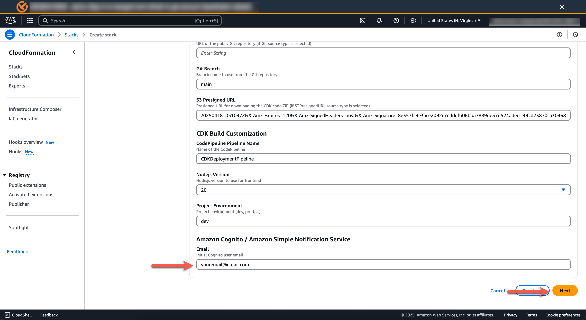
2. Go to **CloudFormation** > click **Create Stack** > **With new resources (standard)**.
   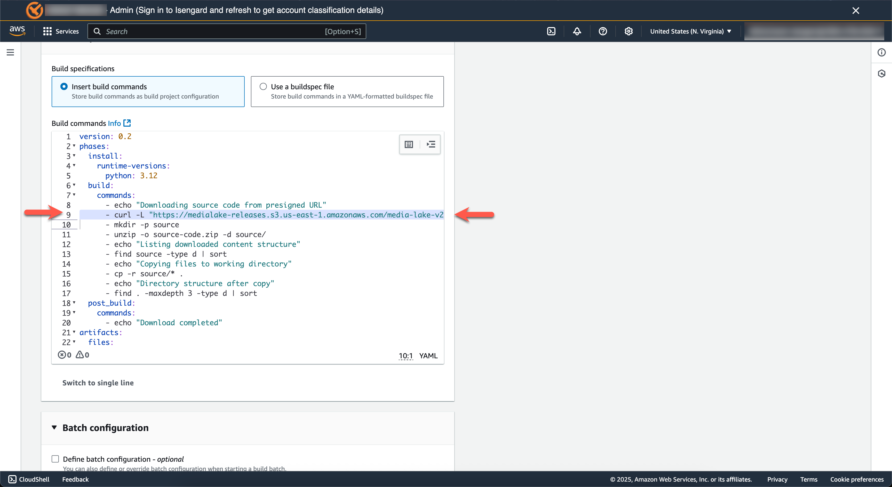
3. Choose **Upload a template file**, select `medialake.template`.
   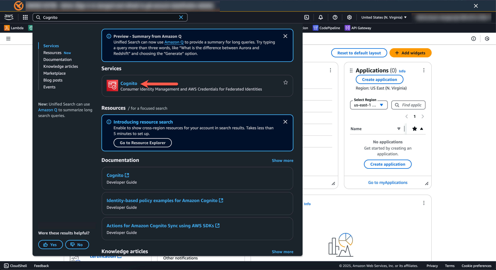
4. Name the stack `medialake-cf`.
   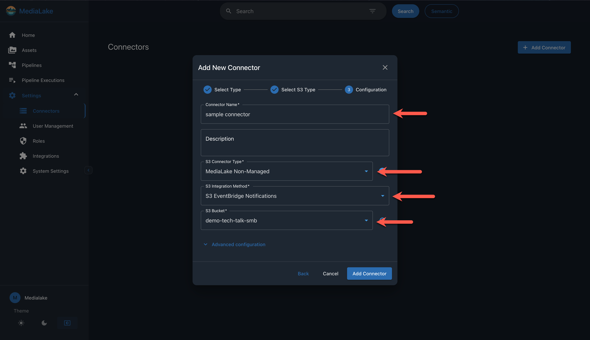

5. **Configure Initial Media Lake User**:
   - **Email**: Enter your email address to receive a welcome email
   - **First Name**: Enter the administrator's first name
   - **Last Name**: Enter the administrator's last name
   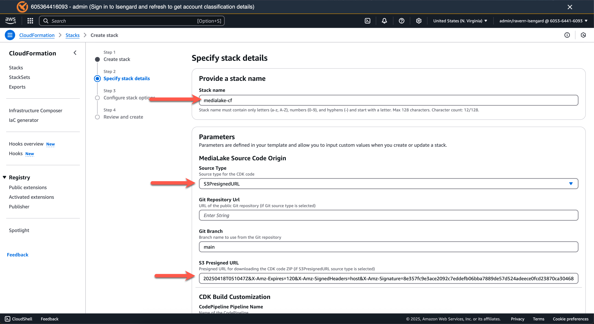

6. **Configure Media Lake Settings**:
   - **Media Lake Environment Name**: Set environment name (e.g., `dev`, `prod`, `staging`)
   - **OpenSearch Deployment Size**: Choose deployment size:
     - `small` - For development/testing
     - `medium` - For moderate production workloads
     - `large` - For high-volume production workloads

7. **Configure Media Lake Deployment**:
   - **Source Type**: Choose between:
     - **Git** - Deploy from a public Git repository
     - **S3PresignedURL** - Deploy from a presigned URL
   - **Git Repository URL**: If using Git source, enter the repository URL (default: `https://github.com/aws-solutions-library-samples/guidance-for-medialake`)
   - **S3 Presigned URL**: If using S3PresignedURL source, paste the presigned URL
   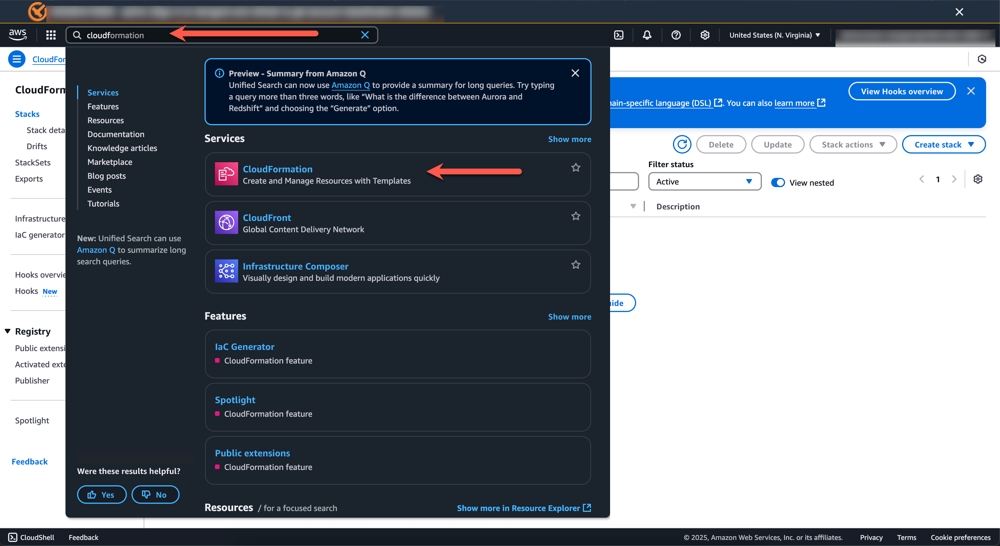

8. Acknowledge required checkboxes, hit **Next**, then **Submit**.
   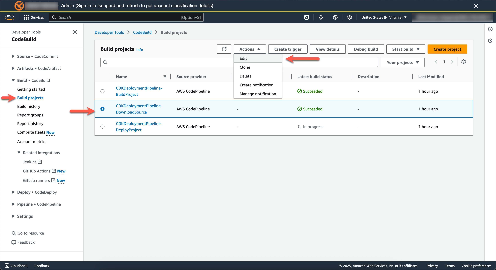
9. After provisioning, you'll receive login details by email.
   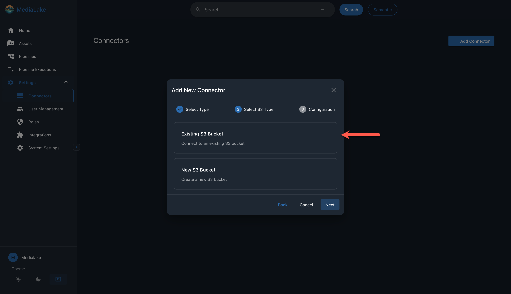

---

## 2. Template Parameters Reference

The [`medialake.template`](../../medialake.template) CloudFormation template includes the following configurable parameters:

### Initial Media Lake User
- **InitialUserEmail**: Email address for the initial administrator account (required)
- **InitialUserFirstName**: First name of the initial administrator (1-50 characters, letters/spaces/hyphens/periods only)
- **InitialUserLastName**: Last name of the initial administrator (1-50 characters, letters/spaces/hyphens/periods only)

### Media Lake Configuration
- **MediaLakeEnvironmentName**: Environment identifier (1-10 alphanumeric characters, default: `dev`)
- **OpenSearchDeploymentSize**: Controls the size of your OpenSearch cluster
  - `small`: Suitable for development and testing environments
  - `medium`: Recommended for moderate production workloads
  - `large`: Designed for high-volume production environments

### Media Lake Deployment Configuration
- **SourceType**: Deployment source method
  - `Git`: Deploy directly from a public Git repository
  - `S3PresignedURL`: Deploy from a ZIP file via presigned URL
- **GitRepositoryUrl**: Public Git repository URL (default: AWS Solutions Library MediaLake repository)
- **S3PresignedURL**: Presigned URL for ZIP file download (required when using S3PresignedURL source type)

---

## 3. Storage Connector Setup

After deployment, you'll need to configure storage connectors to connect MediaLake to your data sources.

### 3.1 Initial Login

1. **Access MediaLake**: Use the login credentials sent to your email after deployment
2. **Navigate to the MediaLake web interface** using the URL provided in the deployment completion email

### 3.2 Configure S3 Storage Connectors

1. **Navigate to Connectors**:
   - Log in to MediaLake
   - Go to **Settings** > **Connectors**
   - Click **Add Connector**

2. **Configure Connector Settings**:
   
   **Step 1: Select Type**
   - Choose **Amazon S3**
   - Click **Next** to proceed
   
   **Step 2: Select S3 Type**
   - Choose your S3 bucket option:
     - **Existing S3 Bucket**: Connect to an existing S3 bucket
     - **New S3 Bucket**: Create a new S3 bucket
   - Click **Next** to proceed
   
   **Step 3: Configuration**
   
   **For Existing S3 Bucket:**
   - **Connector Name**: Enter a descriptive name for your connector
   - **Description**: Add an optional description for the connector
   - **S3 Connector Type**: Select from the dropdown options
   - **S3 Integration Method**: Choose the integration method from available options
   - **S3 Bucket**: Select your existing bucket from the dropdown list
   
   **For New S3 Bucket:**
   - **Connector Name**: Enter a descriptive name for your connector
   - **Description**: Add an optional description for the connector
   - **S3 Connector Type**: Select from the dropdown options
   - **S3 Integration Method**: Choose the integration method from available options
   - **New Bucket Name**: Enter the S3 bucket name (must be globally unique and follow S3 naming rules)
   
   **Advanced Configuration** (optional):
   - **Object Prefix**: Enter an optional prefix to filter objects (e.g., 'folder/')
   - Click **Add Prefix** to add additional prefixes if needed

3. **Complete Setup**:
   - Review your configuration settings
   - Click **Add Connector** to create the connector

### 3.3 Configure Connector Permissions

Ensure your S3 bucket has the appropriate IAM policies for MediaLake to access your content:

```json
{
  "Version": "2012-10-17",
  "Statement": [
    {
      "Effect": "Allow",
      "Principal": {
        "AWS": "arn:aws:iam::YOUR-ACCOUNT:role/MediaLake-*"
      },
      "Action": [
        "s3:GetObject",
        "s3:ListBucket",
        "s3:PutObject"
      ],
      "Resource": [
        "arn:aws:s3:::your-bucket-name",
        "arn:aws:s3:::your-bucket-name/*"
      ]
    }
  ]
}
```

### 3.4 Sync and Index Content

1. **Initial Sync**:
   - After creating the connector, navigate back to the Connectors list
   - Find your newly created connector and click the sync button to perform an initial scan
   - This will discover and index existing media files in your S3 bucket

2. **Monitor Sync Status**:
   - Check the S3 batch report in the AWS Console to monitor sync operation status
   - The **Last Updated** timestamp will show when the last sync occurred

### 3.5 Verify Setup

1. **Browse Assets**: Navigate to the **Assets** section to verify that files from your S3 bucket are visible
2. **Check Metadata**: Verify that file metadata is being extracted correctly

---

## 4. Semantic Search & Integrations

- **Enable Semantic Search**:
  - Configure your semantic search provider in MediaLake.
  - Add and configure the **Twelve Labs** integration.
  - Import pipelines for Twelve Labs.
- **Ingest Content**:
  - Upload assets to the connected S3 buckets.

---

## 5. Incremental Updates

### For S3PresignedURL Source Type

To update source code via presigned URL:

1. In AWS, go to **CodeBuild** > **Build projects**.
   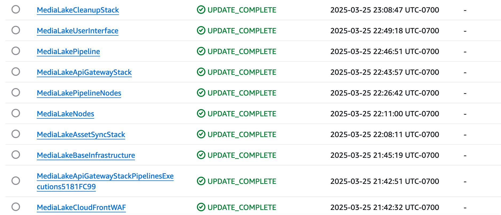
2. Select the `MediaLakeCDKPipeline-DownloadSource` project.
   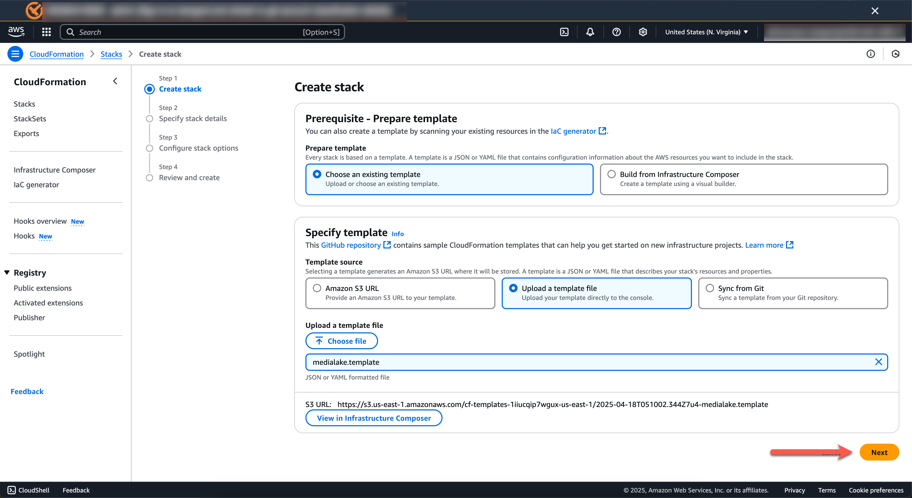
3. Click **Actions** > **Edit**.
   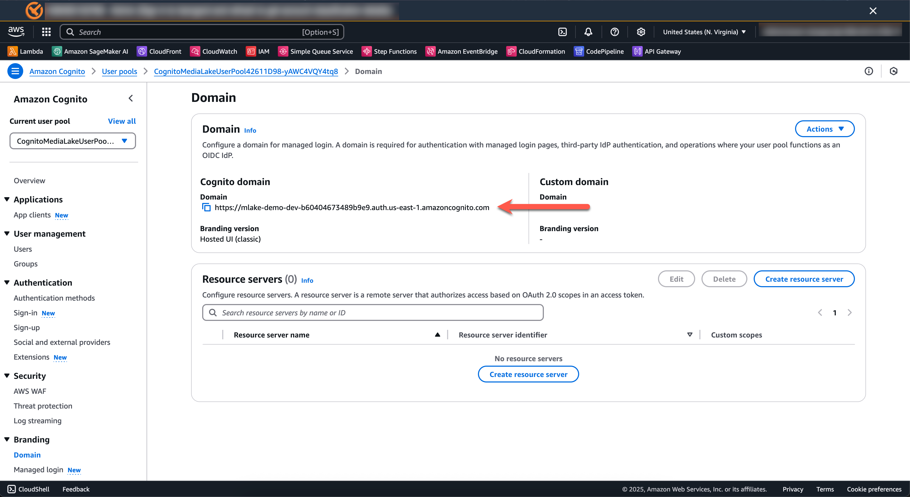
4. Locate the build command with `curl -L "${S3PresignedURL}" -o source-code.zip`.
   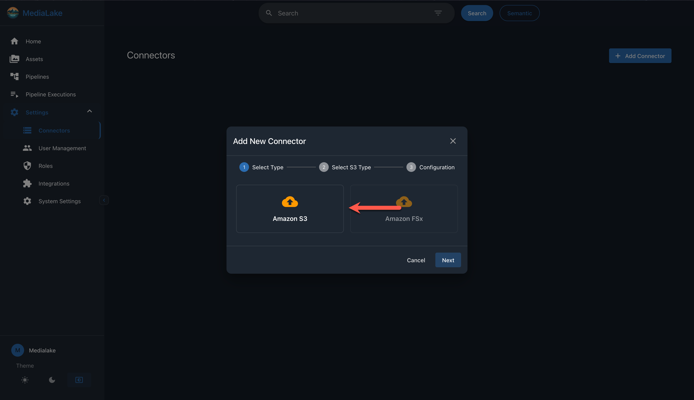
5. Replace the URL with the latest presigned URL provided to you (keep quotes and output file name).
6. Save changes and start the build to redeploy.

### For Git Source Type

To update source code from Git repository:

1. In AWS, go to **CodeBuild** > **Build projects**.
2. Select the `MediaLakeCDKPipeline-GitClone` project.
3. Click **Actions** > **Edit**.
4. Update the **GIT_REPOSITORY_URL** environment variable with the new repository URL if needed.
5. Update the **GIT_BRANCH** environment variable if you want to deploy from a different branch.
6. Save changes and start the build to redeploy.

**Note**: For Git source type, the pipeline will automatically pull the latest code from the specified branch on each execution.

---

## 6. SAML Integration

- Create the MediaLake app in your identity provider (Okta, etc.).
  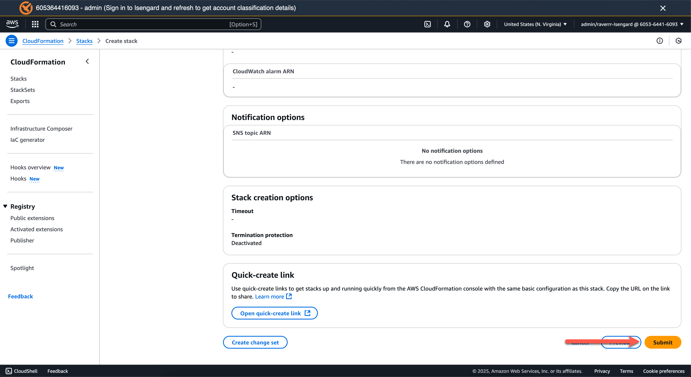
- Use placeholder URLs for SSO endpoints initially.
  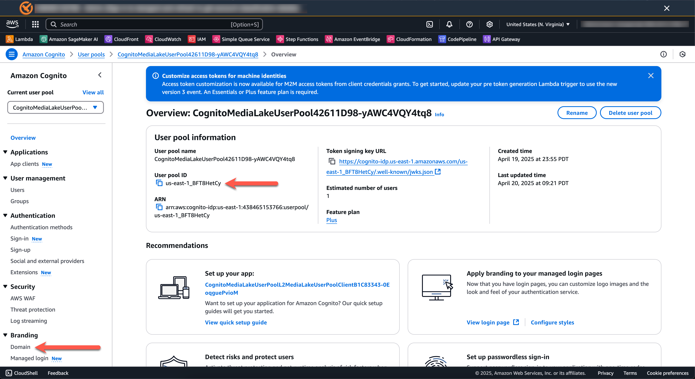
- After deployment, copy your Cognito **User Pool ID** and **domain** from AWS Cognito.
  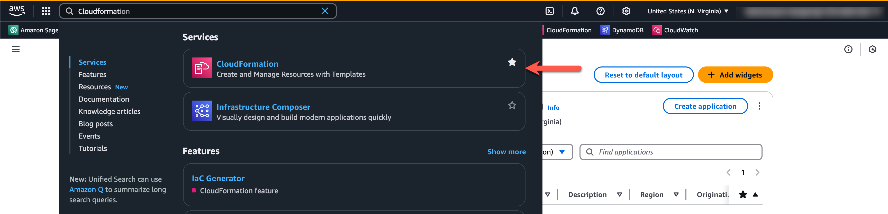
- Set up SAML metadata, audience URI, and relay state using the provided format and IDs.
  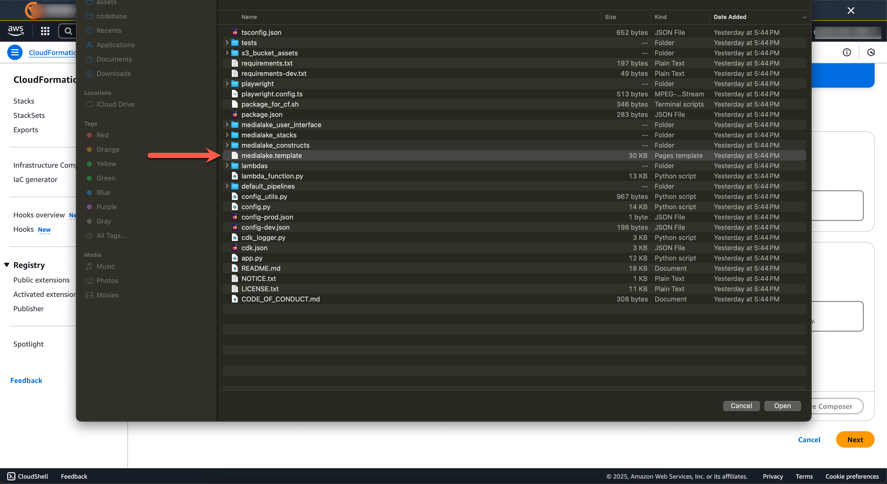
- Map attributes:
  - `emailaddress` → user.email
  - `surname` → user.lastName
  - `givenname` → user.firstName
  - `role` → user.role

---

## 7. Pipelines & Integration Creation

- **Create Integrations**:
  - Log in > go to **Integrations** > add/configure required third-party integrations.
- **Import Pipelines**:
  - Go to **Pipelines** > **Import**.
  - Assign credentials if required for specific nodes.

---

## 8. Full Redeploy / Stack Cleanup

- In CloudFormation, delete all stacks prefixed with `MediaLake` and `medialake-cf`.
  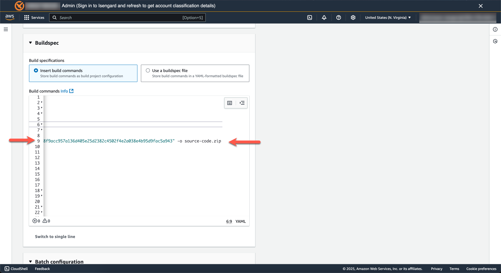
- If you encounter dependency errors, retry after deleting prerequisite stacks.
  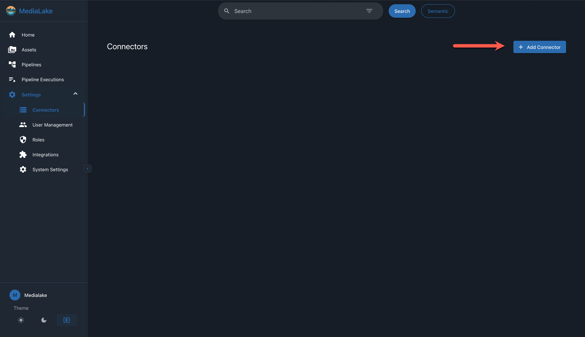
- When clean, redeploy using the base install steps above.

---

## 9. Manual Stack Removal

- Some AWS resources may require manual deletion if cleanup fails.
- Check for CloudFormation errors and remove orphaned resources as needed.

---

## 10. Troubleshooting & Additional Notes

- Ensure all required integrations are configured **before** importing or running pipelines.
- For development, MacOS, Windows, and Linux are supported.

---