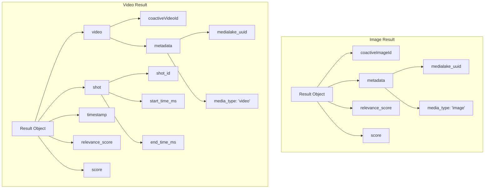
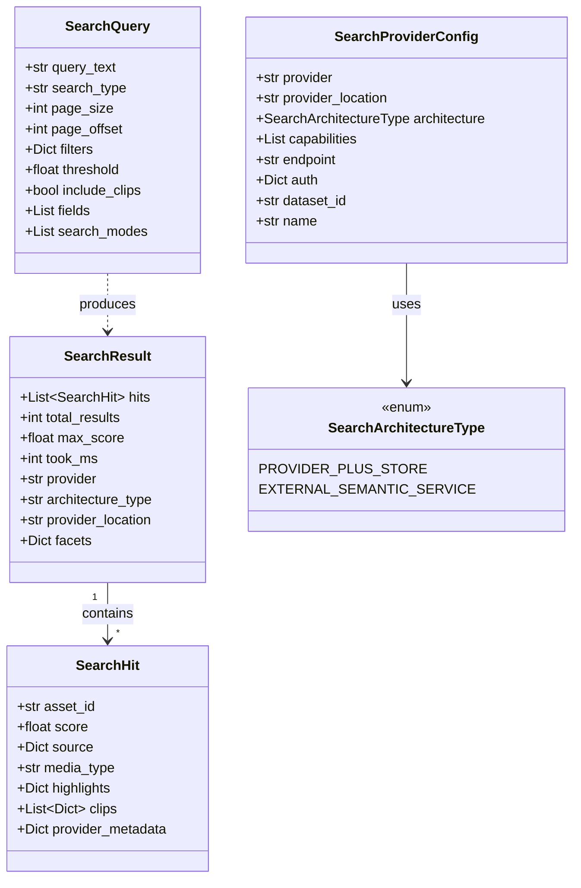
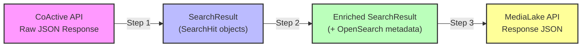
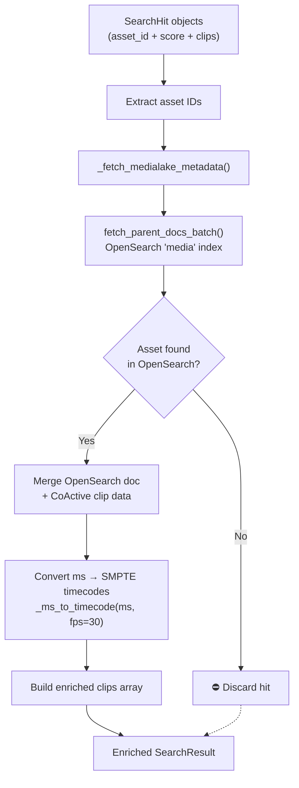
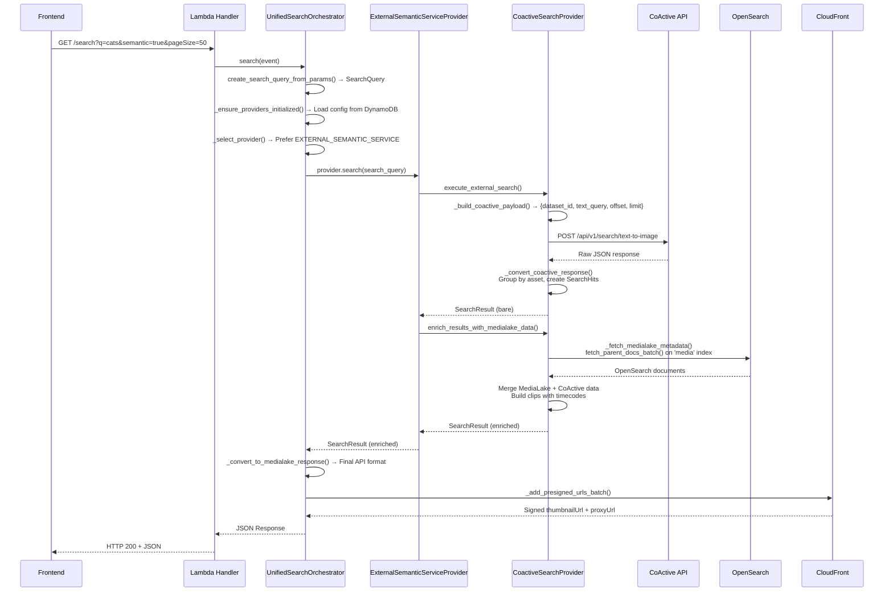
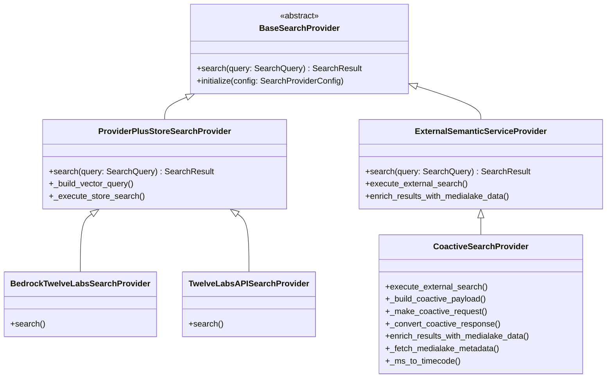
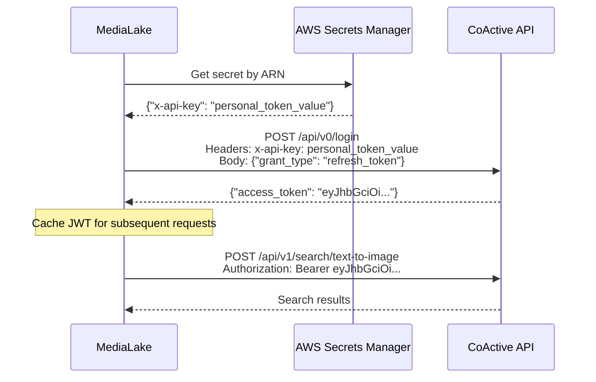

# CoActive Semantic Search Integration — Data Model & Transformation Pipeline

> **Last updated:** 2026-04-24
>
> Primary reference document for developers working on the CoActive search integration in MediaLake.

---

## Table of Contents

1. [Overview](#1-overview)
2. [CoActive Response Data Model](#2-coactive-response-data-model)
3. [Internal Data Models](#3-internal-data-models)
4. [Transformation Pipeline](#4-transformation-pipeline-coactive-response--medialake-search-results)
5. [End-to-End Search Flow](#5-end-to-end-search-flow)
6. [Class Hierarchy](#6-class-hierarchy)
7. [Authentication Flow](#7-authentication-flow)
8. [Configuration](#8-configuration)
9. [Key API Endpoints & Constants](#9-key-api-endpoints--constants)
10. [File Reference Index](#10-file-reference-index)

---

## 1. Overview

**CoActive** is integrated into MediaLake as an **External Semantic Service** for multimodal (image + video) semantic search. Unlike the "Provider Plus Store" architecture used by TwelveLabs — where embedding generation and vector storage are handled by separate components — CoActive combines both search and storage into a single external service.

MediaLake's unified search architecture supports two provider patterns:

| Architecture                    | Description                                                          | Example                     |
| ------------------------------- | -------------------------------------------------------------------- | --------------------------- |
| **`PROVIDER_PLUS_STORE`**       | Embedding provider + separate vector store (OpenSearch / S3 Vectors) | TwelveLabs (Bedrock or API) |
| **`EXTERNAL_SEMANTIC_SERVICE`** | Search + storage bundled in one external service                     | **CoActive**                |

When a semantic search request arrives, the [`UnifiedSearchOrchestrator`](lambdas/api/search/get_search/unified_search_orchestrator.py) selects a provider. If both architecture types are configured and enabled, it **prefers `EXTERNAL_SEMANTIC_SERVICE`** over `PROVIDER_PLUS_STORE`.

CoActive supports:

- **Image search** — returns matching images with relevance scores
- **Video search** — returns matching video _shots_ (temporal segments) grouped by parent asset, with millisecond-precision timing

After CoActive returns raw results, MediaLake enriches them with metadata from OpenSearch and generates presigned CloudFront URLs for thumbnails and proxies before returning the final response to the frontend.

---

## 2. CoActive Response Data Model

### API Endpoint

```
POST https://api.coactive.ai/api/v1/search/text-to-image
```

### Response Structure

```json
{
  "data": [
    {
      "coactiveImageId": "ca-img-abc123",
      "metadata": {
        "medialake_uuid": "550e8400-e29b-41d4-a716-446655440000",
        "media_type": "image"
      },
      "relevance_score": 0.95,
      "score": 0.95
    },
    {
      "video": {
        "coactiveVideoId": "ca-vid-def456",
        "metadata": {
          "medialake_uuid": "7c9e6679-7425-40de-944b-e07fc1f90ae7",
          "media_type": "video"
        }
      },
      "shot": {
        "shot_id": "shot-001",
        "start_time_ms": 12000,
        "end_time_ms": 18000
      },
      "timestamp": 15000,
      "relevance_score": 0.9,
      "score": 0.9
    }
  ],
  "total_count": 42
}
```

### Key Observations

| Aspect                   | Detail                                                                                                                                                                       |
| ------------------------ | ---------------------------------------------------------------------------------------------------------------------------------------------------------------------------- |
| **Results array**        | All results live in the `data` array field                                                                                                                                   |
| **Total count**          | `total_count` holds the total number of matching results                                                                                                                     |
| **Scoring**              | CoActive does **not** always provide explicit scores. The code handles this gracefully by deriving scores from rank position: `1.0 / rank`                                   |
| **Image results**        | `coactiveImageId` at the **top level**, with `metadata.medialake_uuid` identifying the MediaLake asset                                                                       |
| **Video results**        | Nested `video` object containing `coactiveVideoId` and `metadata`, plus a `shot` object with temporal boundaries (`start_time_ms`, `end_time_ms`) and a `timestamp` midpoint |
| **Media type detection** | Determined by the presence/absence of the `video` key in the result object                                                                                                   |

### Image vs. Video Result Structures



---

## 3. Internal Data Models

All internal models are defined in [`unified_search_models.py`](lambdas/api/search/get_search/unified_search_models.py). These dataclasses provide a provider-agnostic abstraction layer.

### `SearchArchitectureType` (enum)

```python
# unified_search_models.py:122
class SearchArchitectureType(str, Enum):
    PROVIDER_PLUS_STORE = "provider_plus_store"
    EXTERNAL_SEMANTIC_SERVICE = "external_semantic_service"
```

Determines how the orchestrator routes a search request and which provider base class handles execution.

---

### `SearchQuery`

```python
# unified_search_models.py:146
@dataclass
class SearchQuery:
    query_text: str                    # The user's search text (e.g., "cats playing")
    search_type: str                   # "semantic", "keyword", etc.
    page_size: int                     # Number of results per page (default: 50)
    page_offset: int                   # Pagination offset
    filters: Optional[Dict]           # Metadata filters (collection, media type, etc.)
    threshold: Optional[float]        # Minimum relevance score threshold
    include_clips: bool               # Whether to include temporal clips for video
    fields: Optional[List[str]]       # Specific fields to return
    search_modes: Optional[List[str]] # Search mode qualifiers
```

Created by `create_search_query_from_params()` from the incoming HTTP request query parameters.

---

### `SearchHit`

```python
# unified_search_models.py:180
@dataclass
class SearchHit:
    asset_id: str                              # MediaLake UUID
    score: float                               # Relevance score (0.0–1.0)
    source: Optional[Dict]                     # Enriched metadata from OpenSearch
    media_type: Optional[str]                  # "image" or "video"
    highlights: Optional[Dict]                 # Text highlights (unused for CoActive)
    clips: Optional[List[Dict]]               # Temporal segments for video results
    provider_metadata: Optional[Dict]          # Raw provider-specific data
```

Represents a single search result after the CoActive response is converted. For video assets, a single `SearchHit` may contain **multiple clips** (temporal segments) grouped under the same `asset_id`.

---

### `SearchResult`

```python
# unified_search_models.py:193
@dataclass
class SearchResult:
    hits: List[SearchHit]                       # Ordered list of search hits
    total_results: int                          # Total matching results from provider
    max_score: Optional[float]                  # Highest relevance score in results
    took_ms: Optional[int]                      # Search execution time in milliseconds
    provider: str                               # Provider identifier (e.g., "coactive")
    architecture_type: str                      # "external_semantic_service"
    provider_location: Optional[str]            # Provider endpoint URL
    facets: Optional[Dict]                      # Aggregation facets (if any)
```

Container for a complete set of search results from a single provider invocation.

---

### `SearchProviderConfig`

```python
# unified_search_models.py:207
@dataclass
class SearchProviderConfig:
    provider: str                               # "coactive"
    provider_location: str                      # API endpoint URL
    architecture: SearchArchitectureType        # EXTERNAL_SEMANTIC_SERVICE
    capabilities: List[str]                     # ["image", "video"]
    endpoint: str                               # CoActive API URL
    store: Optional[str]                        # None for external services
    auth: Dict                                  # {"secret_arn": "arn:aws:..."}
    metadata_mapping: Optional[Dict]            # Field mapping configuration
    callbacks: Optional[Dict]                   # Callback configuration
    dataset_id: str                             # CoActive dataset identifier
    name: str                                   # "Coactive AI"
    id: str                                     # "coactive"
    type: str                                   # "coactive"
    dimensions: Optional[int]                   # Embedding dimensions (if applicable)
    target_index: Optional[str]                 # Target index (None for CoActive)
```

Loaded from DynamoDB during provider initialization. Encapsulates all configuration needed to execute searches against CoActive.

---

### Data Model Relationships



---

## 4. Transformation Pipeline (CoActive Response → MediaLake Search Results)

The transformation from raw CoActive API response to the final MediaLake API response happens in **three distinct steps**:



---

### Step 1: `_convert_coactive_response()`

> **File:** [`coactive_search_provider.py`](lambdas/api/search/get_search/coactive_search_provider.py) — lines 329–471

This method transforms the raw CoActive JSON response into a `SearchResult` containing `SearchHit` objects.

#### Algorithm

1. **Extract results** from `response["data"]`
2. **Iterate** over each result with enumeration (for rank-based scoring)
3. **Detect media type** by checking for the presence of the `"video"` key
4. **Extract `medialake_uuid`:**
   - Images: `result["metadata"]["medialake_uuid"]`
   - Videos: `result["video"]["metadata"]["medialake_uuid"]`
5. **Extract timing info** (videos only) from `result["shot"]`:
   - `start_time_ms`
   - `end_time_ms`
   - `timestamp_ms` (from `result["timestamp"]`)
   - `shot_id`
6. **Compute score:**
   - Use `result["relevance_score"]` if present
   - Fall back to `result["score"]` if present
   - Otherwise derive from rank: **`1.0 / rank`**
7. **Group by asset UUID** into an `assets_with_clips` dictionary — multiple CoActive results for the same video are aggregated as clips under a single asset entry
8. **Create `SearchHit` objects** with `asset_id`, `score` (max score across clips), grouped `clips`, and `media_type`

#### Pseudocode

```python
def _convert_coactive_response(self, response: dict, search_query: SearchQuery) -> SearchResult:
    results = response.get("data", [])
    total_count = response.get("total_count", len(results))
    assets_with_clips = {}  # {uuid: {"score": float, "clips": [...], "media_type": str}}

    for rank, result in enumerate(results, start=1):
        is_video = "video" in result

        # Extract UUID
        if is_video:
            uuid = result["video"]["metadata"]["medialake_uuid"]
        else:
            uuid = result["metadata"]["medialake_uuid"]

        # Compute score
        score = result.get("relevance_score") or result.get("score") or (1.0 / rank)

        # Extract timing (video only)
        clip_data = None
        if is_video and "shot" in result:
            shot = result["shot"]
            clip_data = {
                "start_time_ms": shot.get("start_time_ms"),
                "end_time_ms": shot.get("end_time_ms"),
                "timestamp_ms": result.get("timestamp"),
                "shot_id": shot.get("shot_id"),
                "score": score,
            }

        # Group by asset
        if uuid not in assets_with_clips:
            assets_with_clips[uuid] = {
                "score": score,
                "clips": [],
                "media_type": "video" if is_video else "image",
            }
        else:
            assets_with_clips[uuid]["score"] = max(assets_with_clips[uuid]["score"], score)

        if clip_data:
            assets_with_clips[uuid]["clips"].append(clip_data)

    # Build SearchHit list
    hits = []
    for asset_id, data in assets_with_clips.items():
        hits.append(SearchHit(
            asset_id=asset_id,
            score=data["score"],
            source=None,          # Populated in Step 2
            media_type=data["media_type"],
            highlights=None,
            clips=data["clips"] if data["clips"] else None,
            provider_metadata=None,
        ))

    return SearchResult(hits=hits, total_results=total_count, ...)
```

#### Score Derivation Strategy

```
┌──────────────────────────────────────────┐
│         Score Resolution Order            │
├──────────────────────────────────────────┤
│ 1. result["relevance_score"]   ← prefer  │
│ 2. result["score"]             ← fallback │
│ 3. 1.0 / rank                 ← last     │
│    (rank 1 = 1.0, rank 2 = 0.5, ...)    │
└──────────────────────────────────────────┘
```

---

### Step 2: `enrich_results_with_medialake_data()`

> **File:** [`coactive_search_provider.py`](lambdas/api/search/get_search/coactive_search_provider.py) — lines 473–608

This method enriches the bare `SearchHit` objects from Step 1 with full metadata from MediaLake's OpenSearch index.

#### Algorithm

1. **Extract asset IDs** from all `SearchHit` objects
2. **Query OpenSearch** via `_fetch_medialake_metadata()` → delegates to `fetch_parent_docs_batch()` against the `media` index
3. **Build enriched source** by merging the OpenSearch document with CoActive clip data
4. **For videos**, construct a proper `clips` array with SMPTE timecodes converted from milliseconds via `_ms_to_timecode()` at **30 fps**
5. **Discard orphaned hits** — any asset not found in OpenSearch is excluded from the final results

#### Timecode Conversion

The `_ms_to_timecode()` helper converts millisecond timestamps to SMPTE timecodes at 30 fps:

```python
def _ms_to_timecode(ms: int, fps: int = 30) -> str:
    """Convert milliseconds to SMPTE timecode HH:MM:SS:FF"""
    total_seconds = ms / 1000
    hours = int(total_seconds // 3600)
    minutes = int((total_seconds % 3600) // 60)
    seconds = int(total_seconds % 60)
    frames = int((total_seconds % 1) * fps)
    return f"{hours:02d}:{minutes:02d}:{seconds:02d}:{frames:02d}"

# Examples:
# 12000ms → "00:00:12:00"
# 15500ms → "00:00:15:15"
# 90000ms → "00:01:30:00"
```

#### Enriched Clip Structure

For video results, each clip in the `clips` array has the following structure:

```python
{
    "DigitalSourceAsset": {"ID": "7c9e6679-7425-40de-944b-e07fc1f90ae7"},
    "score": 0.90,
    "assetType": "Video",
    "format": "mp4",
    "objectName": "interview_recording.mp4",
    "fullPath": "uploads/videos/interview_recording.mp4",
    "bucket": "medialake-assets-prod",
    "fileSize": 157286400,
    "createdAt": "2024-11-15T10:30:00Z",
    "embedding_scope": "clip",
    "type": "video",
    "embedding_option": "visual-text",
    "start_timecode": "00:01:30:15",
    "end_timecode": "00:01:45:00",
}
```

| Field                                                                              | Source                                                                          |
| ---------------------------------------------------------------------------------- | ------------------------------------------------------------------------------- |
| `DigitalSourceAsset.ID`                                                            | MediaLake OpenSearch                                                            |
| `score`                                                                            | CoActive relevance score                                                        |
| `assetType`, `format`, `objectName`, `fullPath`, `bucket`, `fileSize`, `createdAt` | MediaLake OpenSearch                                                            |
| `embedding_scope`                                                                  | Hardcoded `"clip"`                                                              |
| `type`                                                                             | Hardcoded `"video"`                                                             |
| `embedding_option`                                                                 | Hardcoded `"visual-text"`                                                       |
| `start_timecode`, `end_timecode`                                                   | Converted from CoActive `start_time_ms` / `end_time_ms` via `_ms_to_timecode()` |

#### Enrichment Flow



---

### Step 3: `_convert_to_medialake_response()`

> **File:** [`unified_search_orchestrator.py`](lambdas/api/search/get_search/unified_search_orchestrator.py) — line 557

This final step converts the enriched `SearchResult` into MediaLake's standard API response format.

#### Output Structure

```json
{
  "status": "200",
  "message": "ok",
  "data": {
    "searchMetadata": {
      "totalResults": 42,
      "page": 1,
      "pageSize": 50,
      "searchTerm": "cats playing on beach",
      "facets": null,
      "suggestions": null
    },
    "results": [
      {
        "InventoryID": "550e8400-e29b-41d4-a716-446655440000",
        "DigitalSourceAsset": {
          "ID": "550e8400-e29b-41d4-a716-446655440000",
          "AssetType": "Image",
          "Format": "jpg"
        },
        "DerivedRepresentations": [],
        "clips": [],
        "thumbnailUrl": "https://d1234.cloudfront.net/thumb/550e8400.jpg?...",
        "proxyUrl": "https://d1234.cloudfront.net/proxy/550e8400.jpg?..."
      },
      {
        "InventoryID": "7c9e6679-7425-40de-944b-e07fc1f90ae7",
        "DigitalSourceAsset": {
          "ID": "7c9e6679-7425-40de-944b-e07fc1f90ae7",
          "AssetType": "Video",
          "Format": "mp4"
        },
        "DerivedRepresentations": [],
        "clips": [
          {
            "start_timecode": "00:00:12:00",
            "end_timecode": "00:00:18:00",
            "score": 0.9,
            "embedding_scope": "clip"
          }
        ],
        "thumbnailUrl": "https://d1234.cloudfront.net/thumb/7c9e6679.jpg?...",
        "proxyUrl": "https://d1234.cloudfront.net/proxy/7c9e6679.mp4?..."
      }
    ]
  }
}
```

After this conversion, `_add_presigned_urls_batch()` appends CloudFront-signed `thumbnailUrl` and `proxyUrl` to each result.

---

## 5. End-to-End Search Flow

### Sequence Diagram



### Textual Flow Summary

```
Frontend Search Request
    → GET /search?q=cats&semantic=true&pageSize=50
    → Lambda handler (lambdas/api/search/get_search/index.py)
    → UnifiedSearchOrchestrator.search()
    → create_search_query_from_params() → Creates SearchQuery dataclass
    → _ensure_providers_initialized() → Loads config from DynamoDB
    → _select_provider() → Prefers EXTERNAL_SEMANTIC_SERVICE over PROVIDER_PLUS_STORE
    → provider.search(search_query) (ExternalSemanticServiceProvider.search)
        ├── execute_external_search()
        │   ├── _build_coactive_payload() → {dataset_id, text_query, offset, limit}
        │   ├── _make_coactive_request() → POST to api.coactive.ai
        │   └── _convert_coactive_response() → Groups by asset, creates SearchHits
        └── enrich_results_with_medialake_data()
            ├── _fetch_medialake_metadata() → Queries OpenSearch 'media' index
            ├── Merges MediaLake + CoActive data
            └── Builds clips array with timecodes
    → _convert_to_medialake_response() → Final API response format
    → _add_presigned_urls_batch() → Adds CloudFront thumbnailUrl / proxyUrl
    → JSON Response → Frontend
```

---

## 6. Class Hierarchy

### Provider Inheritance Tree



### File Locations

| Class                             | File                                                                                       | Line |
| --------------------------------- | ------------------------------------------------------------------------------------------ | ---- |
| `BaseSearchProvider`              | [`unified_search_provider.py`](lambdas/api/search/get_search/unified_search_provider.py)   | 19   |
| `ProviderPlusStoreSearchProvider` | [`unified_search_provider.py`](lambdas/api/search/get_search/unified_search_provider.py)   | 91   |
| `ExternalSemanticServiceProvider` | [`unified_search_provider.py`](lambdas/api/search/get_search/unified_search_provider.py)   | 118  |
| `CoactiveSearchProvider`          | [`coactive_search_provider.py`](lambdas/api/search/get_search/coactive_search_provider.py) | 28   |

---

## 7. Authentication Flow

CoActive uses a **two-step authentication** process: a personal API token is exchanged for a short-lived JWT.



### Authentication Details

| Step                    | Detail                                                                                                                           |
| ----------------------- | -------------------------------------------------------------------------------------------------------------------------------- |
| **1. Retrieve token**   | Personal API token stored in AWS Secrets Manager under the key `x-api-key` within the secret JSON                                |
| **2. Exchange for JWT** | `POST https://api.coactive.ai/api/v0/login` with body `{"grant_type": "refresh_token"}` and header `x-api-key: <personal_token>` |
| **3. Use JWT**          | All subsequent API calls use `Authorization: Bearer <jwt_access_token>` header                                                   |

The authentication helper logic lives in [`coactive_auth.py`](s3_bucket_assets/pipeline_nodes/api_templates/coactive/coactive_auth.py).

---

## 8. Configuration

### DynamoDB Configuration

CoActive provider configuration is stored in DynamoDB under the composite key:

| Key                    | Value             |
| ---------------------- | ----------------- |
| **Partition Key (PK)** | `SYSTEM_SETTINGS` |
| **Sort Key (SK)**      | `SEARCH_PROVIDER` |

#### DynamoDB Record Fields

| Field             | Type      | Description                                              |
| ----------------- | --------- | -------------------------------------------------------- |
| `type`            | `string`  | `"coactive"`                                             |
| `name`            | `string`  | Display name (e.g., `"Coactive AI"`)                     |
| `isEnabled`       | `boolean` | Whether the provider is active                           |
| `endpoint`        | `string`  | CoActive API base URL                                    |
| `secretArn`       | `string`  | ARN of the Secrets Manager secret containing the API key |
| `datasetId`       | `string`  | CoActive dataset identifier for this environment         |
| `metadataMapping` | `object`  | Field mapping between CoActive and MediaLake metadata    |

### Provider Metadata

Defined in [`system_search_get.py`](lambdas/api/settings/system_search_get.py):

```python
"coactive": {
    "id": "coactive",
    "name": "Coactive AI",
    "type": "coactive",
    "defaultEndpoint": "https://app.coactive.ai/api/v1/search",
    "requiresApiKey": True,
    "isExternal": True,
    "supportedMediaTypes": ["image", "video"],
    "inference_provider": "coactive_api",
}
```

### Dataset Auto-Creation

When a CoActive provider is first configured via the settings POST endpoint ([`system_search_post.py`](lambdas/api/settings/system_search_post.py)), the system automatically creates a dataset in CoActive:

| Parameter        | Value                                                              |
| ---------------- | ------------------------------------------------------------------ |
| **Dataset name** | `MediaLake_Dataset_{ENVIRONMENT}` (e.g., `MediaLake_Dataset_prod`) |
| **Encoder**      | `"multimodal-tx-large3"`                                           |
| **API endpoint** | `POST https://app.coactive.ai/api/v1/datasets`                     |

Updates to the dataset configuration are handled by [`system_search_put.py`](lambdas/api/settings/system_search_put.py).

---

## 9. Key API Endpoints & Constants

### API Endpoints

| Constant                    | Value                                                          | Host              |
| --------------------------- | -------------------------------------------------------------- | ----------------- |
| CoActive Login URL          | `https://api.coactive.ai/api/v0/login`                         | `api.coactive.ai` |
| CoActive Search URL         | `https://api.coactive.ai/api/v1/search/text-to-image`          | `api.coactive.ai` |
| CoActive Datasets URL       | `https://app.coactive.ai/api/v1/datasets`                      | `app.coactive.ai` |
| CoActive Delete URL pattern | `https://app.coactive.ai/api/v1/datasets/{id}/video/{assetId}` | `app.coactive.ai` |

> **⚠️ Note:** CoActive uses **two different API hosts**:
>
> - **`api.coactive.ai`** — Authentication and search operations
> - **`app.coactive.ai`** — Dataset management, asset deletion, and administrative operations

### Internal Constants

| Constant             | Value                             |
| -------------------- | --------------------------------- |
| Dataset name pattern | `MediaLake_Dataset_{ENVIRONMENT}` |
| Dataset encoder      | `"multimodal-tx-large3"`          |
| DynamoDB PK          | `SYSTEM_SETTINGS`                 |
| DynamoDB SK          | `SEARCH_PROVIDER`                 |
| Secret key format    | `{"x-api-key": "personal_token"}` |
| Default page size    | `50`                              |
| Timecode FPS         | `30` (for ms → SMPTE conversion)  |

---

## 10. File Reference Index

### Backend — Search Lambda

| File                                                                                                   | Description                                                                                                                 |
| ------------------------------------------------------------------------------------------------------ | --------------------------------------------------------------------------------------------------------------------------- |
| [`coactive_search_provider.py`](lambdas/api/search/get_search/coactive_search_provider.py)             | Core CoActive search provider — payload building, API calls, response conversion, enrichment                                |
| [`unified_search_orchestrator.py`](lambdas/api/search/get_search/unified_search_orchestrator.py)       | Routes queries to providers, loads config from DynamoDB, converts to final response format                                  |
| [`unified_search_provider.py`](lambdas/api/search/get_search/unified_search_provider.py)               | Base classes (`BaseSearchProvider`, `ProviderPlusStoreSearchProvider`, `ExternalSemanticServiceProvider`), provider factory |
| [`unified_search_models.py`](lambdas/api/search/get_search/unified_search_models.py)                   | Internal dataclasses: `SearchQuery`, `SearchHit`, `SearchResult`, `SearchProviderConfig`, `SearchArchitectureType`          |
| [`metadata_filter_utils.py`](lambdas/api/search/get_search/metadata_filter_utils.py)                   | Shared filter normalization utilities for search queries                                                                    |
| [`search_provider_config_manager.py`](lambdas/api/search/get_search/search_provider_config_manager.py) | Configuration creation helper for provider initialization                                                                   |

### Backend — Settings

| File                                                                  | Description                                                             |
| --------------------------------------------------------------------- | ----------------------------------------------------------------------- |
| [`system_search_get.py`](lambdas/api/settings/system_search_get.py)   | GET endpoint — returns provider metadata and current configuration      |
| [`system_search_post.py`](lambdas/api/settings/system_search_post.py) | POST endpoint — creates provider config, triggers dataset auto-creation |
| [`system_search_put.py`](lambdas/api/settings/system_search_put.py)   | PUT endpoint — updates existing provider configuration and dataset      |

### Backend — Common Libraries

| File                                                                                  | Description                                                                      |
| ------------------------------------------------------------------------------------- | -------------------------------------------------------------------------------- |
| [`coactive_plugin.py`](lambdas/common_libraries/coactive_plugin.py)                   | CoActive asset deletion plugin — removes assets from CoActive datasets           |
| [`external_service_manager.py`](lambdas/common_libraries/external_service_manager.py) | External service operations — manages lifecycle of external service integrations |
| [`search_provider_models.py`](lambdas/common_libraries/search_provider_models.py)     | Shared models used across common libraries                                       |
| [`search_provider_base.py`](lambdas/common_libraries/search_provider_base.py)         | Shared base classes for search provider implementations                          |

### Pipeline Templates

| File                                                                                                                                           | Description                                            |
| ---------------------------------------------------------------------------------------------------------------------------------------------- | ------------------------------------------------------ |
| [`coactive_auth.py`](s3_bucket_assets/pipeline_nodes/api_templates/coactive/coactive_auth.py)                                                  | Authentication helper — personal token → JWT exchange  |
| [`Coactive API Image Ingestion Pipeline.json`](pipeline_library/Semantic%20Search/Coactive/Coactive%20API%20Image%20Ingestion%20Pipeline.json) | Pipeline definition for ingesting images into CoActive |
| [`Coactive API Video Ingestion Pipeline.json`](pipeline_library/Semantic%20Search/Coactive/Coactive%20API%20Video%20Ingestion%20Pipeline.json) | Pipeline definition for ingesting videos into CoActive |

### Frontend

| File                                                                                                       | Description                                           |
| ---------------------------------------------------------------------------------------------------------- | ----------------------------------------------------- |
| [`config.ts`](medialake_user_interface/src/features/settings/system/config.ts)                             | Frontend provider configuration constants             |
| [`system.types.ts`](medialake_user_interface/src/features/settings/system/types/system.types.ts)           | TypeScript type definitions for system settings       |
| [`useSystemSettings.ts`](medialake_user_interface/src/features/settings/system/hooks/useSystemSettings.ts) | React hook for loading and managing system settings   |
| [`searchResults.ts`](medialake_user_interface/src/types/search/searchResults.ts)                           | TypeScript type definitions for search result objects |
| [`clipTransformation.ts`](medialake_user_interface/src/utils/clipTransformation.ts)                        | Client-side clip data transformation utilities        |
