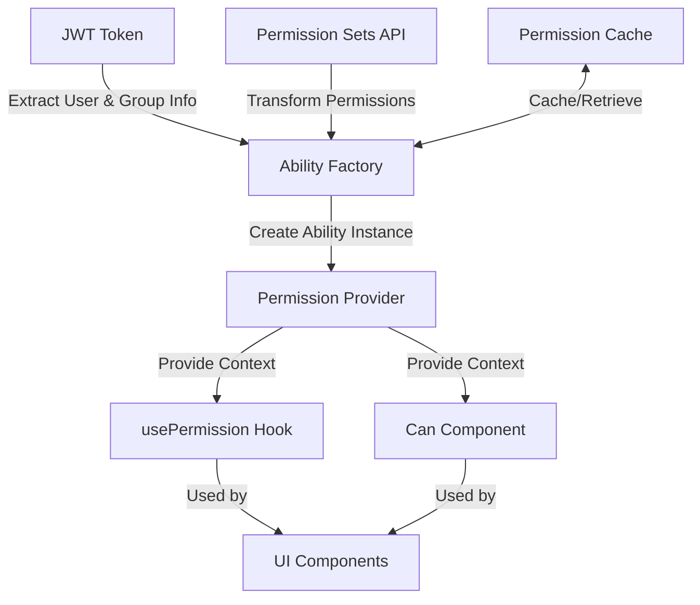

# CASL v5 Implementation Plan for MediaLake React Frontend

Based on the information gathered about the current authentication and authorization system, I've developed a comprehensive plan for implementing CASL v5 in the MediaLake React frontend. This plan addresses the requirements for authorization controls throughout the application, with a mix of hiding and disabling UI elements based on permissions, while ensuring good performance through caching.

## 1. Current System Analysis

### Authentication
- AWS Cognito for authentication
- JWT tokens contain user group information in "cognito:groups" claim
- Authentication managed through `authService.ts` and `auth-context.tsx`

### Authorization
- Amazon Verified Permissions (AVP) for backend authorization
- Permission sets with action/resource/effect permissions
- No client-side permission checking currently

## 2. CASL v5 Implementation Architecture



### Core Components

1. **Ability Factory**
   - Transforms JWT claims and permission sets into CASL abilities
   - Handles "most explicit deny wins" rule
   - Supports subject-based authorization and conditions

2. **Permission Provider**
   - React context provider that makes the ability instance available throughout the app
   - Handles permission refreshing when user/group permissions change

3. **Permission Hooks**
   - `usePermission` hook for checking permissions in components
   - `useSubjectPermission` hook for subject-based authorization

4. **UI Components**
   - `Can` component for conditional rendering based on permissions
   - `PermissionGuard` higher-order component for protecting routes

5. **Permission Cache**
   - Caches permission checks to improve performance
   - Invalidates cache when permissions change

## 3. Implementation Steps

### Phase 1: Setup and Core Components

1. **Install Dependencies**
   - Add CASL v5 packages to the project:
     ```bash
     npm install @casl/ability @casl/react
     ```

2. **Create Ability Types**
   - Define TypeScript types for actions, subjects, and conditions
   - Create the ability factory interface

3. **Implement Ability Factory**
   - Create a factory function that converts JWT claims and permission sets to CASL abilities
   - Implement the "most explicit deny wins" rule
   - Support subject-based authorization and conditions

4. **Create Permission Provider**
   - Implement a React context provider for the ability instance
   - Connect to the existing auth context for user information
   - Set up permission refreshing mechanism

### Phase 2: Permission Hooks and Components

1. **Implement Permission Hooks**
   - Create `usePermission` hook for checking permissions
   - Create `useSubjectPermission` hook for subject-based authorization
   - Implement caching for performance optimization

2. **Create UI Components**
   - Implement `Can` component for conditional rendering
   - Create `PermissionGuard` HOC for route protection
   - Add support for disabling vs. hiding elements

3. **Integrate with Existing Code**
   - Connect to the existing auth context
   - Set up permission fetching from the permission sets API
   - Implement the transformation layer for converting between formats

### Phase 3: Testing and Optimization

1. **Unit Testing**
   - Test ability factory with various permission scenarios
   - Test permission hooks with mocked abilities
   - Test UI components with different permission states

2. **Integration Testing**
   - Test the complete permission flow from JWT to UI rendering
   - Verify correct behavior with complex permission rules
   - Test the "most explicit deny wins" rule

3. **Performance Testing**
   - Benchmark permission checking performance
   - Optimize caching strategy based on results
   - Ensure minimal impact on application performance

4. **Documentation**
   - Create usage documentation for developers
   - Document permission patterns and best practices
   - Provide examples for common use cases

## 4. File Structure

```
src/
└── permissions/
    ├── types/
    │   ├── ability.types.ts       # TypeScript types for CASL
    │   └── permission.types.ts    # Permission-related types
    ├── utils/
    │   ├── ability-factory.ts     # Creates CASL ability instances
    │   ├── permission-cache.ts    # Caching mechanism
    │   └── permission-utils.ts    # Helper functions
    ├── hooks/
    │   ├── usePermission.ts       # Hook for checking permissions
    │   └── useSubjectPermission.ts # Hook for subject-based permissions
    ├── components/
    │   ├── Can.tsx                # Component for conditional rendering
    │   └── PermissionGuard.tsx    # HOC for route protection
    ├── context/
    │   └── permission-context.tsx # Permission provider context
    └── transformers/
        └── permission-transformer.ts # Transforms API permissions to CASL format
```

## 5. Detailed Component Specifications

### Ability Factory

```typescript
// ability-factory.ts
import { AbilityBuilder, createMongoAbility } from '@casl/ability';
import { Permission } from '../../api/types/permissionSet.types';

export function defineAbilityFor(user: User, permissions: Permission[]) {
  const { can, cannot, build } = new AbilityBuilder(createMongoAbility);
  
  // Process user permissions first
  const userPermissions = permissions.filter(p => p.principalType === 'USER');
  
  // Then process group permissions
  const groupPermissions = permissions.filter(p => p.principalType === 'GROUP');
  
  // Apply permissions in the correct order
  // Most specific permissions should be applied last
  
  // Apply "Allow" permissions first
  [...groupPermissions, ...userPermissions]
    .filter(p => p.effect === 'Allow')
    .forEach(permission => {
      can(permission.action, permission.resource, permission.conditions);
    });
  
  // Then apply "Deny" permissions (these will override allows)
  [...groupPermissions, ...userPermissions]
    .filter(p => p.effect === 'Deny')
    .forEach(permission => {
      cannot(permission.action, permission.resource, permission.conditions);
    });
  
  return build();
}
```

### Permission Context

```typescript
// permission-context.tsx
import React, { createContext, useContext, useState, useEffect } from 'react';
import { Ability } from '@casl/ability';
import { useAuth } from '../../common/hooks/auth-context';
import { useGetPermissionSets } from '../../api/hooks/usePermissionSets';
import { defineAbilityFor } from '../utils/ability-factory';
import { transformPermissions } from '../transformers/permission-transformer';

const PermissionContext = createContext<{
  ability: Ability;
  loading: boolean;
  error: Error | null;
  refreshPermissions: () => Promise<void>;
}>({
  ability: defineAbilityFor({}, []),
  loading: true,
  error: null,
  refreshPermissions: async () => {},
});

export function PermissionProvider({ children }) {
  const { isAuthenticated } = useAuth();
  const { data: permissionSets, isLoading, error, refetch } = useGetPermissionSets();
  const [ability, setAbility] = useState(() => defineAbilityFor({}, []));
  
  useEffect(() => {
    if (isAuthenticated && permissionSets) {
      const transformedPermissions = transformPermissions(permissionSets);
      setAbility(defineAbilityFor(user, transformedPermissions));
    }
  }, [isAuthenticated, permissionSets]);
  
  const refreshPermissions = async () => {
    await refetch();
  };
  
  return (
    <PermissionContext.Provider 
      value={{ 
        ability, 
        loading: isLoading, 
        error, 
        refreshPermissions 
      }}
    >
      {children}
    </PermissionContext.Provider>
  );
}

export function usePermissionContext() {
  return useContext(PermissionContext);
}
```

### Permission Hooks

```typescript
// usePermission.ts
import { useCallback } from 'react';
import { usePermissionContext } from '../context/permission-context';
import { permissionCache } from '../utils/permission-cache';

export function usePermission() {
  const { ability, loading, error } = usePermissionContext();
  
  const can = useCallback((action: string, subject: any, field?: string) => {
    const cacheKey = `${action}:${JSON.stringify(subject)}:${field || ''}`;
    
    // Check cache first
    if (permissionCache.has(cacheKey)) {
      return permissionCache.get(cacheKey);
    }
    
    // Perform the check and cache the result
    const result = ability.can(action, subject, field);
    permissionCache.set(cacheKey, result);
    return result;
  }, [ability]);
  
  const cannot = useCallback((action: string, subject: any, field?: string) => {
    return !can(action, subject, field);
  }, [can]);
  
  return { can, cannot, loading, error };
}
```

### Can Component

```typescript
// Can.tsx
import React from 'react';
import { usePermission } from '../hooks/usePermission';

interface CanProps {
  I: string;  // action
  a: any;     // subject
  field?: string;
  passThrough?: boolean;
  children: React.ReactNode | ((allowed: boolean) => React.ReactNode);
}

export function Can({ I: action, a: subject, field, passThrough = false, children }: CanProps) {
  const { can } = usePermission();
  const allowed = can(action, subject, field);
  
  if (typeof children === 'function') {
    return <>{children(allowed)}</>;
  }
  
  if (allowed) {
    return <>{children}</>;
  }
  
  if (passThrough) {
    return <div style={{ opacity: 0.5, pointerEvents: 'none' }}>{children}</div>;
  }
  
  return null;
}
```

## 6. Integration Examples

### Protecting a Button

```tsx
import { Can } from '../permissions/components/Can';

function AssetActions({ asset }) {
  return (
    <div>
      <Can I="view" a="asset" subject={asset}>
        <Button>View Details</Button>
      </Can>
      
      <Can I="edit" a="asset" subject={asset}>
        <Button>Edit</Button>
      </Can>
      
      <Can I="delete" a="asset" subject={asset} passThrough>
        {(allowed) => (
          <Button 
            disabled={!allowed}
            title={!allowed ? "You don't have permission to delete this asset" : ""}
          >
            Delete
          </Button>
        )}
      </Can>
    </div>
  );
}
```

### Protecting a Route

```tsx
import { PermissionGuard } from '../permissions/components/PermissionGuard';

const routes = [
  {
    path: '/assets',
    element: <AssetPage />,
    permission: { action: 'view', subject: 'asset' }
  },
  {
    path: '/settings',
    element: (
      <PermissionGuard action="manage" subject="settings">
        <SettingsPage />
      </PermissionGuard>
    )
  }
];
```

## 7. Testing Strategy

### Unit Tests

- Test ability factory with various permission scenarios
- Test permission hooks with mocked abilities
- Test UI components with different permission states

### Integration Tests

- Test the complete permission flow from JWT to UI rendering
- Verify correct behavior with complex permission rules
- Test the "most explicit deny wins" rule

### Performance Tests

- Benchmark permission checking performance
- Test caching effectiveness
- Measure impact on application rendering performance

## 8. Implementation Timeline

1. **Week 1: Setup and Core Components**
   - Install dependencies
   - Create ability types
   - Implement ability factory
   - Create permission provider

2. **Week 2: Permission Hooks and Components**
   - Implement permission hooks
   - Create UI components
   - Integrate with existing code

3. **Week 3: Testing and Optimization**
   - Write unit tests
   - Write integration tests
   - Perform performance testing
   - Optimize based on test results

4. **Week 4: Documentation and Finalization**
   - Create documentation
   - Refine implementation based on feedback
   - Final testing and bug fixes

## 9. Implementation Progress
|
### Completed
|
1. **Phase 1: Setup and Core Components**
   - ✅ Installed CASL v5 packages (@casl/ability, @casl/react)
   - ✅ Created ability types in ability.types.ts
   - ✅ Implemented ability factory in ability-factory.ts
   - ✅ Created permission provider in permission-context.tsx
|
2. **Phase 2: Permission Hooks and Components**
   - ✅ Implemented permission hooks in usePermission.ts
   - ✅ Created UI components in Can.tsx and PermissionGuard.tsx
   - ✅ Implemented caching mechanism in permission-cache.ts
   - ✅ Created permission transformer in permission-transformer.ts
|
3. **Documentation**
   - ✅ Created comprehensive documentation in README.md
   - ✅ Documented permission patterns and best practices
   - ✅ Provided examples for common use cases in integration-example.tsx
   - ✅ Updated Memory Bank files with implementation details
|
### Remaining Tasks
|
1. **Integration with Existing Code**
   - ❌ Add PermissionProvider to the app's root component
   - ❌ Update components to use the Can component for conditional rendering
   - ❌ Update routes to use the PermissionGuard component for route protection
   - ❌ Connect to the permission sets API
|
2. **Testing**
   - ❌ Write unit tests for ability factory
   - ❌ Write unit tests for permission hooks
   - ❌ Write unit tests for UI components
   - ❌ Write integration tests for the complete permission flow
   - ❌ Perform performance testing
|
## 10. Conclusion

The core components of the CASL v5 authorization system have been implemented according to the plan. The system provides:

1. Fine-grained authorization controls throughout the application
2. Support for both hiding and disabling UI elements based on permissions
3. Implementation of the "most explicit deny wins" rule
4. Performance optimization through caching
5. Flexible UI components for permission-based rendering

The next steps involve integrating the system with the existing application code and writing tests to ensure the system works correctly with different user roles and permissions.