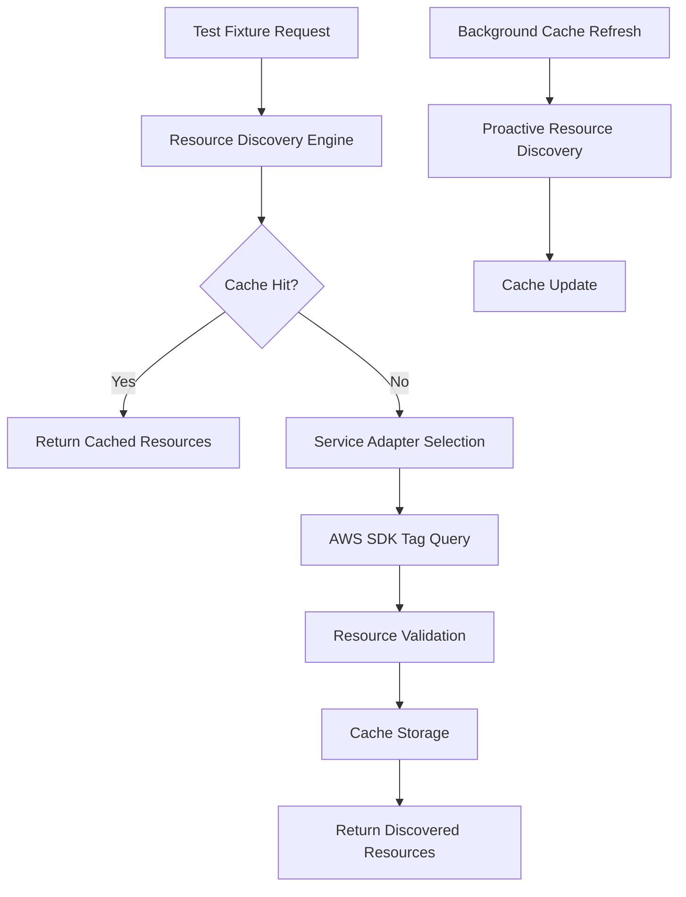

# AWS Resource Discovery Architecture for Tag-Based Testing

## Objective

Design a scalable, tag-based AWS resource discovery system that extends the existing MediaLake Playwright testing infrastructure to support dynamic discovery of AWS resources (Cognito User Pools, CloudFront distributions) using standardized tagging patterns.

## System Context

### Current State Analysis

The existing MediaLake testing infrastructure demonstrates sophisticated patterns:

- **AWS CLI Integration**: Uses [`executeAwsCommand()`](medialake_user_interface/tests/fixtures/cognito.fixtures.ts:21-36) for resource discovery
- **Name-Based Discovery**: Current Cognito discovery uses pattern matching on resource names
- **Worker-Scoped Resources**: S3 fixtures demonstrate worker-isolated resource management
- **Secure User Creation**: Automated test user lifecycle with password policy compliance
- **Parallel Test Execution**: Multi-worker support with isolated resource contexts

### Target Architecture Requirements

1. **Tag-Based Discovery**: Replace name-pattern matching with standardized AWS resource tagging
2. **Multi-Service Support**: Extend beyond Cognito to include CloudFront distributions
3. **Backward Compatibility**: Maintain existing fixture interfaces and test patterns
4. **Performance Optimization**: Cache discovered resources within test worker scope
5. **Error Resilience**: Graceful fallback mechanisms for resource discovery failures

## Architecture Design

### Core Components

#### 1. Resource Discovery Engine

```typescript
interface ResourceDiscoveryEngine {
  discoverByTags(
    resourceType: AWSResourceType,
    tags: TagFilter[],
  ): Promise<DiscoveredResource[]>;
  getCachedResources(
    resourceType: AWSResourceType,
  ): DiscoveredResource[] | null;
  invalidateCache(resourceType?: AWSResourceType): void;
}
```

**Responsibilities:**

- Execute AWS SDK calls for tag-based resource queries
- Implement intelligent caching with TTL-based invalidation
- Provide unified interface across different AWS service APIs
- Handle pagination for large result sets

#### 2. Tag Filter System

```typescript
interface TagFilter {
  key: string;
  values: string[];
  operator: "equals" | "contains" | "startsWith";
}

interface StandardTagPatterns {
  APPLICATION_TAG: TagFilter;
  ENVIRONMENT_TAG: TagFilter;
  TESTING_TAG: TagFilter;
}
```

**Standard Tag Patterns:**

- `Application: medialake` - Primary application identifier
- `Environment: dev|staging|prod` - Environment-specific filtering
- `Testing: enabled` - Marks resources available for testing

#### 3. AWS Service Adapters

##### Cognito Service Adapter

```typescript
interface CognitoServiceAdapter extends ServiceAdapter {
  discoverUserPools(tags: TagFilter[]): Promise<CognitoUserPool[]>;
  discoverUserPoolClients(userPoolId: string): Promise<CognitoUserPoolClient[]>;
  validateUserPoolConfiguration(userPool: CognitoUserPool): ValidationResult;
}
```

##### CloudFront Service Adapter

```typescript
interface CloudFrontServiceAdapter extends ServiceAdapter {
  discoverDistributions(tags: TagFilter[]): Promise<CloudFrontDistribution[]>;
  getDistributionConfiguration(
    distributionId: string,
  ): Promise<DistributionConfig>;
  validateDistributionStatus(
    distribution: CloudFrontDistribution,
  ): ValidationResult;
}
```

#### 4. Resource Cache Manager

```typescript
interface ResourceCacheManager {
  store(key: string, resources: DiscoveredResource[], ttl: number): void;
  retrieve(key: string): DiscoveredResource[] | null;
  isExpired(key: string): boolean;
  generateCacheKey(resourceType: AWSResourceType, tags: TagFilter[]): string;
}
```

**Caching Strategy:**

- Worker-scoped cache isolation
- 5-minute TTL for resource discovery results
- Intelligent cache invalidation on AWS API errors
- Memory-efficient storage with LRU eviction

### Data Flow Architecture



### Integration Patterns

#### 1. Fixture Extension Pattern

Extend existing fixtures while maintaining backward compatibility:

```typescript
// Enhanced Cognito fixture with tag-based discovery
export const test = base.extend<EnhancedCognitoFixtures>({
  cognitoTestUser: [
    async ({}, use, testInfo) => {
      const discoveryEngine = new ResourceDiscoveryEngine();
      const userPools = await discoveryEngine.discoverByTags(
        "cognito-user-pool",
        [StandardTagPatterns.APPLICATION_TAG],
      );

      // Fallback to existing name-based discovery if tag discovery fails
      const selectedPool = userPools[0] || (await findUserPoolByName());

      // Continue with existing user creation logic...
    },
    { scope: "test" },
  ],
});
```

#### 2. Multi-Service Resource Context

```typescript
interface TestResourceContext {
  cognitoUserPool: CognitoUserPool
  cognitoUserPoolClient: CognitoUserPoolClient
  cloudFrontDistribution?: CloudFrontDistribution
  s3Bucket: string
}

// Unified resource context fixture
export const resourceContext: [
  async ({}, use, workerInfo) => {
    const context = await ResourceContextBuilder
      .forWorker(workerInfo.workerIndex)
      .withCognito()
      .withCloudFront()
      .withS3()
      .build();

    await use(context);

    // Cleanup handled by individual service adapters
  },
  { scope: "worker" }
];
```

### Error Handling and Resilience

#### 1. Graceful Degradation Strategy

```typescript
class ResourceDiscoveryEngine {
  async discoverWithFallback<T>(
    primaryStrategy: () => Promise<T[]>,
    fallbackStrategy: () => Promise<T[]>,
  ): Promise<T[]> {
    try {
      const results = await primaryStrategy();
      if (results.length > 0) return results;
    } catch (error) {
      console.warn("Primary discovery failed, using fallback:", error.message);
    }

    return await fallbackStrategy();
  }
}
```

#### 2. Resource Validation Pipeline

```typescript
interface ResourceValidator {
  validate(resource: DiscoveredResource): ValidationResult;
  getRequiredTags(): string[];
  checkResourceAvailability(resource: DiscoveredResource): Promise<boolean>;
}
```

### Performance Optimization

#### 1. Parallel Discovery Pattern

```typescript
async function discoverAllResources(): Promise<TestResourceContext> {
  const [cognitoResources, cloudFrontResources] = await Promise.all([
    cognitoAdapter.discoverUserPools(standardTags),
    cloudFrontAdapter.discoverDistributions(standardTags),
  ]);

  return {
    cognitoUserPool: cognitoResources[0],
    cloudFrontDistribution: cloudFrontResources[0],
  };
}
```

#### 2. Intelligent Prefetching

```typescript
class WorkerResourceManager {
  async prefetchResources(workerIndex: number): Promise<void> {
    // Prefetch common resources during worker initialization
    await Promise.all([
      this.discoveryEngine.discoverByTags("cognito-user-pool", standardTags),
      this.discoveryEngine.discoverByTags(
        "cloudfront-distribution",
        standardTags,
      ),
    ]);
  }
}
```

## Security Considerations

### 1. IAM Permission Requirements

```json
{
  "Version": "2012-10-17",
  "Statement": [
    {
      "Effect": "Allow",
      "Action": [
        "cognito-idp:ListUserPools",
        "cognito-idp:ListTagsForResource",
        "cloudfront:ListDistributions",
        "cloudfront:ListTagsForResource",
        "resourcegroupstaggingapi:GetResources"
      ],
      "Resource": "*"
    }
  ]
}
```

### 2. Resource Access Control

- Tag-based resource filtering prevents access to unintended resources
- Environment-specific tagging ensures test isolation
- Audit logging for all resource discovery operations

## Deployment and Configuration

### 1. Environment Configuration

```typescript
interface DiscoveryConfig {
  defaultTags: TagFilter[];
  cacheSettings: {
    ttl: number;
    maxSize: number;
  };
  fallbackEnabled: boolean;
  serviceEndpoints?: {
    cognito?: string;
    cloudfront?: string;
  };
}
```

### 2. Feature Flags

```typescript
interface FeatureFlags {
  enableTagBasedDiscovery: boolean;
  enableResourceCaching: boolean;
  enableParallelDiscovery: boolean;
  enableCloudFrontTesting: boolean;
}
```

## Monitoring and Observability

### 1. Metrics Collection

- Resource discovery latency per service
- Cache hit/miss ratios
- Fallback activation frequency
- Resource validation failure rates

### 2. Logging Strategy

```typescript
interface DiscoveryLogger {
  logResourceDiscovery(
    resourceType: string,
    tagFilters: TagFilter[],
    resultCount: number,
  ): void;
  logCacheOperation(operation: "hit" | "miss" | "store", key: string): void;
  logFallbackActivation(reason: string, resourceType: string): void;
}
```

## Migration Strategy

### Phase 1: Foundation (Week 1-2)

- Implement core ResourceDiscoveryEngine
- Create Cognito service adapter with tag-based discovery
- Add backward compatibility layer

### Phase 2: Extension (Week 3-4)

- Implement CloudFront service adapter
- Add resource caching system
- Create unified resource context fixtures

### Phase 3: Optimization (Week 5-6)

- Implement parallel discovery patterns
- Add comprehensive error handling
- Performance tuning and monitoring

## Dependencies

### External Dependencies

- `@aws-sdk/client-cognito-identity-provider`
- `@aws-sdk/client-cloudfront`
- `@aws-sdk/client-resource-groups-tagging-api`

### Internal Dependencies

- Existing Playwright fixture system
- Current AWS CLI integration patterns
- MediaLake environment configuration

## Next Actions

1. Create detailed CloudFront testing integration design
2. Define architecture decision record for tag-based discovery strategy
3. Specify AWS SDK integration approach and migration path
4. Design extension strategy for existing fixture patterns
