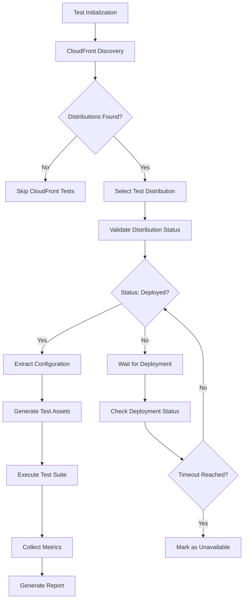

# CloudFront Distribution Discovery and Testing Integration

## Objective

Design a comprehensive CloudFront testing integration that extends the MediaLake Playwright testing infrastructure to support automated discovery, validation, and end-to-end testing of CloudFront distributions using tag-based resource discovery.

## System Context

### CloudFront in MediaLake Architecture

CloudFront distributions serve as the content delivery layer for MediaLake, providing:

- Global content acceleration for media assets
- Edge caching for improved user experience
- Security features including WAF integration
- Custom domain and SSL certificate management
- Origin access control for S3 bucket protection

### Integration Requirements

1. **Automated Discovery**: Locate CloudFront distributions using standardized tags
2. **Configuration Validation**: Verify distribution settings match expected patterns
3. **End-to-End Testing**: Test content delivery through CloudFront edge locations
4. **Performance Monitoring**: Measure cache hit rates and response times
5. **Security Testing**: Validate access controls and security headers

## Architecture Design

### Core Components

#### 1. CloudFront Service Adapter

```typescript
interface CloudFrontServiceAdapter extends ServiceAdapter {
  // Resource Discovery
  discoverDistributions(tags: TagFilter[]): Promise<CloudFrontDistribution[]>;
  getDistributionConfiguration(
    distributionId: string,
  ): Promise<DistributionConfig>;

  // Status and Health Checks
  validateDistributionStatus(
    distribution: CloudFrontDistribution,
  ): Promise<ValidationResult>;
  checkDistributionDeployment(
    distributionId: string,
  ): Promise<DeploymentStatus>;

  // Testing Support
  getDistributionDomains(distributionId: string): Promise<string[]>;
  getCacheInvalidationStatus(
    distributionId: string,
    invalidationId: string,
  ): Promise<InvalidationStatus>;

  // Performance Metrics
  getDistributionMetrics(
    distributionId: string,
    timeRange: TimeRange,
  ): Promise<DistributionMetrics>;
}
```

#### 2. CloudFront Test Context

```typescript
interface CloudFrontTestContext {
  distribution: CloudFrontDistribution;
  primaryDomain: string;
  alternativeDomains: string[];
  originConfiguration: OriginConfig;
  cacheConfiguration: CacheBehavior[];
  securityConfiguration: SecurityConfig;
  testAssets: TestAsset[];
}

interface TestAsset {
  path: string;
  contentType: string;
  expectedCacheHeaders: Record<string, string>;
  cacheTtl: number;
  requiresAuthentication: boolean;
}
```

#### 3. CloudFront Testing Engine

```typescript
interface CloudFrontTestingEngine {
  // Content Delivery Testing
  testContentDelivery(
    context: CloudFrontTestContext,
    asset: TestAsset,
  ): Promise<DeliveryTestResult>;
  testCacheEffectiveness(
    context: CloudFrontTestContext,
    asset: TestAsset,
  ): Promise<CacheTestResult>;

  // Performance Testing
  measureResponseTimes(
    domain: string,
    paths: string[],
  ): Promise<PerformanceMetrics>;
  testGlobalDistribution(
    domain: string,
    regions: string[],
  ): Promise<GlobalPerformanceResult>;

  // Security Testing
  validateSecurityHeaders(domain: string): Promise<SecurityValidationResult>;
  testOriginAccessControl(
    context: CloudFrontTestContext,
  ): Promise<AccessControlResult>;
}
```

### Discovery and Configuration Flow



### Test Asset Management

#### 1. Dynamic Test Asset Generation

```typescript
class TestAssetManager {
  async generateTestAssets(s3BucketName: string): Promise<TestAsset[]> {
    const assets = [
      // Static content tests
      await this.createStaticAsset(
        "test-image.jpg",
        "image/jpeg",
        s3BucketName,
      ),
      await this.createStaticAsset(
        "test-document.pdf",
        "application/pdf",
        s3BucketName,
      ),

      // Dynamic content tests
      await this.createDynamicAsset(
        "api/test-endpoint",
        "application/json",
        s3BucketName,
      ),

      // Cache behavior tests
      await this.createCacheableAsset(
        "cached-content.html",
        "text/html",
        3600,
        s3BucketName,
      ),
      await this.createNonCacheableAsset(
        "dynamic-content.json",
        "application/json",
        s3BucketName,
      ),
    ];

    return assets;
  }

  private async createStaticAsset(
    filename: string,
    contentType: string,
    bucketName: string,
  ): Promise<TestAsset> {
    // Upload test content to S3 origin
    const content = await this.generateTestContent(contentType);
    await this.uploadToS3(bucketName, filename, content, contentType);

    return {
      path: `/${filename}`,
      contentType,
      expectedCacheHeaders: {
        "Cache-Control": "public, max-age=86400",
        "Content-Type": contentType,
      },
      cacheTtl: 86400,
      requiresAuthentication: false,
    };
  }
}
```

#### 2. Test Content Lifecycle

```typescript
interface TestContentLifecycle {
  setup(context: CloudFrontTestContext): Promise<void>;
  cleanup(context: CloudFrontTestContext): Promise<void>;
  invalidateCache(distributionId: string, paths: string[]): Promise<string>;
  waitForInvalidation(
    distributionId: string,
    invalidationId: string,
  ): Promise<void>;
}
```

### Testing Strategies

#### 1. Content Delivery Validation

```typescript
class ContentDeliveryTester {
  async testBasicDelivery(
    context: CloudFrontTestContext,
    asset: TestAsset,
  ): Promise<DeliveryTestResult> {
    const url = `https://${context.primaryDomain}${asset.path}`;

    const response = await fetch(url);

    return {
      success: response.ok,
      statusCode: response.status,
      responseTime: await this.measureResponseTime(url),
      headers: Object.fromEntries(response.headers.entries()),
      cacheStatus: response.headers.get("x-cache") || "unknown",
      contentLength: parseInt(response.headers.get("content-length") || "0"),
      contentType: response.headers.get("content-type") || "unknown",
    };
  }

  async testCacheBehavior(
    context: CloudFrontTestContext,
    asset: TestAsset,
  ): Promise<CacheTestResult> {
    const url = `https://${context.primaryDomain}${asset.path}`;

    // First request - should be cache miss
    const firstResponse = await fetch(url);
    const firstCacheStatus = firstResponse.headers.get("x-cache");

    // Second request - should be cache hit
    const secondResponse = await fetch(url);
    const secondCacheStatus = secondResponse.headers.get("x-cache");

    return {
      firstRequestCacheStatus: firstCacheStatus,
      secondRequestCacheStatus: secondCacheStatus,
      cacheEffective: secondCacheStatus?.includes("Hit") || false,
      cacheHeaders: {
        cacheControl: secondResponse.headers.get("cache-control"),
        expires: secondResponse.headers.get("expires"),
        etag: secondResponse.headers.get("etag"),
      },
    };
  }
}
```

#### 2. Performance Testing

```typescript
class PerformanceTester {
  async measureGlobalPerformance(
    domain: string,
    testPath: string,
  ): Promise<GlobalPerformanceResult> {
    const regions = ["us-east-1", "eu-west-1", "ap-southeast-1"];
    const results = await Promise.all(
      regions.map((region) =>
        this.measureRegionalPerformance(domain, testPath, region),
      ),
    );

    return {
      averageResponseTime: this.calculateAverage(
        results.map((r) => r.responseTime),
      ),
      minResponseTime: Math.min(...results.map((r) => r.responseTime)),
      maxResponseTime: Math.max(...results.map((r) => r.responseTime)),
      regionalResults: results,
      globalCacheHitRate: this.calculateCacheHitRate(results),
    };
  }

  private async measureRegionalPerformance(
    domain: string,
    path: string,
    region: string,
  ): Promise<RegionalPerformanceResult> {
    // Simulate requests from different regions using edge location testing
    const startTime = Date.now();
    const response = await fetch(`https://${domain}${path}`, {
      headers: {
        "CloudFront-Viewer-Country": this.getCountryForRegion(region),
      },
    });
    const endTime = Date.now();

    return {
      region,
      responseTime: endTime - startTime,
      cacheStatus: response.headers.get("x-cache") || "unknown",
      edgeLocation: response.headers.get("x-amz-cf-pop") || "unknown",
    };
  }
}
```

#### 3. Security Validation

```typescript
class SecurityTester {
  async validateSecurityHeaders(
    domain: string,
  ): Promise<SecurityValidationResult> {
    const response = await fetch(`https://${domain}/`);
    const headers = response.headers;

    const securityChecks = {
      hasHSTS: headers.has("strict-transport-security"),
      hasCSP: headers.has("content-security-policy"),
      hasXFrameOptions: headers.has("x-frame-options"),
      hasXContentTypeOptions: headers.has("x-content-type-options"),
      hasReferrerPolicy: headers.has("referrer-policy"),
    };

    return {
      securityScore: this.calculateSecurityScore(securityChecks),
      checks: securityChecks,
      recommendations: this.generateSecurityRecommendations(securityChecks),
      headers: Object.fromEntries(headers.entries()),
    };
  }

  async testOriginAccessControl(
    context: CloudFrontTestContext,
  ): Promise<AccessControlResult> {
    // Test direct S3 access (should be blocked)
    const originUrl = context.originConfiguration.domainName;

    try {
      const directResponse = await fetch(`https://${originUrl}/test-asset.jpg`);
      const directAccessBlocked = !directResponse.ok;

      // Test CloudFront access (should work)
      const cloudfrontResponse = await fetch(
        `https://${context.primaryDomain}/test-asset.jpg`,
      );
      const cloudfrontAccessWorks = cloudfrontResponse.ok;

      return {
        originAccessBlocked: directAccessBlocked,
        cloudfrontAccessWorks: cloudfrontAccessWorks,
        securityConfigured: directAccessBlocked && cloudfrontAccessWorks,
      };
    } catch (error) {
      return {
        originAccessBlocked: true, // Assume blocked if request fails
        cloudfrontAccessWorks: false,
        securityConfigured: false,
        error: error.message,
      };
    }
  }
}
```

### Fixture Integration

#### 1. CloudFront Fixture Extension

```typescript
interface CloudFrontFixtures {
  cloudFrontContext: CloudFrontTestContext;
  cloudFrontTester: CloudFrontTestingEngine;
  testAssets: TestAsset[];
}

export const test = authBase.extend<CloudFrontFixtures>({
  cloudFrontContext: [
    async ({ s3BucketName }, use, workerInfo) => {
      const discoveryEngine = new ResourceDiscoveryEngine();

      // Discover CloudFront distributions
      const distributions = await discoveryEngine.discoverByTags(
        "cloudfront-distribution",
        [StandardTagPatterns.APPLICATION_TAG],
      );

      if (distributions.length === 0) {
        console.log(
          "[CloudFront Fixture] No distributions found, skipping CloudFront tests",
        );
        await use(null);
        return;
      }

      const distribution = distributions[0];
      const config = await cloudFrontAdapter.getDistributionConfiguration(
        distribution.id,
      );

      // Generate test assets
      const assetManager = new TestAssetManager();
      const testAssets = await assetManager.generateTestAssets(s3BucketName);

      const context: CloudFrontTestContext = {
        distribution,
        primaryDomain: config.domainName,
        alternativeDomains: config.aliases || [],
        originConfiguration: config.origins[0],
        cacheConfiguration: config.cacheBehaviors,
        securityConfiguration: config.securityConfig,
        testAssets,
      };

      await use(context);

      // Cleanup test assets
      await assetManager.cleanup(context);
    },
    { scope: "worker" },
  ],

  cloudFrontTester: [
    async ({}, use) => {
      const tester = new CloudFrontTestingEngine();
      await use(tester);
    },
    { scope: "worker" },
  ],

  testAssets: [
    async ({ cloudFrontContext }, use) => {
      if (!cloudFrontContext) {
        await use([]);
        return;
      }

      await use(cloudFrontContext.testAssets);
    },
    { scope: "test" },
  ],
});
```

#### 2. Test Implementation Examples

```typescript
// Basic CloudFront functionality test
test("CloudFront distribution serves content correctly", async ({
  cloudFrontContext,
  cloudFrontTester,
}) => {
  test.skip(!cloudFrontContext, "No CloudFront distribution available");

  for (const asset of cloudFrontContext.testAssets) {
    const result = await cloudFrontTester.testContentDelivery(
      cloudFrontContext,
      asset,
    );

    expect(result.success).toBe(true);
    expect(result.statusCode).toBe(200);
    expect(result.contentType).toBe(asset.contentType);
    expect(result.responseTime).toBeLessThan(5000); // 5 second timeout
  }
});

// Cache behavior test
test("CloudFront caching works correctly", async ({
  cloudFrontContext,
  cloudFrontTester,
}) => {
  test.skip(!cloudFrontContext, "No CloudFront distribution available");

  const cacheableAssets = cloudFrontContext.testAssets.filter(
    (asset) => asset.cacheTtl > 0,
  );

  for (const asset of cacheableAssets) {
    const result = await cloudFrontTester.testCacheEffectiveness(
      cloudFrontContext,
      asset,
    );

    expect(result.cacheEffective).toBe(true);
    expect(result.secondRequestCacheStatus).toContain("Hit");
  }
});

// Performance test
test("CloudFront performance meets requirements", async ({
  cloudFrontContext,
  cloudFrontTester,
}) => {
  test.skip(!cloudFrontContext, "No CloudFront distribution available");

  const performanceResult = await cloudFrontTester.measureResponseTimes(
    cloudFrontContext.primaryDomain,
    cloudFrontContext.testAssets.map((asset) => asset.path),
  );

  expect(performanceResult.averageResponseTime).toBeLessThan(2000); // 2 second average
  expect(performanceResult.cacheHitRate).toBeGreaterThan(0.8); // 80% cache hit rate
});

// Security test
test("CloudFront security configuration is correct", async ({
  cloudFrontContext,
  cloudFrontTester,
}) => {
  test.skip(!cloudFrontContext, "No CloudFront distribution available");

  const securityResult = await cloudFrontTester.validateSecurityHeaders(
    cloudFrontContext.primaryDomain,
  );

  expect(securityResult.securityScore).toBeGreaterThan(80);
  expect(securityResult.checks.hasHSTS).toBe(true);
  expect(securityResult.checks.hasXFrameOptions).toBe(true);

  const accessControlResult =
    await cloudFrontTester.testOriginAccessControl(cloudFrontContext);
  expect(accessControlResult.securityConfigured).toBe(true);
});
```

### Error Handling and Edge Cases

#### 1. Distribution Status Handling

```typescript
class DistributionStatusManager {
  async waitForDistributionReady(
    distributionId: string,
    maxWaitTime: number = 300000,
  ): Promise<boolean> {
    const startTime = Date.now();

    while (Date.now() - startTime < maxWaitTime) {
      const status = await this.checkDistributionStatus(distributionId);

      if (status === "Deployed") {
        return true;
      }

      if (status === "InProgress") {
        await this.sleep(30000); // Wait 30 seconds
        continue;
      }

      throw new Error(
        `Distribution ${distributionId} is in unexpected state: ${status}`,
      );
    }

    return false; // Timeout reached
  }
}
```

#### 2. Graceful Test Degradation

```typescript
class CloudFrontTestRunner {
  async runTestSuite(context: CloudFrontTestContext): Promise<TestSuiteResult> {
    const results: TestResult[] = [];

    for (const testCase of this.getTestCases()) {
      try {
        const result = await this.runTestCase(testCase, context);
        results.push(result);
      } catch (error) {
        console.warn(`Test case ${testCase.name} failed: ${error.message}`);
        results.push({
          name: testCase.name,
          success: false,
          error: error.message,
          skipped: false,
        });
      }
    }

    return {
      totalTests: results.length,
      passedTests: results.filter((r) => r.success).length,
      failedTests: results.filter((r) => !r.success && !r.skipped).length,
      skippedTests: results.filter((r) => r.skipped).length,
      results,
    };
  }
}
```

## Monitoring and Observability

### 1. Test Metrics Collection

```typescript
interface CloudFrontTestMetrics {
  distributionId: string;
  testDuration: number;
  contentDeliveryTests: {
    total: number;
    passed: number;
    averageResponseTime: number;
  };
  cacheEffectivenessTests: {
    total: number;
    passed: number;
    averageCacheHitRate: number;
  };
  securityTests: {
    total: number;
    passed: number;
    securityScore: number;
  };
}
```

### 2. Performance Benchmarking

```typescript
class PerformanceBenchmark {
  async establishBaseline(
    context: CloudFrontTestContext,
  ): Promise<PerformanceBaseline> {
    const measurements = [];

    for (let i = 0; i < 10; i++) {
      const result = await this.measurePerformance(context);
      measurements.push(result);
      await this.sleep(1000); // 1 second between measurements
    }

    return {
      averageResponseTime: this.calculateAverage(
        measurements.map((m) => m.responseTime),
      ),
      p95ResponseTime: this.calculatePercentile(
        measurements.map((m) => m.responseTime),
        95,
      ),
      averageCacheHitRate: this.calculateAverage(
        measurements.map((m) => m.cacheHitRate),
      ),
      timestamp: new Date().toISOString(),
    };
  }
}
```

## Dependencies and Requirements

### AWS SDK Dependencies

```json
{
  "@aws-sdk/client-cloudfront": "^3.x.x",
  "@aws-sdk/client-s3": "^3.x.x",
  "@aws-sdk/client-resource-groups-tagging-api": "^3.x.x"
}
```

### IAM Permissions

```json
{
  "Version": "2012-10-17",
  "Statement": [
    {
      "Effect": "Allow",
      "Action": [
        "cloudfront:ListDistributions",
        "cloudfront:GetDistribution",
        "cloudfront:GetDistributionConfig",
        "cloudfront:ListTagsForResource",
        "cloudfront:CreateInvalidation",
        "cloudfront:GetInvalidation"
      ],
      "Resource": "*"
    }
  ]
}
```

## Next Actions

1. Create architecture decision record for tag-based discovery strategy
2. Document extension strategy for existing fixture patterns
3. Specify detailed AWS SDK integration approach
4. Define CloudFront-specific test scenarios and acceptance criteria
5. Plan integration testing with existing S3 and Cognito fixtures
