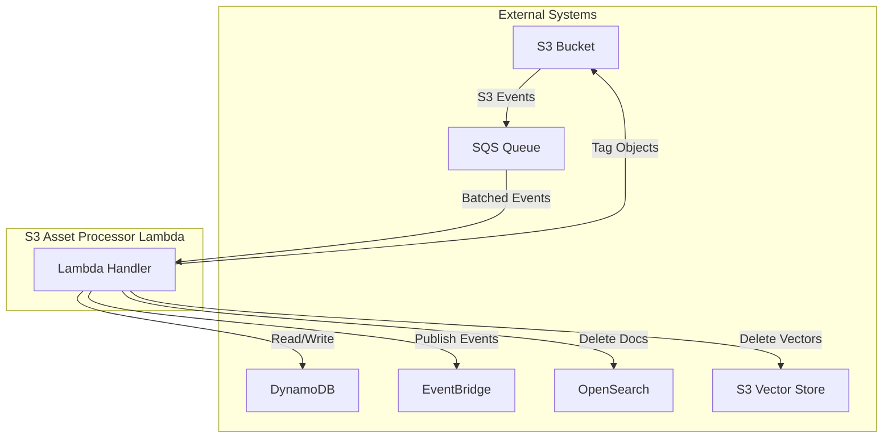
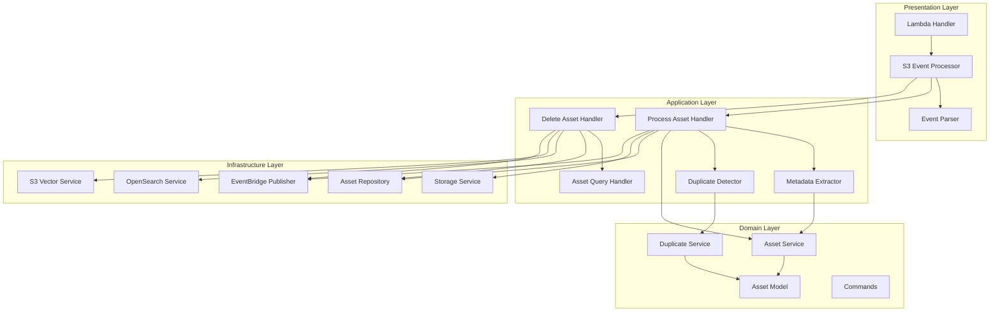
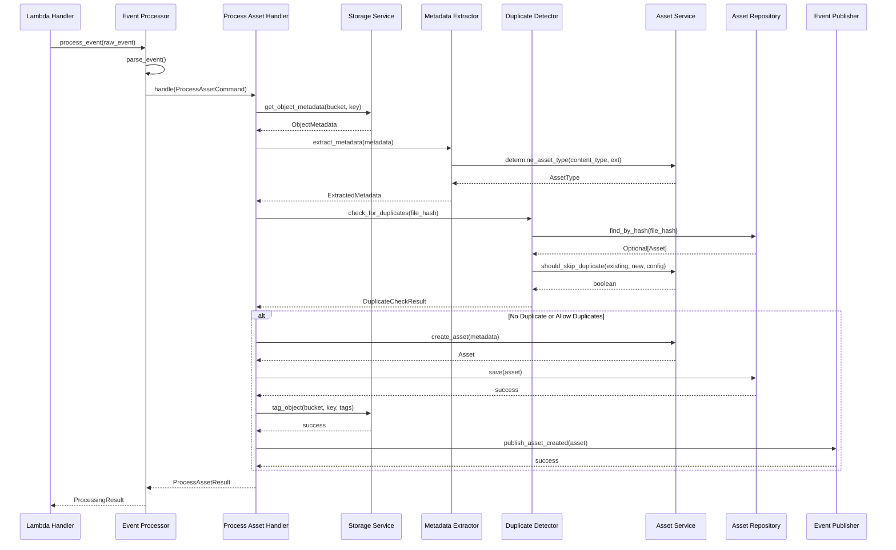
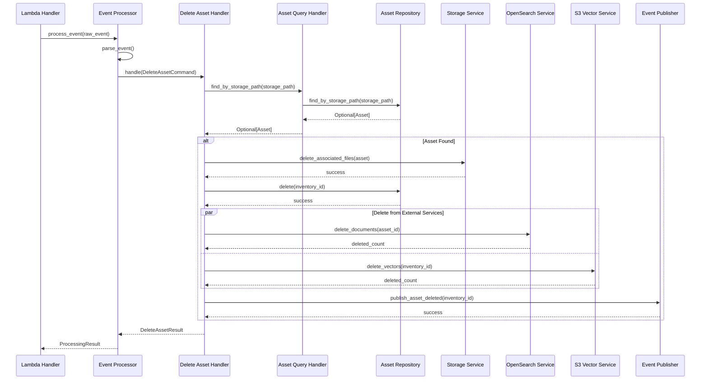
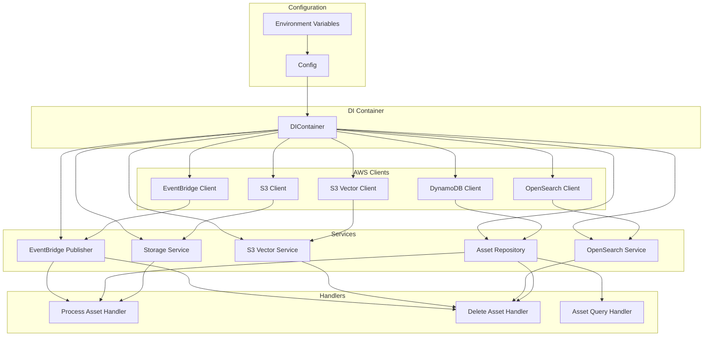
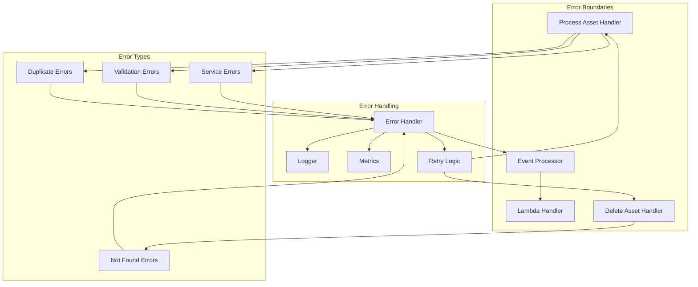
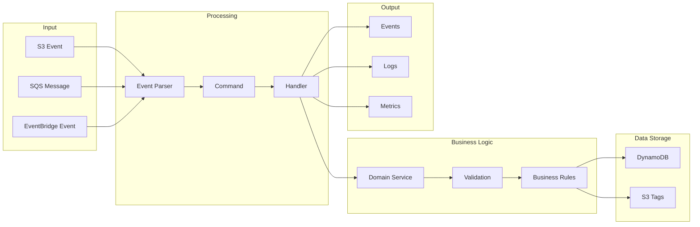
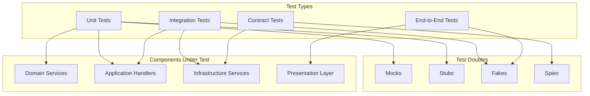
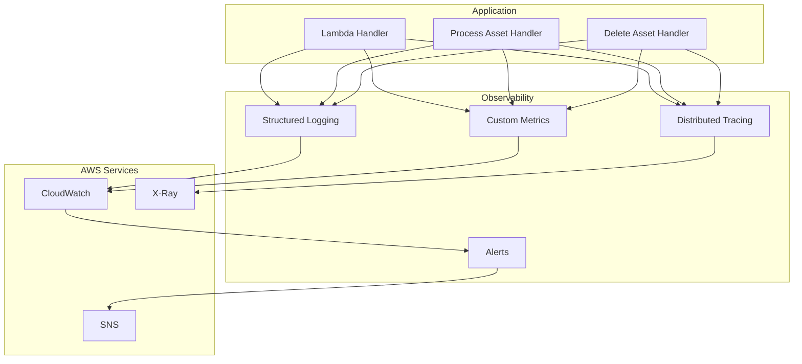

# S3 Asset Processor - Component Interaction Diagrams

## Overview

This document provides visual representations of component interactions in the proposed modular architecture, showing how different layers communicate and maintain clear separation of concerns.

## System Context Diagram

## Container Diagram - Layered Architecture

## Component Diagram - Process Asset Flow

## Component Diagram - Delete Asset Flow

## Dependency Injection Flow

## Error Handling Flow

## Data Flow Diagram

## Testing Architecture

## Monitoring & Observability

## Key Architectural Benefits

### 1. Clear Separation of Concerns

- Each layer has distinct responsibilities
- Dependencies flow inward (Dependency Inversion)
- Business logic isolated from infrastructure

### 2. Testability

- Each component can be tested in isolation
- Dependencies can be easily mocked
- Clear test boundaries at each layer

### 3. Maintainability

- Changes to one layer don't affect others
- New features can be added without modifying existing code
- Clear component boundaries

### 4. Scalability

- Components can be optimized independently
- Async processing support
- Parallel execution capabilities

### 5. Observability

- Structured logging at each layer
- Metrics collection at component boundaries
- Distributed tracing through the entire flow

## Component Interaction Patterns

### 1. Command Pattern

- Commands encapsulate requests
- Handlers process commands
- Clear separation between request and processing

### 2. Repository Pattern

- Abstract data access
- Domain objects independent of storage
- Easy to swap implementations

### 3. Service Layer Pattern

- Business logic encapsulated in services
- Reusable across different handlers
- Clear API boundaries

### 4. Dependency Injection Pattern

- Loose coupling between components
- Easy testing and configuration
- Runtime flexibility

This modular architecture provides a solid foundation for maintaining and extending the S3 Asset Processor Lambda while ensuring high code quality, testability, and maintainability.
