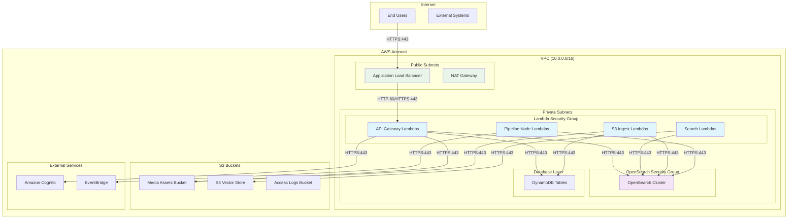

# MediaLake Network Architecture

## Overview

This document provides a comprehensive analysis of the MediaLake network architecture, focusing on OpenSearch security group configurations, network flows, and security boundaries.

## OpenSearch Security Group Analysis

### Current Configuration

Based on the infrastructure code analysis, here's what I found regarding the OpenSearch security group rules:

#### 1. OpenSearch-Specific Security Group

**Location**: [`medialake_constructs/shared_constructs/opensearch_managed_cluster.py`](medialake_constructs/shared_constructs/opensearch_managed_cluster.py:134)

```python
os_security_group.add_ingress_rule(
    peer=props.security_group,
    connection=ec2.Port.tcp(443),
    description="Allow HTTPS access from trusted security group",
)
```

**Purpose**: This rule allows HTTPS (port 443) access to OpenSearch **only from the MediaLake Lambda security group**, not from the internet.

#### 2. MediaLake Lambda Security Group

**Location**: [`medialake_stacks/base_infrastructure.py`](medialake_stacks/base_infrastructure.py:188)

```python
# Allow HTTPS ingress from the VPC CIDR
self._security_group.add_ingress_rule(
    peer=ec2.Peer.ipv4(self._vpc.vpc.vpc_cidr_block),
    connection=ec2.Port.tcp(443),
    description="Allow HTTPS ingress from VPC CIDR",
)

# Allow HTTP ingress from the VPC CIDR
self._security_group.add_ingress_rule(
    peer=ec2.Peer.ipv4(self._vpc.vpc.vpc_cidr_block),
    connection=ec2.Port.tcp(80),
    description="Allow HTTP ingress from VPC CIDR",
)
```

### Port Usage Clarification

**The ports 80 and 443 you're seeing are NOT on the OpenSearch security group directly.** They are on the MediaLake Lambda security group for the following purposes:

#### Port 443 (HTTPS)

- **Required**: Yes
- **Purpose**:
  - Lambda functions need to make HTTPS calls to OpenSearch (port 443)
  - Lambda functions need to make HTTPS calls to AWS services
  - Inter-service communication within the VPC
- **Scope**: Limited to VPC CIDR block only

#### Port 80 (HTTP)

- **Required**: Potentially unnecessary for OpenSearch
- **Purpose**:
  - Legacy HTTP communication (should be reviewed)
  - Some internal services might still use HTTP
- **Recommendation**: Consider removing if not needed

## Network Architecture Diagram



## Security Group Rules Breakdown

### 1. MediaLake Lambda Security Group

**Ingress Rules:**

- Port 443 (HTTPS) from VPC CIDR (10.0.0.0/16)
- Port 80 (HTTP) from VPC CIDR (10.0.0.0/16)

**Egress Rules:**

- All traffic to 0.0.0.0/0 (default)

### 2. OpenSearch Security Group

**Ingress Rules:**

- Port 443 (HTTPS) from MediaLake Lambda Security Group only

**Egress Rules:**

- All traffic to 0.0.0.0/0 (default)

## Network Flows

### 1. Search Operations

```
User → ALB → API Lambda → OpenSearch Cluster
                      ↓
                   S3 Vector Store (if enabled)
```

### 2. Asset Ingestion

```
S3 Event → Ingest Lambda → DynamoDB → OpenSearch Cluster
                        ↓
                   Media Assets Bucket
```

### 3. Pipeline Processing

```
EventBridge → Node Lambda → OpenSearch Cluster
                         ↓
                    Media Assets Bucket
```

## Security Boundaries

### Network Isolation

1. **OpenSearch Cluster**: Isolated in private subnets, accessible only from Lambda security group
2. **Lambda Functions**: In private subnets with controlled egress through NAT Gateway
3. **S3 Buckets**: Accessed via VPC endpoints (recommended) or through NAT Gateway

### Access Control

1. **OpenSearch Access**: Limited to specific Lambda security group
2. **VPC-only Communication**: All internal services communicate within VPC
3. **IAM-based Authorization**: Service-to-service authentication via IAM roles

## Recommendations

### 1. Remove Unnecessary Port 80

```python
# Consider removing this rule if HTTP is not needed
self._security_group.add_ingress_rule(
    peer=ec2.Peer.ipv4(self._vpc.vpc.vpc_cidr_block),
    connection=ec2.Port.tcp(80),  # ← Review if this is needed
    description="Allow HTTP ingress from VPC CIDR",
)
```

### 2. Implement VPC Endpoints

Add VPC endpoints for AWS services to reduce NAT Gateway costs:

- S3 VPC Endpoint
- DynamoDB VPC Endpoint
- Lambda VPC Endpoint

### 3. Network Segmentation

Consider creating separate security groups for different Lambda function types:

- API Gateway Lambdas
- Background Processing Lambdas
- Pipeline Node Lambdas

### 4. OpenSearch Dashboard Access

If you need to access OpenSearch Dashboards, consider:

- VPN connection to VPC
- Bastion host in public subnet
- AWS Systems Manager Session Manager

## Configuration Files

### Security Group Configuration

The security groups are configured in [`config.json`](config.json) under the VPC section:

```json
{
  "vpc": {
    "security_groups": {
      "use_existing_groups": false,
      "new_groups": {
        "media_lake_sg": {
          "name": "MediaLake-Lambda-SG",
          "description": "Security group for MediaLake Lambda functions"
        },
        "opensearch_sg": {
          "name": "MediaLake-OpenSearch-SG",
          "description": "Security group for OpenSearch cluster"
        }
      }
    }
  }
}
```

## Troubleshooting Network Issues

### Common Issues

1. **Lambda Timeout**: Check NAT Gateway and VPC endpoint configuration
2. **OpenSearch Connection Failed**: Verify security group rules and VPC configuration
3. **S3 Access Issues**: Ensure proper IAM roles and VPC endpoint configuration

### Monitoring

- CloudWatch VPC Flow Logs
- OpenSearch cluster metrics
- Lambda function metrics and logs

## Summary

The current network architecture is well-designed with proper security boundaries. The ports 80 and 443 on the Lambda security group are for outbound communication from Lambda functions, not inbound internet traffic to OpenSearch. The OpenSearch cluster is properly isolated and only accessible from authorized Lambda functions within the VPC.

The port 80 rule should be reviewed for necessity, and VPC endpoints should be considered for cost optimization and improved security.
